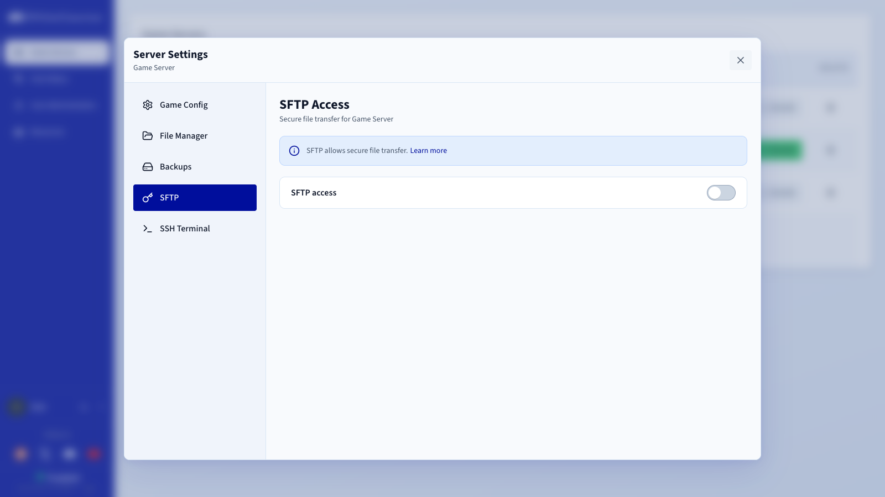
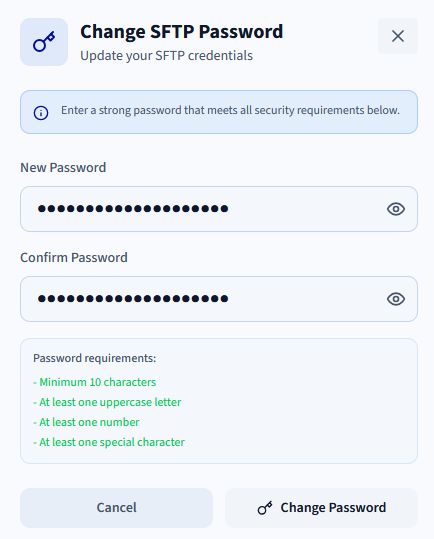

## Objective

SFTP lets you connect to your game server and access its files and directories. It is more powerful than the Game Panel File Manager and useful for uploading larger files and managing your server.

**This guide explains how to enable SFTP on a game server in the OVHcloud Game Panel.**

## Requirements

- A [VPS](/links/bare-metal/vps) in your OVHcloud account with the Game Panel feature enabled.
- A game server instance deployed on the Game Panel.
- An SFTP client such as [FileZilla](https://filezilla-project.org/).

> [!primary]
>
> Make sure to download the **client** version of FileZilla, not the server version.

## Instructions

### Step 1 — Log in to the Game Panel

Log in to your Game Panel. If you need help, refer to [Log in to the Game Panel](/pages/bare_metal_cloud/virtual_private_servers/game-panel-log-in).

### Step 2 — Access SFTP settings

Once logged in:

1. Select your game server.
2. Click `Settings`{.action}.
3. Go to the `SFTP`{.action} tab.

{.thumbnail}

### Step 3 — Enable SFTP

Enable SFTP and set a secure password.

Password requirements:

- Minimum 10 characters
- At least one uppercase letter
- At least one number
- At least one special character

{.thumbnail}

### Step 4 — Connect using an SFTP client

Once SFTP is enabled, connect to your server using your SFTP client. The connection information (host, port, username) can be found in the `Connection Details`{.action} section of your Game Panel.

For instructions on using FileZilla, refer to [How to use SFTP to transfer files](/pages/bare_metal_cloud/dedicated_servers/comment-deposer-ou-recuperer-des-donnees-sur-un-serveur-dedie-via-sftp).

## Go further

- [Getting started with the Game Panel](/pages/bare_metal_cloud/virtual_private_servers/game-panel-getting-started)

Join our [community of users](/links/community).