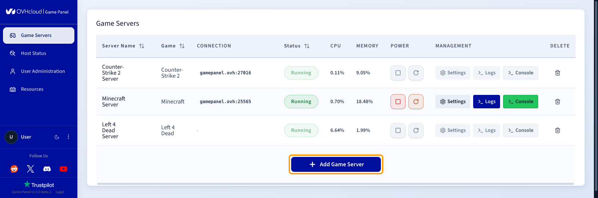
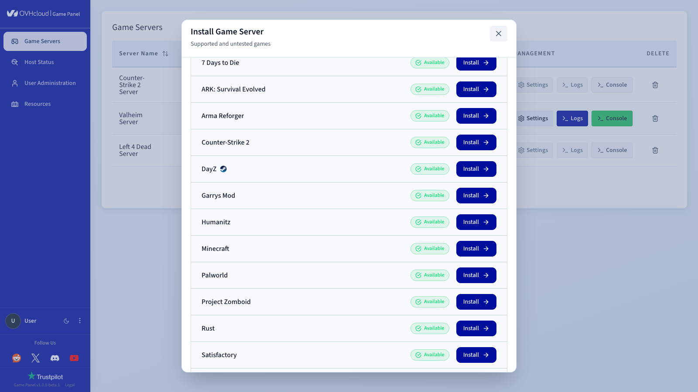
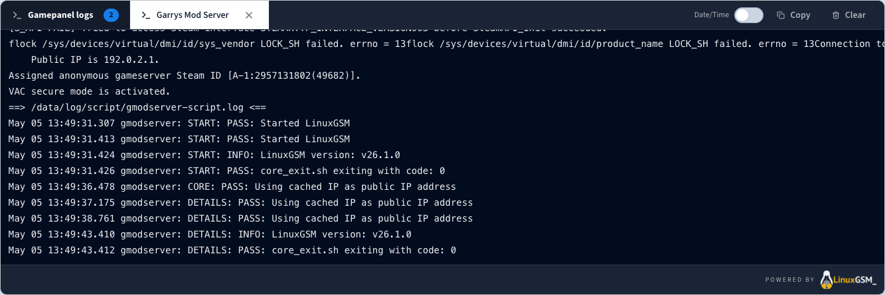
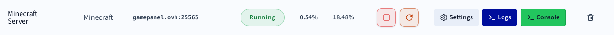
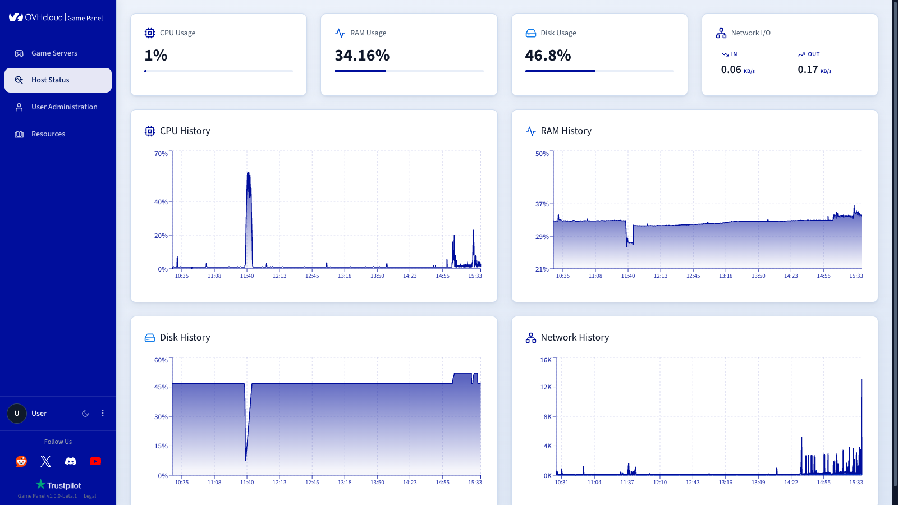

## Objective

The OVHcloud Game Panel lets you deploy and manage game servers for a wide range of popular titles. With its streamlined interface and automated tools, you can launch instances, customise configurations, and monitor performance.

Why choose the OVHcloud Game Panel:

- **Easy to use**: Designed for both beginners and experienced users.
- **Automated deployment**: Set up and maintain servers quickly.
- **Multi-game support**: Run several game servers on a single VPS.
- **Resource visibility**: Keep full control over system performance.

With OVHcloud infrastructure, hosting game servers becomes straightforward and reliable. Whether you're running sessions on Rust, ARK, Minecraft, Counter-Strike, or other titles, this guide gives you the foundation to start and manage your servers efficiently.

**This guide takes you through the first steps of using the OVHcloud Game Panel.**

## Requirements

- A [VPS](/links/bare-metal/vps) in your OVHcloud account with the Game Panel feature enabled.

<!-- CP-NAV-START:baremetal-vps -->
---

### OVHcloud Control Panel Access

- **Direct link:** [VPS management](/links/control-panel/baremetal-vps)
- **Navigation path:** `Bare Metal Cloud`{.action} > `Virtual private servers`{.action} > Select your VPS

---
<!-- CP-NAV-END:baremetal-vps -->

## Instructions

### Step 1 — Access the Game Panel

From your [VPS management page](/links/control-panel/baremetal-vps), locate the game management feature linked to your server and click `Open Panel`{.action} to access the Game Panel interface.

{.thumbnail}

### Step 2 — Deploy your first game server

From the Game Servers dashboard, select the option to add a new instance.

{.thumbnail}

Choose the game you want to host from the available list (40+ games) and click `Install`{.action}. The configuration may vary depending on the game.

- Assign a name to your server.
- Set up ports if needed.
- Launch the deployment process.

The panel automatically downloads and configures all required files. You can follow the installation progress directly from the log tab.

{.thumbnail}

### Step 3 — Manage your server

Once deployed, the panel provides the following controls for your game server:

- **Start/Stop/Restart** the server.
- **Edit** the server name.
- **Copy the IP** address.
- **View resource consumption** (CPU, RAM).
- **Access logs and console**.
- **Delete** the server.

{.thumbnail}

### Step 4 — Configure game settings

Depending on the game, you can configure options by clicking the `Settings`{.action} button. The following features are available:

- **Configure game**: Adjust game-specific parameters that impact gameplay.
- **File manager**: Browse and edit server files.
- **Backups**: Set up automated backups for your game server.
- **SFTP**: Configure SFTP access for file transfers.
- **SSH terminal**: Access a full shell inside the server container.

> [!warning]
>
> The SSH terminal gives full shell access inside the server container. Misuse can break the game server, delete files, or expose sensitive data. Use with caution.

{.thumbnail}

### Step 5 — Monitor performance

The monitoring section shows your game server's health:

- Monitor **CPU and RAM** usage.
- Check **overall server health**.

{.thumbnail}

### Step 6 — Manage users

The user management feature controls and customises access to your game servers. For full details, refer to our guide on [Managing users on the Game Panel](/pages/bare_metal_cloud/virtual_private_servers/game-panel-manage-users).

Through this interface, you can create and manage user accounts, enable or disable access, and assign credentials. Each user can then be granted specific permissions, both at a global level and on a per-server basis.

**Global-level permissions:**

- Managing other users.
- Installing servers.

**Server-level permissions:**

Predefined roles (viewer, operator, or full access) or custom permissions, including:

- Accessing the server console.
- Starting, stopping, or restarting the server.
- Managing game updates.
- Reading and editing files.
- Handling backups (create, download, delete).
- Accessing logs.
- Using SFTP or SSH.

This ensures each administrator accesses only the features they need, improving security and operational efficiency. It is especially useful for teams managing multiple servers or collaborating on game hosting projects.

{.thumbnail}

## Go further

- [Getting started with a VPS](/pages/bare_metal_cloud/virtual_private_servers/starting_with_a_vps)
- [Securing a VPS](/pages/bare_metal_cloud/virtual_private_servers/secure_your_vps)

Join our [community of users](/links/community).