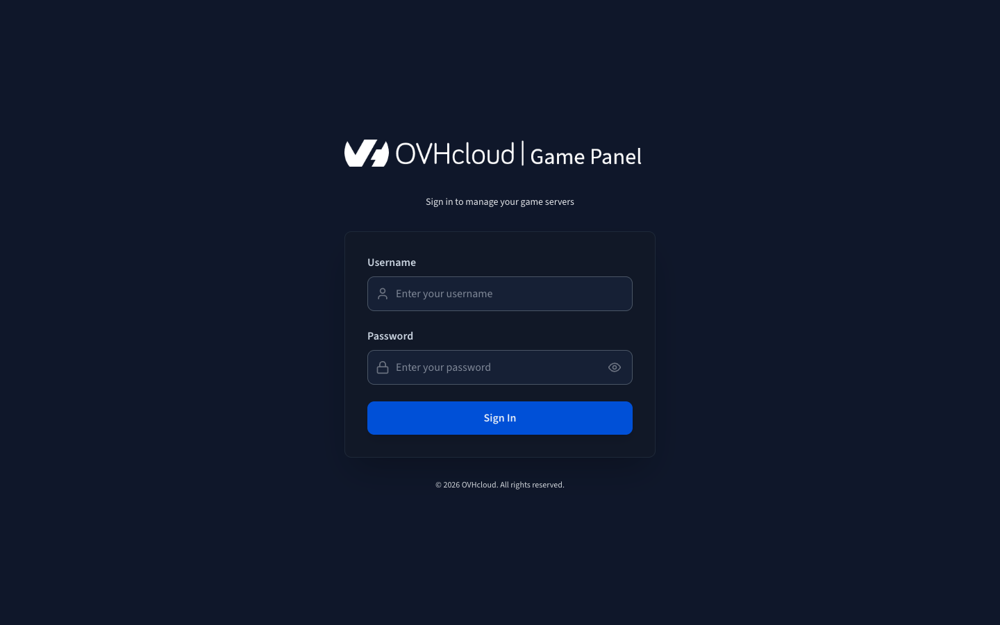
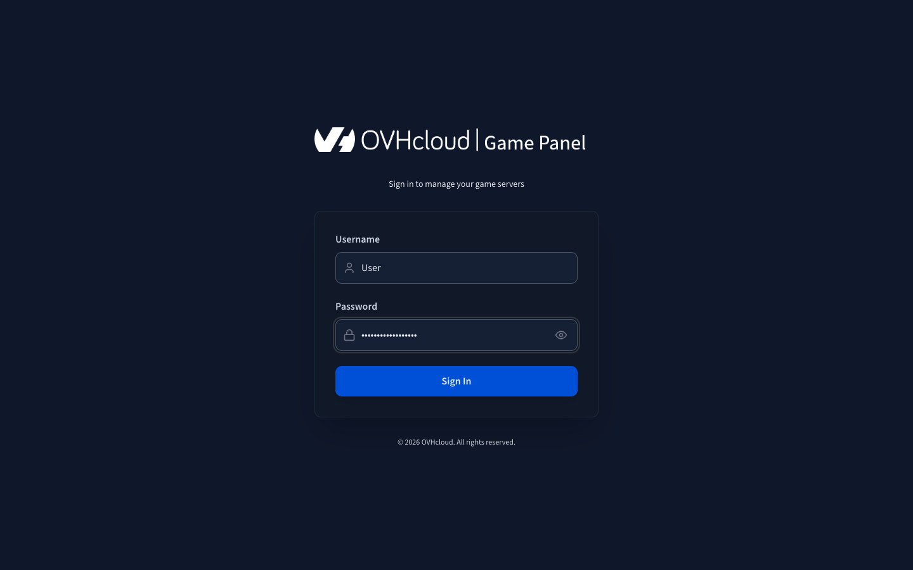

## Objective

The OVHcloud Game Panel provides a dedicated interface for managing your game servers. To use it, you need to log in with your credentials.

**This guide explains how to log in to the OVHcloud Game Panel and how to recover a lost password.**

## Requirements

- A [VPS](/links/bare-metal/vps) in your OVHcloud account with the Game Panel feature enabled.
- The Game Panel access link provided during installation.

## Instructions

### Step 1 — Access the Game Panel

Go to your Game Panel. The access link depends on the domain you selected during installation.

<!-- SCREENSHOT-STATUS: as-is -->
{.thumbnail}

### Step 2 — Log in

Enter your username and the associated password to log in to the Game Panel.

<!-- SCREENSHOT-STATUS: as-is -->
{.thumbnail}

### Recover a lost password

#### Non-admin accounts

If a password has been lost, ask an administrator to reset it. Refer to our guide on [Managing users on the Game Panel](/pages/bare_metal_cloud/virtual_private_servers/game-panel-manage-users) for details.

#### Super admin account

If the super admin password has been lost, you can reset it by connecting via SSH to the host machine, navigating to the deploy folder of the installation, and running the following command:

```bash
sudo bash tools/reset-admin-password.sh
```

Expected output:

```console
New admin password: XXXXXXXXXX
Confirm new admin password: XXXXXXXXXX
[INFO] Updating the root user password in the database...
[INFO] Rotating JWT secret...
[INFO] Recreating the backend to invalidate existing sessions...
[INFO] Admin password reset complete for user: admin
```

Reconnect to the application with the new admin password.

> [!warning]
>
> This operation disconnects all currently connected users.

## Go further

To get started with the Game Panel, refer to our guide on [Getting started with the Game Panel](/pages/bare_metal_cloud/virtual_private_servers/game-panel-getting-started).

Join our [community of users](/links/community).