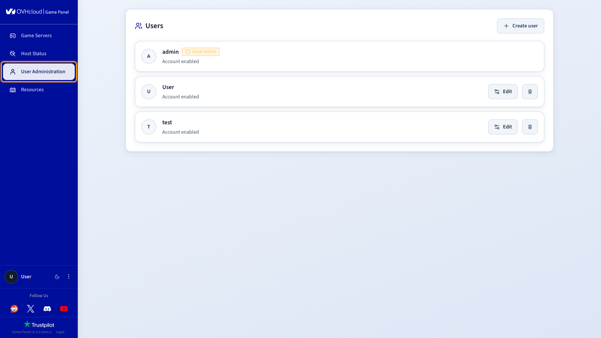
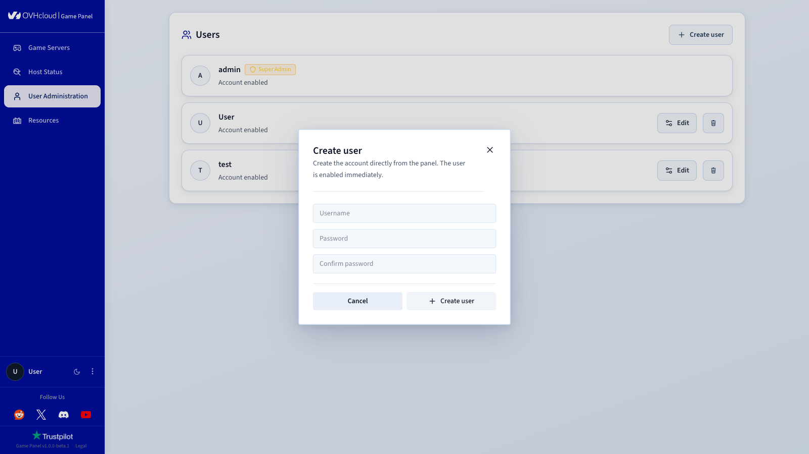
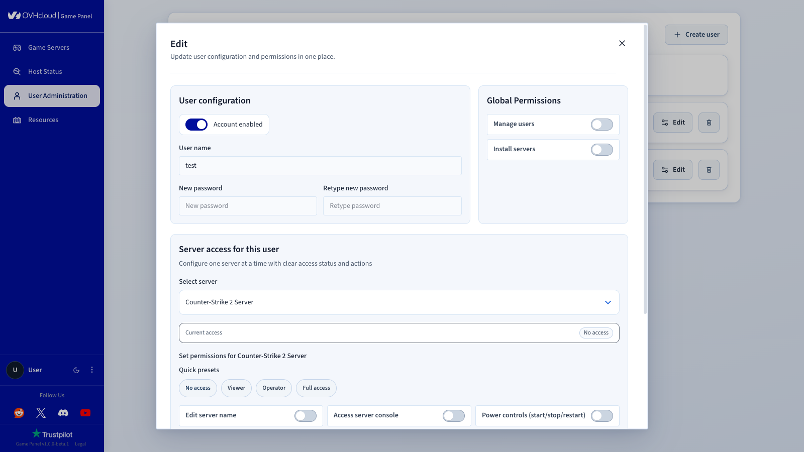

## Objectif

Le Game Panel OVHcloud permet de créer et gérer des comptes utilisateurs avec des permissions granulaires. Vous pouvez contrôler les accès au niveau global ou par serveur, en attribuant des rôles prédéfinis ou des permissions personnalisées.

**Ce guide vous explique comment gérer les utilisateurs sur le Game Panel OVHcloud.**

## Prérequis

- Un [VPS](/links/bare-metal/vps) dans votre compte OVHcloud avec la fonctionnalité Game Panel activée.
- Un accès administrateur au Game Panel. Consultez le guide [Se connecter au Game Panel](/pages/bare_metal_cloud/virtual_private_servers/game-panel-log-in).

## En pratique

### Étape 1 — Accéder à l'administration des utilisateurs

Cliquez sur `User Administration`{.action} dans le menu de gauche du Game Panel.

{.thumbnail}

La liste des utilisateurs existants s'affiche. Utilisez `Edit`{.action} ou `Delete`{.action} pour modifier ou supprimer un utilisateur.

### Étape 2 — Créer un nouvel utilisateur

Cliquez sur `+ Create user`{.action} en haut à droite.

Remplissez les champs suivants :

- **User name** : le nom d'utilisateur (par exemple, `Florian`).
- **New password** : un mot de passe sécurisé.
- **Retype new password** : confirmez le mot de passe.

{.thumbnail}

### Étape 3 — Configurer les permissions par serveur

Sous **Server access for this user**, choisissez un serveur dans la liste déroulante.

#### Définir un niveau d'accès

Des préréglages rapides sont disponibles :

| Préréglage | Description |
|--------|-------------|
| **No access** | Aucune permission. |
| **Viewer** | Accès en lecture seule. |
| **Operator** | Accès limité. |
| **Full access** | Contrôle total (recommandé pour les administrateurs). |

{.thumbnail}

#### Personnaliser les permissions

Cochez les cases correspondant aux actions spécifiques :

- **Edit server name** : modifier le nom du serveur.
- **Access server console** : accéder à la console du serveur.
- **Power controls (start/stop/restart)** : démarrer, arrêter ou redémarrer le serveur.
- **Manage game update settings** : gérer les mises à jour du jeu.
- **Read server logs** : consulter les logs du serveur.
- **Delete server** : supprimer le serveur.
- **Read files** / **Write files** : lire et écrire les fichiers du serveur.
- **Download backups** : télécharger les archives de sauvegarde.
- **Create backups** : créer de nouvelles sauvegardes.
- **Edit backup settings** : modifier la configuration des sauvegardes.
- **Delete backups** : supprimer les archives de sauvegarde.
- **Manage SFTP** : configurer l'accès SFTP.
- **Use SSH terminal** : accéder au terminal SSH.

### Étape 4 — Enregistrer les modifications

Cliquez sur `Save`{.action} ou `Apply`{.action} pour confirmer.

### Supprimer un utilisateur

Cliquez sur `Delete`{.action} à côté de l'utilisateur à supprimer, puis confirmez la suppression.

## Aller plus loin

- [Premiers pas avec le Game Panel](/pages/bare_metal_cloud/virtual_private_servers/game-panel-getting-started)

Échangez avec notre [communauté d'utilisateurs](/links/community).
