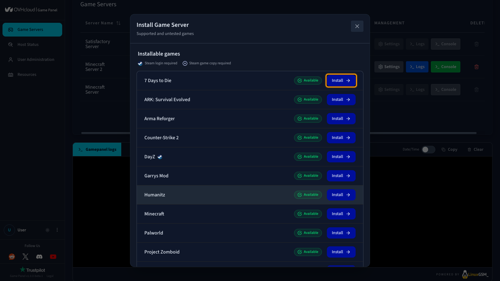
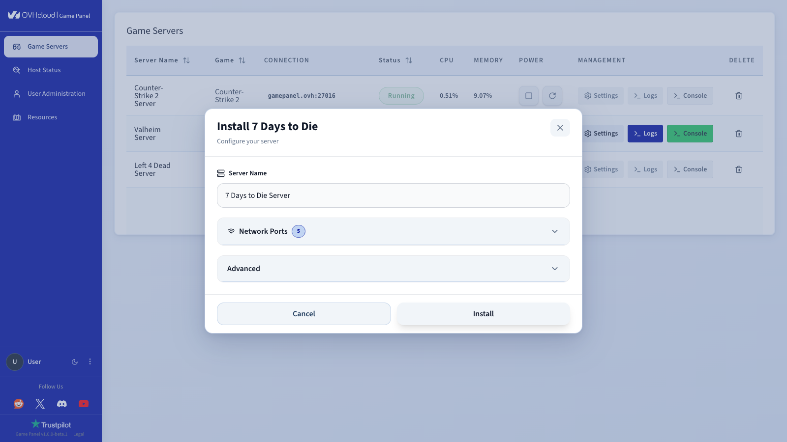
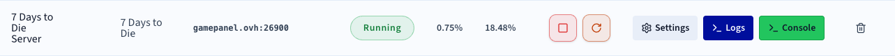
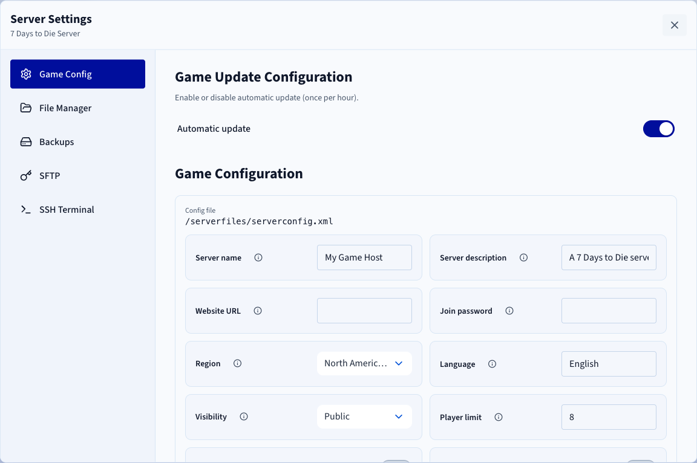

## Objective

The Game Panel lets you deploy a 7 Days to Die server with automated installation and port configuration.

**This guide explains how to deploy and connect to a 7 Days to Die server on the Game Panel.**

## Requirements

- A [VPS](/links/bare-metal/vps) in your OVHcloud account with the Game Panel feature enabled.
- Access to the Game Panel. Refer to [Log in to the Game Panel](/pages/bare_metal_cloud/virtual_private_servers/game-panel-log-in).

## Instructions

### Step 1 — Access the Game Panel

Log in to your Game Panel. Go to the **Game Servers** section in the left-hand menu.

{.thumbnail}

### Step 2 — Create a 7 Days to Die server

Click `Add Game Server`{.action} and select **7 Days to Die** from the list.

{.thumbnail}

Configure the installation:

- `Server Name`: Give your server a name (e.g., `7 Days to Die Server`).
- `Network Ports`: Leave the default ports or add more if needed in the advanced section.

{.thumbnail}

### Step 3 — Launch the installation

Click `Install`{.action}. The deployment starts automatically. Wait a few minutes while the image downloads and the server installs.

Then click `Launch`{.action} to start the server.

### Step 4 — Verify the server is running

Check that the server status displays **Running** and that CPU/RAM activity is visible.

{.thumbnail}

Available actions:

- `Console`{.action}: Open the console to monitor startup.
- `Logs`{.action}: Check logs if there are any issues.
- `Settings`{.action} > `Game Config`{.action}: Access game settings.

{.thumbnail}

### Step 5 — Connect to the server

In the `Connection`{.action} column, you will find the IP address and port (e.g., `xxx.xxx.xxx.xxx:26900`).

In 7 Days to Die:

1. Open the console (`~`).
2. Type:

    ```console
    connect IP:PORT
    ```

### Best practices

- Configure permissions via `User Administration`{.action}.
- Perform regular backups.
- Customise your game settings.

> [!primary]
>
> To go further, add mods or competitive configurations, adjust tickrate and performance settings, or restrict access with a password or whitelist.

## Go further

- [Getting started with the Game Panel](/pages/bare_metal_cloud/virtual_private_servers/game-panel-getting-started)
- [Manage users on the Game Panel](/pages/bare_metal_cloud/virtual_private_servers/game-panel-manage-users)

Join our [community of users](/links/community).