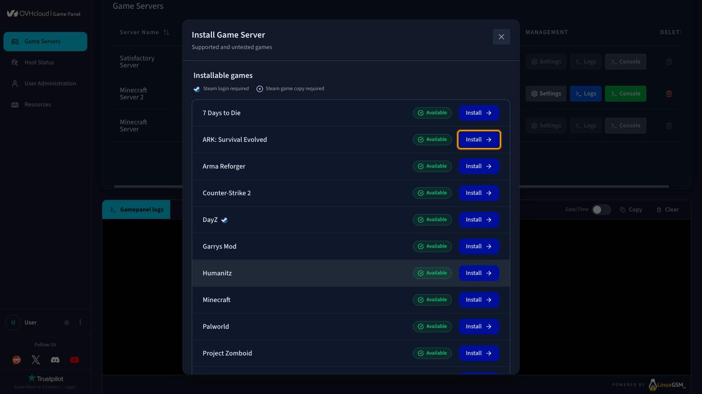
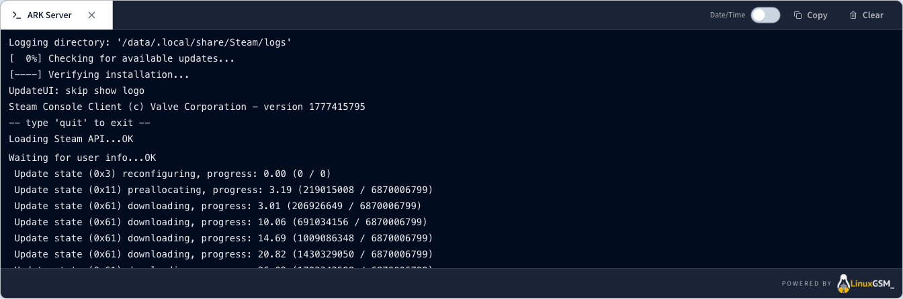
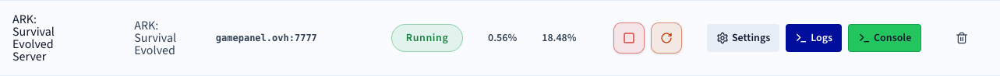
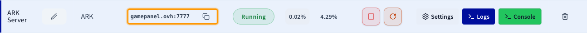

## Objectif

Le Game Panel OVHcloud vous permet de déployer un serveur ARK: Survival Evolved en quelques étapes. Le Game Panel gère automatiquement l'installation, y compris la configuration des ports.

**Ce guide vous explique comment déployer un serveur ARK: Survival Evolved sur le Game Panel OVHcloud et vous y connecter.**

## Prérequis

- Un [VPS](/links/bare-metal/vps) dans votre compte OVHcloud avec la fonctionnalité Game Panel activée.
- Un accès au Game Panel. Consultez le guide [Se connecter au Game Panel](/pages/bare_metal_cloud/virtual_private_servers/game-panel-log-in).

## En pratique

### Étape 1 — Accéder au Game Panel

Connectez-vous à votre Game Panel OVHcloud.

### Étape 2 — Créer une nouvelle instance de serveur

Cliquez sur `Add Game Server`{.action} et sélectionnez **ARK: Survival Evolved**.

{.thumbnail}

> [!primary]
>
> S'il s'agit de votre premier serveur ARK sur le Game Panel et que le port de jeu par défaut est disponible, tous les ports requis seront configurés automatiquement lors de l'installation. Aucune configuration manuelle n'est nécessaire dans ce cas.

### Étape 3 — Suivre la progression de l'installation

Une fois l'installation lancée, un écran de confirmation apparaît. Cliquez sur `Open Logs`{.action} pour suivre la progression de l'installation en temps réel.

Pendant l'installation du serveur, le statut affiche **Installing**. Suivez la progression détaillée directement dans le panneau des logs.

{.thumbnail}

### Étape 4 — Confirmer la fin de l'installation

Une fois l'installation terminée, le statut du serveur passe à **Running**.

{.thumbnail}

### Étape 5 — Récupérer les informations de connexion

Lorsque le statut de votre serveur est **Running**, copiez les informations de connexion depuis le Game Panel.

{.thumbnail}

### Étape 6 — Rejoindre votre serveur dans ARK

1. Lancez **ARK: Survival Evolved**.
2. Allez dans **Join Game**.
3. Utilisez l'une des méthodes suivantes :

    - **Direct Connect** : collez `gamepanel.ovh:PORT`.
    - Ou recherchez le nom de votre serveur dans la liste.

## Aller plus loin

- [Premiers pas avec le Game Panel](/pages/bare_metal_cloud/virtual_private_servers/game-panel-getting-started)
- [Gérer les utilisateurs sur le Game Panel](/pages/bare_metal_cloud/virtual_private_servers/game-panel-manage-users)
- [Créer une sauvegarde sur le Game Panel](/pages/bare_metal_cloud/virtual_private_servers/game-panel-create-backup)

Échangez avec notre [communauté d'utilisateurs](/links/community).
