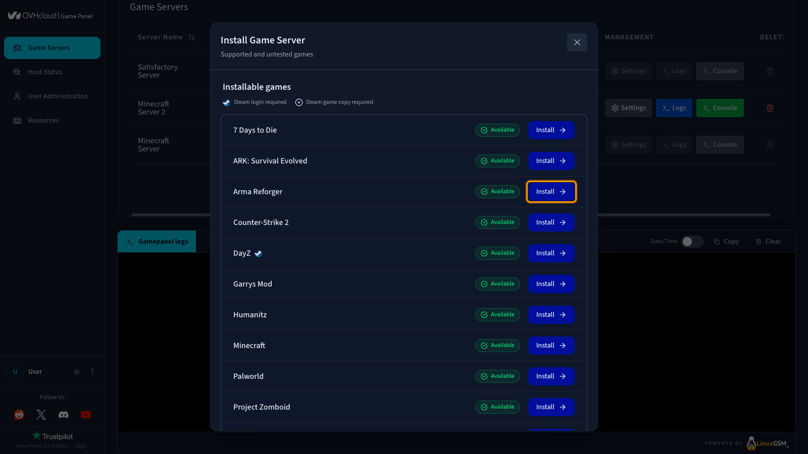
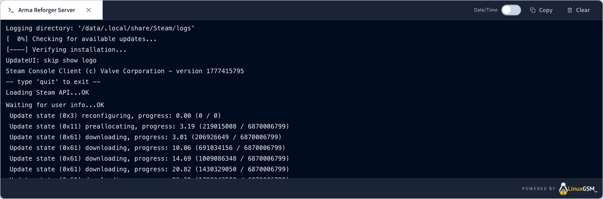
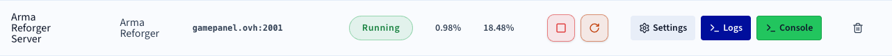

## Objectif

Le Game Panel vous permet de déployer un serveur Arma Reforger en quelques étapes. Le Game Panel gère l'installation automatiquement, y compris la configuration des ports.

**Ce guide vous explique comment déployer un serveur Arma Reforger sur le Game Panel et vous y connecter.**

## Prérequis

- Un [VPS](/links/bare-metal/vps) sur votre compte OVHcloud avec la fonctionnalité Game Panel activée.
- Un accès au Game Panel. Consultez le guide [Se connecter au Game Panel](/pages/bare_metal_cloud/virtual_private_servers/game-panel-log-in).

## En pratique

### Étape 1 — Accéder au Game Panel

Connectez-vous à votre Game Panel.

### Étape 2 — Créer une nouvelle instance de serveur

Cliquez sur `Add Game Server`{.action} et sélectionnez **Arma Reforger**.

{.thumbnail}

> [!primary]
>
> S'il s'agit de votre premier serveur Arma Reforger sur le Game Panel et que le Game Port par défaut est disponible, tous les ports requis seront configurés automatiquement lors de l'installation. Aucune configuration manuelle n'est nécessaire dans ce cas.

### Étape 3 — Suivre la progression de l'installation

Une fois l'installation lancée, un écran de confirmation apparaît. Cliquez sur `Open Logs`{.action} pour suivre la progression de l'installation en temps réel.

{.thumbnail}

Pendant l'installation du serveur, le statut affiche **Installing**. Suivez la progression détaillée directement dans le panneau de logs.

{.thumbnail}

### Étape 4 — Confirmer la fin de l'installation

Une fois l'installation terminée, le statut du serveur passe à **Running**.

### Étape 5 — Récupérer les informations de connexion

Une fois que votre serveur est au statut **Running**, copiez les informations de connexion depuis le Game Panel.

{.thumbnail}

### Étape 6 — Rejoindre votre serveur dans Arma Reforger

1. Ouvrez **Arma Reforger** et accédez au menu principal.
2. Cliquez sur `Multiplayer`{.action}.
3. Sélectionnez `Direct Join`{.action} ou appuyez sur `v`.
4. Saisissez l'adresse IP et le port, puis cliquez sur `Join`{.action}.

## Aller plus loin

- [Premiers pas avec le Game Panel](/pages/bare_metal_cloud/virtual_private_servers/game-panel-getting-started)
- [Gérer les utilisateurs sur le Game Panel](/pages/bare_metal_cloud/virtual_private_servers/game-panel-manage-users)
- [Créer une sauvegarde sur le Game Panel](/pages/bare_metal_cloud/virtual_private_servers/game-panel-create-backup)

Échangez avec notre [communauté d'utilisateurs](/links/community).