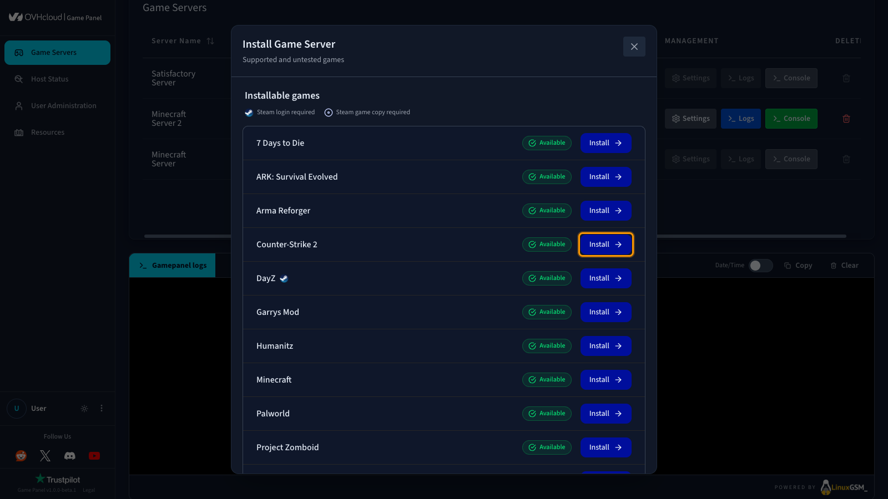
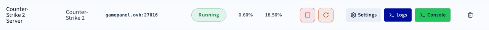

## Objectif

Le Game Panel OVHcloud vous permet de déployer un serveur Counter-Strike 2 (CS2) avec une installation et une configuration des ports automatisées.

**Ce guide vous explique comment déployer un serveur Counter-Strike 2 sur le Game Panel OVHcloud et vous y connecter.**

## Prérequis

- Un [VPS](/links/bare-metal/vps) sur votre compte OVHcloud avec la fonctionnalité Game Panel activée.
- Un accès au Game Panel. Consultez le guide [Se connecter au Game Panel](/pages/bare_metal_cloud/virtual_private_servers/game-panel-log-in).

## En pratique

### Étape 1 — Accéder au Game Panel

Connectez-vous à votre Game Panel OVHcloud. Rendez-vous dans la section **Game Servers** du menu de gauche.

### Étape 2 — Créer un serveur CS2

Cliquez sur `Add Game Server`{.action} et sélectionnez **Counter-Strike 2** dans la liste.

{.thumbnail}

Configurez l'installation :

- `Server Name` : donnez un nom à votre serveur (par exemple `CS2 Competitive Server`).
- `Network Ports` : laissez les ports par défaut ou ajoutez-en si nécessaire dans la section avancée. CS2 utilise généralement des ports proches de `27015`.

### Étape 3 — Lancer l'installation

Cliquez sur `Install`{.action}. Le déploiement démarre. Patientez le temps du téléchargement et de l'installation du serveur.

Cliquez sur `Launch`{.action} pour démarrer le serveur.

### Étape 4 — Vérifier que le serveur fonctionne

Vérifiez que le statut du serveur affiche **Running** et qu'une activité CPU/RAM est visible.

Actions disponibles :

- `Console`{.action} : ouvrez la console pour suivre le démarrage.
- `Logs`{.action} : consultez les logs en cas de problème.
- `Settings`{.action} > `Game Config`{.action} : accédez aux paramètres du jeu.

{.thumbnail}

### Étape 5 — Se connecter au serveur

Dans la colonne `Connection`{.action}, vous trouverez l'adresse IP et le port (par exemple `xxx.xxx.xxx.xxx:27015`).

Dans Counter-Strike 2 :

1. Ouvrez la console (`~`).
2. Saisissez :

    ```console
    connect IP:PORT
    ```

### Bonnes pratiques

- Configurez les permissions via `User Administration`{.action}.
- Effectuez des sauvegardes régulières.
- Personnalisez les paramètres de votre jeu.

> [!primary]
>
> Pour aller plus loin, ajoutez des mods ou des configurations compétitives, ajustez le tickrate et les paramètres de performance, ou restreignez l'accès avec un mot de passe ou une whitelist.

## Aller plus loin

- [Premiers pas avec le Game Panel](/pages/bare_metal_cloud/virtual_private_servers/game-panel-getting-started)
- [Gérer les utilisateurs sur le Game Panel](/pages/bare_metal_cloud/virtual_private_servers/game-panel-manage-users)

Échangez avec notre [communauté d'utilisateurs](/links/community).