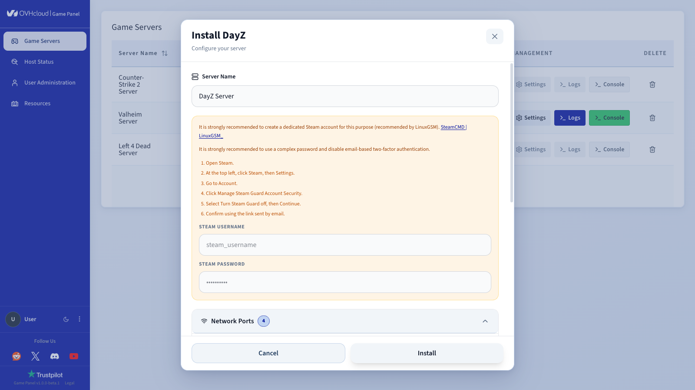
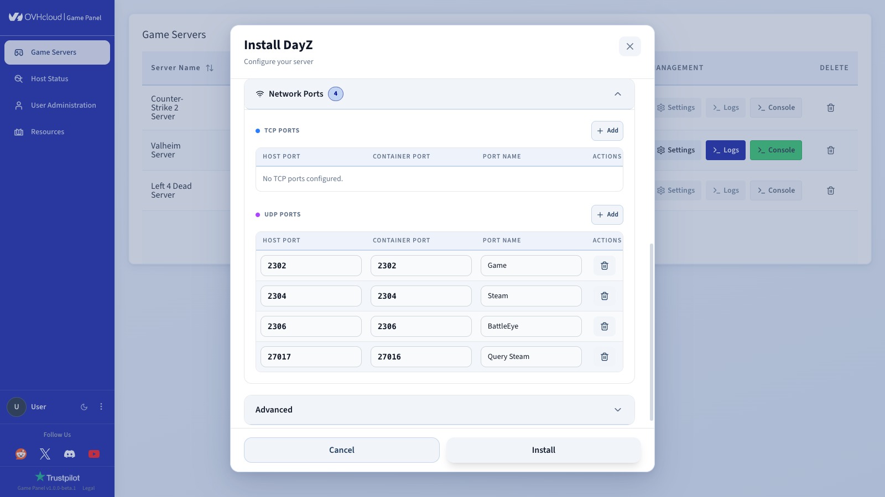
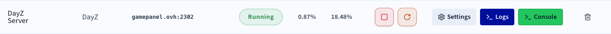
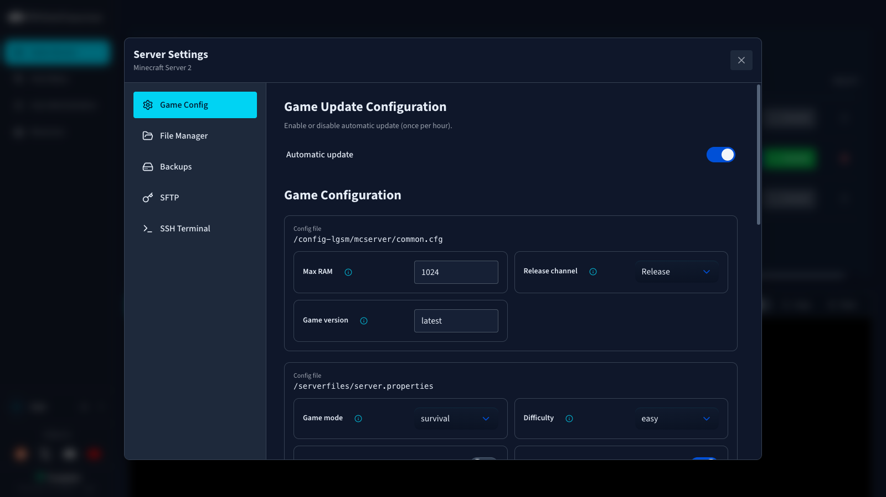
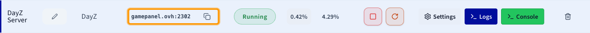

## Objective

The OVHcloud Game Panel allows you to deploy a DayZ server in a few steps. The panel handles the installation automatically, including Steam authentication and network port configuration.

**This guide explains how to deploy and connect to a DayZ server on the OVHcloud Game Panel.**

## Requirements

- A [VPS](/links/bare-metal/vps) in your OVHcloud account with the Game Panel feature enabled.
- Access to the Game Panel. Refer to our guide on [Log in to the Game Panel](/pages/bare_metal_cloud/virtual_private_servers/game-panel-log-in).
- A Steam account to authenticate the DayZ server installation.

## Instructions

### Step 1 — Access the Game Panel

Log in to your OVHcloud Game Panel.

From the left-hand menu, go to the `Game Servers`{.action} section and click `Add Game Server`{.action}.

<!-- DRAFT: To screenshot — Game Servers section with Add Game Server button -->
{.thumbnail}

Select **DayZ** from the game list. A configuration window opens.

### Step 2 — Configure your server

In the configuration window:

- Enter a **Server Name**.
- Enter your **Steam Username** and **Steam Password**.

> [!warning]
>
> It is strongly recommended to use a dedicated Steam account for this purpose, not your personal one. Use a complex password and disable email-based two-factor authentication (Steam Guard) on that account before proceeding.

<!-- DRAFT: To screenshot — DayZ installation form with Server Name and Steam credentials fields -->
{.thumbnail}

### Step 3 — Configure the network ports

The following UDP ports are pre-configured in the installation form:

| Port | Purpose |
|------|---------|
| 2382 | Game |
| 2384 | Steam |
| 2386 | BattlEye |
| 27616 | Query Steam |

> [!primary]
>
> If this is your first DayZ server on the Game Panel and the default ports are available, no manual changes are needed.

<!-- DRAFT: To screenshot — Network Ports section showing pre-filled UDP ports -->
{.thumbnail}

### Step 4 — Launch the installation

Click `Install`{.action}. The deployment starts automatically. The panel will:

1. Download the DayZ server image.
2. Install the server files.

Once installation is complete, click `Launch`{.action} to start your server.

<!-- DRAFT: To screenshot — Installation progress screen -->
{.thumbnail}

### Step 5 — Verify the server is running

Once started, confirm the server status is **Running**. CPU and RAM activity should be visible in the panel.

The following controls are available:

- `Console`{.action} — monitor server startup and activity in real time.
- `Logs`{.action} — check logs if there are any issues.
- `Settings`{.action} — access game configuration options.

<!-- DRAFT: To screenshot — Server row with Running status and Console/Logs/Settings buttons -->
{.thumbnail}

### Step 6 — Configure game settings (optional)

Click `Settings`{.action} on your server, then open `Game Config`{.action} to adjust in-panel options such as automatic updates.

For advanced configuration, use the **File Manager** to edit the DayZ server configuration file directly.

<!-- DRAFT: To screenshot — Settings panel showing Game Config and File Manager tabs -->
{.thumbnail}

### Step 7 — Connect to your server

In the **Connection** column of the Game Servers list, copy your server's IP address and port.

To join from the DayZ client:

1. Launch **DayZ**.
2. Go to **Servers** and click **Direct Connect** at the bottom.
3. Enter your IP address and port (e.g., `192.168.1.1:2302`).
4. Click **Connect**.

<!-- DRAFT: To screenshot — Connection column showing IP address and port -->
{.thumbnail}

## Go further

See our guide on [Getting started with the Game Panel](/pages/bare_metal_cloud/virtual_private_servers/game-panel-getting-started).

See our guide on [Managing users on the Game Panel](/pages/bare_metal_cloud/virtual_private_servers/game-panel-manage-users).

See our guide on [Creating a backup on the Game Panel](/pages/bare_metal_cloud/virtual_private_servers/game-panel-create-backup).

Join our [community of users](/links/community).
