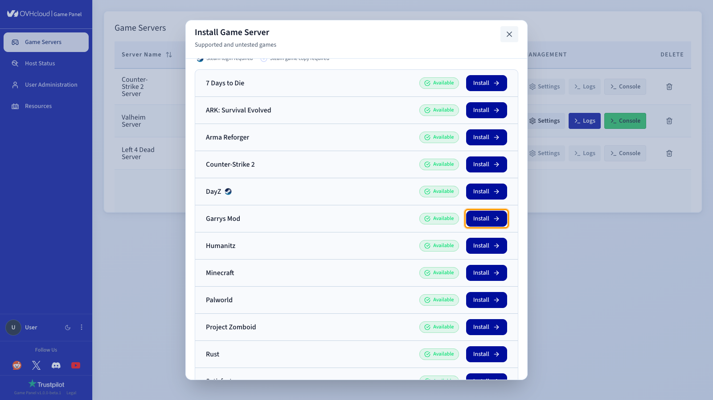
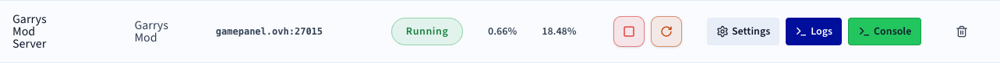
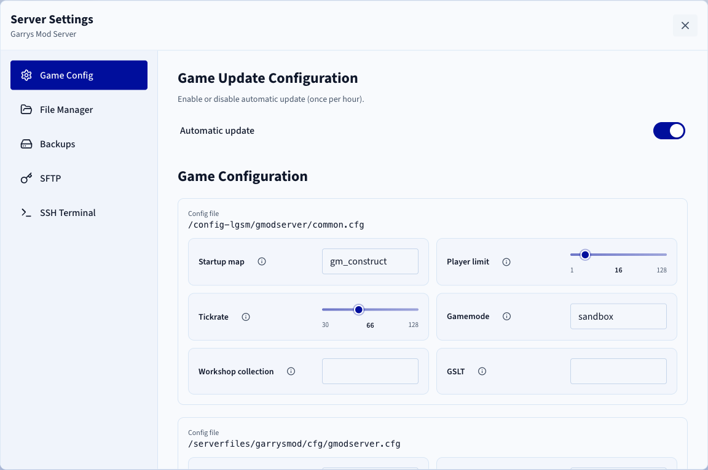

## Objectif

Le Game Panel vous permet de déployer un serveur Garry's Mod avec une installation et une configuration des ports automatisées.

**Ce guide vous explique comment déployer un serveur Garry's Mod sur le Game Panel et vous y connecter.**

## Prérequis

- Un [VPS](/links/bare-metal/vps) sur votre compte OVHcloud avec la fonctionnalité Game Panel activée.
- Un accès au Game Panel. Consultez le guide [Se connecter au Game Panel](/pages/bare_metal_cloud/virtual_private_servers/game-panel-log-in).

## En pratique

### Étape 1 — Accéder au Game Panel

Connectez-vous à votre Game Panel. Rendez-vous dans la section `Game Servers`{.action} du menu de gauche.

{.thumbnail}

### Étape 2 — Créer un serveur Garry's Mod

Cliquez sur `Add Game Server`{.action} et sélectionnez **Garrys Mod** dans la liste.

{.thumbnail}

Configurez l'installation :

- `Server Name`{.action} : donnez un nom à votre serveur (par exemple `Garrys Mod Server`).
- `Network Ports`{.action} : laissez les ports par défaut ou ajoutez-en si nécessaire dans la section avancée. Garry's Mod utilise généralement des ports proches de `27015`.

### Étape 3 — Lancer l'installation

Cliquez sur `Install`{.action}. Le déploiement démarre automatiquement. Patientez quelques minutes pendant le téléchargement de l'image et l'installation du serveur.

Cliquez sur `Launch`{.action} pour démarrer le serveur.

### Étape 4 — Vérifier que le serveur fonctionne

Vérifiez que le statut du serveur affiche **Running** et qu'une activité CPU/RAM est visible.

{.thumbnail}

Actions disponibles :

- `Console`{.action} : ouvrez la console pour suivre le démarrage.
- `Logs`{.action} : consultez les logs en cas de problème.
- `Settings`{.action} > `Game Config`{.action} : accédez aux paramètres du jeu (carte de démarrage, tickrate, gamemode, limite de joueurs, mot de passe RCON, collection Workshop, GSLT).

{.thumbnail}

### Étape 5 — Se connecter au serveur

Dans la colonne `Connection`{.action}, vous trouverez l'adresse IP et le port (par exemple `xxx.xxx.xxx.xxx:27015`).

Dans Garry's Mod :

1. Ouvrez la console (`~`).
2. Saisissez :

    ```console
    connect IP:PORT
    ```

> [!primary]
>
> Pour aller plus loin, ajoutez des mods ou des collections Workshop, ajustez le tickrate et les paramètres de performance, ou restreignez l'accès avec un mot de passe ou une whitelist.

## Aller plus loin

- [Premiers pas avec le Game Panel](/pages/bare_metal_cloud/virtual_private_servers/game-panel-getting-started)
- [Gérer les utilisateurs sur le Game Panel](/pages/bare_metal_cloud/virtual_private_servers/game-panel-manage-users)

Échangez avec notre [communauté d'utilisateurs](/links/community).