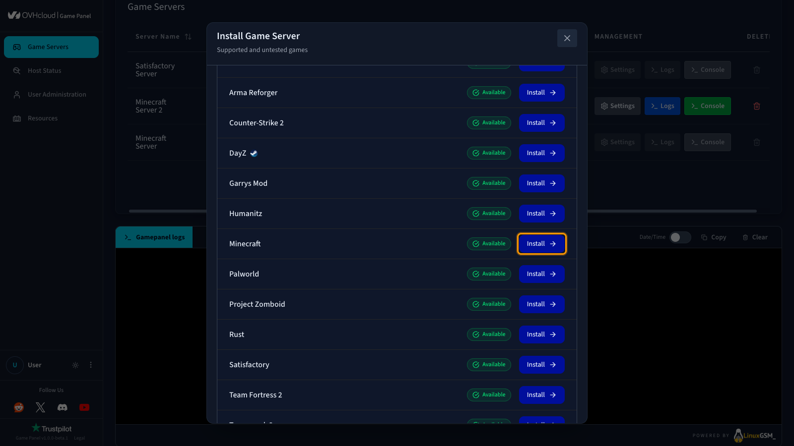
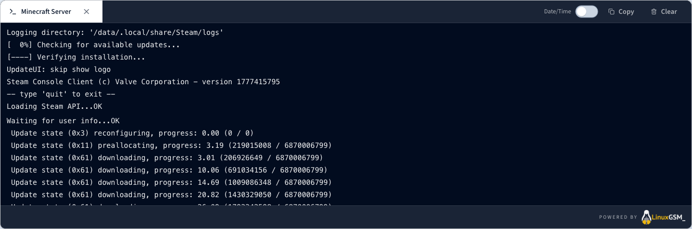

## Objective

The OVHcloud Game Panel lets you deploy a Minecraft server with automated installation and port configuration.

**This guide explains how to deploy and connect to a Minecraft server on the OVHcloud Game Panel.**

## Requirements

- A [VPS](/links/bare-metal/vps) in your OVHcloud account with the Game Panel feature enabled.
- Access to the Game Panel. Refer to [Log in to the Game Panel](/pages/bare_metal_cloud/virtual_private_servers/game-panel-log-in).

## Instructions

### Step 1 — Access the Game Panel

Log in to your OVHcloud Game Panel.

### Step 2 — Create a new server instance

Click `Add Game Server`{.action} and select **Minecraft**.

{.thumbnail}

> [!primary]
>
> If this is your first Minecraft server on the Game Panel and the default Game Port is available, all required ports are configured automatically. No manual setup is needed.

### Step 3 — Monitor installation progress

Once the installation starts, you will see a confirmation screen. Click `Open Logs`{.action} to follow the installation progress in real time.

While the server is installing, the status will display **Installing**. You can track detailed progress directly in the logs panel.

{.thumbnail}

### Step 4 — Confirm installation is complete

Once the installation is finished, the server status will automatically change to **Running**.

{.thumbnail}

### Step 5 — Retrieve connection information

Once your server status is **Running**, copy the connection information from the Game Panel.

### Step 6 — Join your server in Minecraft

1. Open **Minecraft**.
2. Go to **Multiplayer**.
3. Click **Direct Connect** and paste `servX.gamepanel.ovh:PORT`.

## Go further

- [Upload a custom world to your Minecraft server](/pages/bare_metal_cloud/virtual_private_servers/game-panel-upload-minecraft-world)
- [Getting started with the Game Panel](/pages/bare_metal_cloud/virtual_private_servers/game-panel-getting-started)

Join our [community of users](/links/community).