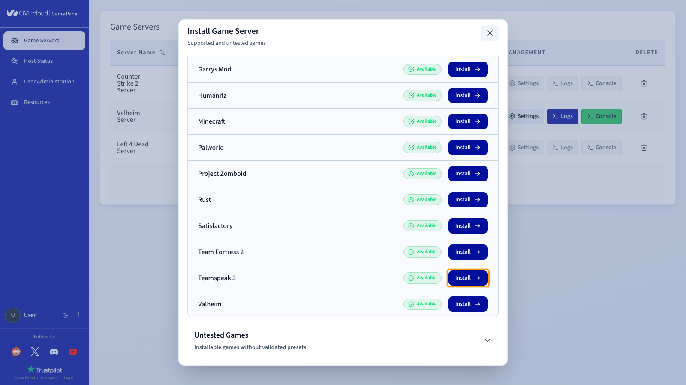
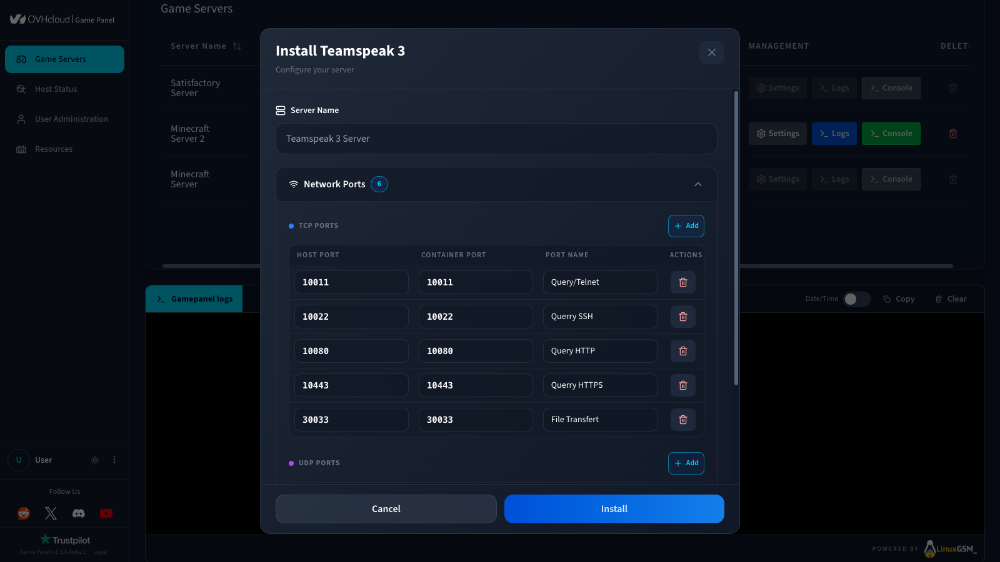
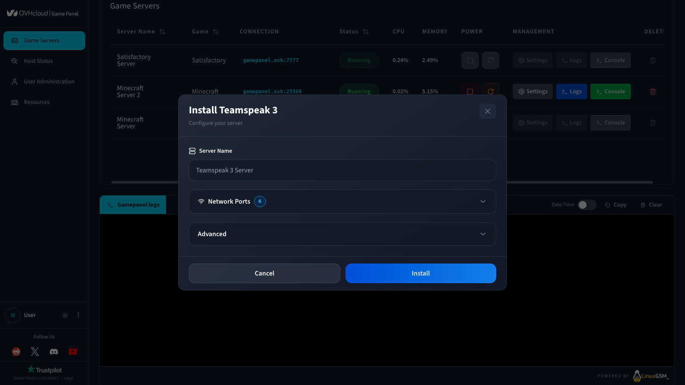
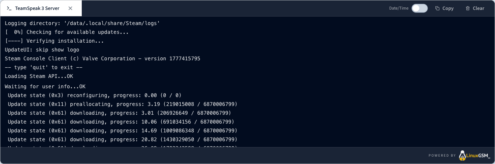
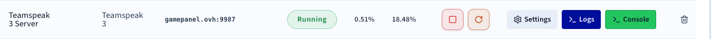

## Objective

The Game Panel lets you deploy and configure a TeamSpeak 3 voice server in a few minutes — no command line or system knowledge required.

**This guide explains how to deploy and connect to a TeamSpeak 3 server on the Game Panel.**

## Requirements

- A [VPS](/links/bare-metal/vps) in your OVHcloud account with the Game Panel feature enabled.
- Access to the Game Panel. Refer to our guide on [Log in to the Game Panel](/pages/bare_metal_cloud/virtual_private_servers/game-panel-log-in).
- A TeamSpeak 3 client installed on your machine to test the connection.

## Instructions

### Step 1 — Access the Game Panel and select TeamSpeak 3

From your Game Panel dashboard, click `Add Game Server`{.action}. In the list of available games, search for and select **TeamSpeak 3**.

<!-- SCREENSHOT-STATUS: as-is -->
{.thumbnail}

<!-- SCREENSHOT-STATUS: as-is -->
{.thumbnail}

### Step 2 — Configure your server

A configuration page opens. Default values are ready to use for an immediate launch, but you can customise them to match your needs.

Among the available settings, you can modify:

- `Server Name`: Give your server an instance name (e.g., `My TS3 server`).
- `Network Ports`: Pre-configured automatically:
    - `9987` (UDP) — voice
    - `10011` (TCP) — ServerQuery
    - `30033` (TCP) — file transfer

<!-- SCREENSHOT-STATUS: as-is -->
{.thumbnail}

> [!primary]
>
> You can modify these settings, but they are not required to launch the server.

### Step 3 — Launch the installation

Once you have reviewed the configuration, click `Install`{.action} to start the deployment.

<!-- SCREENSHOT-STATUS: as-is -->
{.thumbnail}

### Step 4 — Monitor the installation progress

The deployment starts automatically. Let the installation run without closing the page.

Track the process in real time by clicking `Open Logs`{.action} to display the installation messages.

<!-- SCREENSHOT-STATUS: playwright -->

🚧 Image pending

{.thumbnail}

### Step 5 — Verify the server is running

Once installation is complete, confirm that your server displays the **Running** status.

<!-- SCREENSHOT-STATUS: playwright -->

🚧 Image pending

{.thumbnail}

Your server is live. Retrieve the IP address and port from the `Connection`{.action} section to connect from the TeamSpeak 3 client.

### Step 6 — Connect to your server

In the TeamSpeak 3 client:

1. Click `Connections`{.action} > `Connect`{.action}.
2. Enter the address shown in the `Connection`{.action} section (e.g., `release.gamepanel.ovh:9987`).

## Go further

- [Getting started with the Game Panel](/pages/bare_metal_cloud/virtual_private_servers/game-panel-getting-started)
- [Managing users on the Game Panel](/pages/bare_metal_cloud/virtual_private_servers/game-panel-manage-users)

Join our [community of users](/links/community).