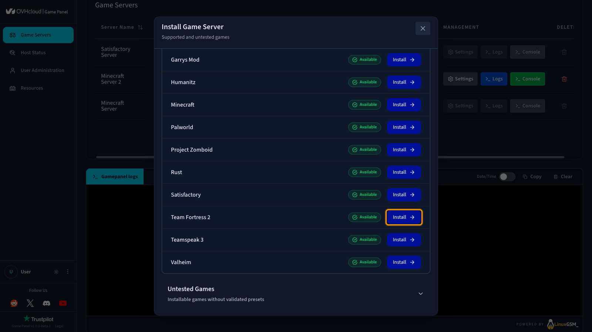
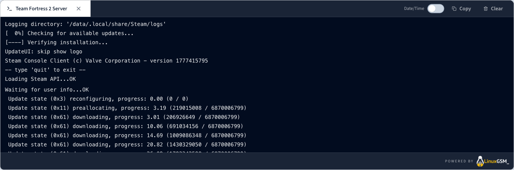
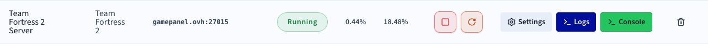

## Objective

The Game Panel lets you deploy a Team Fortress 2 server in a few steps. The panel handles the installation automatically, including port configuration.

**This guide explains how to deploy and connect to a Team Fortress 2 server on the Game Panel.**

## Requirements

- A [VPS](/links/bare-metal/vps) in your OVHcloud account with the Game Panel feature enabled.
- Access to the Game Panel. Refer to our guide on [Log in to the Game Panel](/pages/bare_metal_cloud/virtual_private_servers/game-panel-log-in).

## Instructions

### Step 1 — Access the Game Panel

Log in to your Game Panel.

### Step 2 — Create a new server instance

Click `Add Game Server`{.action} and select **Team Fortress 2**.

<!-- SCREENSHOT-STATUS: as-is -->
{.thumbnail}

> [!primary]
>
> If this is your first Team Fortress 2 server on the Game Panel and the default Game Port is available, all required ports will be automatically configured during installation. No manual setup is needed in this case.

### Step 3 — Monitor installation progress

Once installation starts, a confirmation screen appears. Click `Open Logs`{.action} to follow the installation progress in real time.

<!-- SCREENSHOT-STATUS: playwright -->
{.thumbnail}

While the server is installing, the status displays **Installing**. Track detailed progress directly in the logs panel.

<!-- SCREENSHOT-STATUS: playwright -->
{.thumbnail}

### Step 4 — Confirm installation is complete

Once installation is finished, the server status changes to **Running**.

<!-- SCREENSHOT-STATUS: playwright -->
{.thumbnail}

### Step 5 — Retrieve connection information

Once your server status is **Running**, copy the connection information from the Game Panel.

### Step 6 — Join your server in Team Fortress 2

1. Open **Team Fortress 2**.
2. Go to `Community server`{.action} > `Favorites`{.action}.
3. Click `Add a Server`{.action} and paste `servX.gamepanel.ovh:PORT`.

## Go further

- [Getting started with the Game Panel](/pages/bare_metal_cloud/virtual_private_servers/game-panel-getting-started)
- [Managing users on the Game Panel](/pages/bare_metal_cloud/virtual_private_servers/game-panel-manage-users)

Join our [community of users](/links/community).