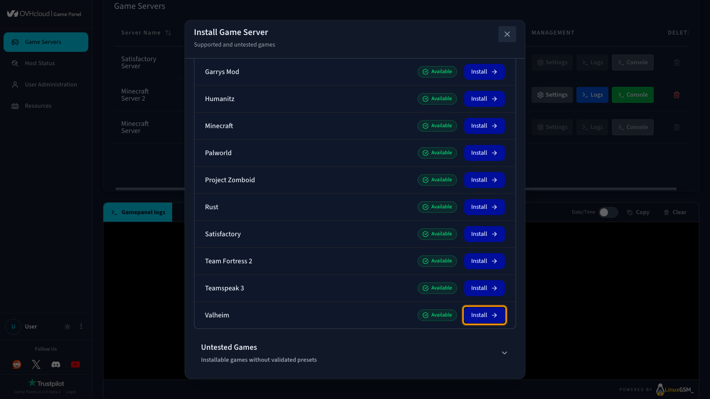
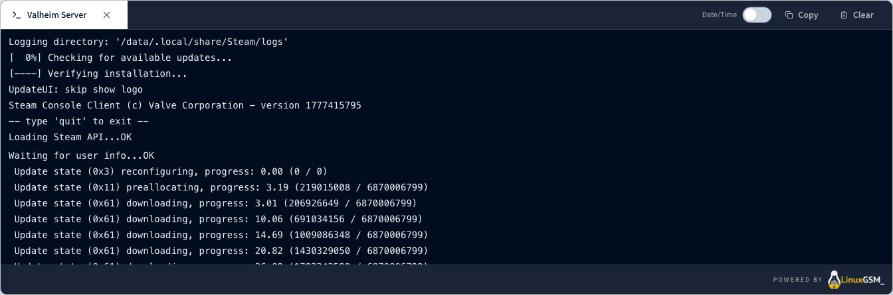
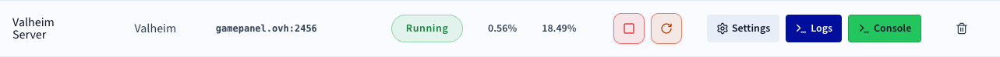

## Objectif

Le Game Panel d'OVHcloud vous permet de déployer un serveur Valheim avec une installation et une configuration des ports automatisées.

**Ce guide vous explique comment déployer un serveur Valheim sur le Game Panel d'OVHcloud et vous y connecter.**

## Prérequis

- Un [VPS](/links/bare-metal/vps) dans votre compte OVHcloud avec la fonctionnalité Game Panel activée.
- L'accès au Game Panel. Consultez le guide [Se connecter au Game Panel](/pages/bare_metal_cloud/virtual_private_servers/game-panel-log-in).

## En pratique

### Étape 1 — Accéder au Game Panel

Connectez-vous à votre Game Panel d'OVHcloud.

### Étape 2 — Créer une nouvelle instance de serveur

Cliquez sur `Add Game Server`{.action} et sélectionnez **Valheim**.

{.thumbnail}

> [!primary]
>
> S'il s'agit de votre premier serveur Valheim sur le Game Panel et que le Game Port par défaut est disponible, tous les ports requis sont configurés automatiquement. Aucune configuration manuelle n'est nécessaire.

### Étape 3 — Suivre la progression de l'installation

Une fois l'installation lancée, un écran de confirmation s'affiche. Cliquez sur `Open Logs`{.action} pour suivre la progression de l'installation en temps réel.

{.thumbnail}

### Étape 4 — Confirmer la fin de l'installation

Une fois l'installation terminée, une notification apparaît : **Server status is now: Running**.

{.thumbnail}

### Étape 5 — Récupérer les informations de connexion

Lorsque le statut de votre serveur est **Running**, copiez les informations de connexion depuis le Game Panel. Valheim utilise deux ports UDP : `2456` (Game) et `2457` (Query).

> [!primary]
>
> Un mot de passe est généré automatiquement lors de l'installation. Ouvrez le `File Manager`{.action} depuis les `Settings`{.action} de votre serveur et consultez `config-lgsm` > `vhserver` > `secrets-common.cfg` pour le récupérer.

### Étape 6 — Rejoindre votre serveur dans Valheim

1. Ouvrez **Valheim**.
2. Cliquez sur `Start`{.action}, puis sur `Join game`{.action}.
3. Cliquez sur `Add server`{.action}.
4. Saisissez l'adresse IP de votre VPS ainsi que le port (par exemple, `serv8.gamepanel.ovh:2456`).
5. Saisissez le mot de passe et cliquez sur `Connect`{.action}.

## Aller plus loin

- [Premiers pas avec le Game Panel](/pages/bare_metal_cloud/virtual_private_servers/game-panel-getting-started)
- [Créer une sauvegarde sur le Game Panel](/pages/bare_metal_cloud/virtual_private_servers/game-panel-create-backup)

Échangez avec notre [communauté d'utilisateurs](/links/community).