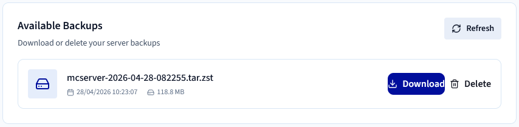
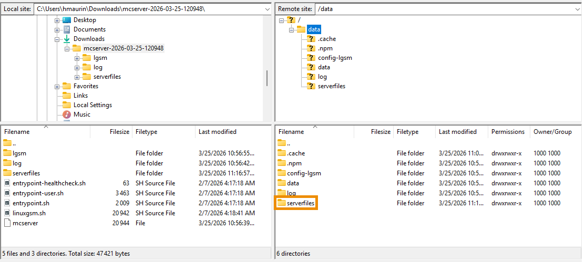

## Objectif

Le Game Panel d'OVHcloud vous permet de restaurer une sauvegarde en téléchargeant une archive, en l'extrayant et en téléversant les fichiers via SFTP.

**Ce guide vous explique comment restaurer une sauvegarde sur votre serveur Game Panel d'OVHcloud.**

## Prérequis

- Un [VPS](/links/bare-metal/vps) dans votre compte OVHcloud avec la fonctionnalité Game Panel activée.
- Une instance de serveur de jeu déployée sur le Game Panel.
- Un client SFTP tel que [FileZilla](https://filezilla-project.org/). Consultez le guide [Activer le SFTP sur le Game Panel](/pages/bare_metal_cloud/virtual_private_servers/game-panel-enable-sftp).
- Une sauvegarde existante. Consultez le guide [Créer une sauvegarde sur le Game Panel](/pages/bare_metal_cloud/virtual_private_servers/game-panel-create-backup).

## En pratique

### Étape 1 — Se connecter au Game Panel

Connectez-vous à votre Game Panel. Si vous avez besoin d'aide, consultez le guide [Se connecter au Game Panel](/pages/bare_metal_cloud/virtual_private_servers/game-panel-log-in).

### Étape 2 — Accéder aux paramètres de sauvegarde

Une fois connecté :

1. Sélectionnez votre serveur de jeu.
2. Cliquez sur `Settings`{.action}.
3. Allez dans l'onglet `Backup`{.action}.

### Étape 3 — Télécharger une sauvegarde

En bas de la page, repérez la liste des sauvegardes disponibles. Cliquez sur `Download`{.action} en regard de la sauvegarde que vous souhaitez restaurer.

Si aucune sauvegarde n'est disponible, vous devez d'abord en créer une. Consultez le guide [Créer une sauvegarde sur le Game Panel](/pages/bare_metal_cloud/virtual_private_servers/game-panel-create-backup).

{.thumbnail}

### Étape 4 — Extraire la sauvegarde

Une fois la sauvegarde téléchargée, extrayez l'archive sur votre ordinateur. Le contenu extrait inclut le répertoire `serverfiles`.

### Étape 5 — Se connecter à votre serveur via SFTP

Connectez-vous à votre serveur de jeu via SFTP. Consultez le guide [Activer le SFTP sur le Game Panel](/pages/bare_metal_cloud/virtual_private_servers/game-panel-enable-sftp) pour les instructions de configuration.

### Étape 6 — Arrêter le serveur

Avant de continuer, vérifiez que votre serveur de jeu est arrêté depuis le Game Panel pour éviter toute corruption ou conflit pendant la restauration.

### Étape 7 — Remplacer le dossier serverfiles distant

Une fois connecté en SFTP, repérez le dossier `serverfiles` distant sur votre serveur.

{.thumbnail}

Avant de téléverser la sauvegarde, vous devez choisir l'une des options suivantes :

- **Le supprimer** (clic droit > `Delete`{.action}) si vous n'en avez plus besoin.
- **Le renommer** (clic droit > `Rename`{.action}) pour le conserver comme sauvegarde.
- **Le télécharger en local** en glissant-déposant le dossier depuis le panneau de droite (serveur) vers le panneau de gauche (votre ordinateur).

### Étape 8 — Téléverser les fichiers de sauvegarde

Téléversez le dossier `serverfiles` local issu de la sauvegarde extraite vers le serveur.

Pour la plupart des jeux, restaurer le dossier `serverfiles` est suffisant. Toutefois, certains jeux peuvent stocker des fichiers de configuration à d'autres emplacements. Si la configuration du jeu a été modifiée, il est également recommandé de restaurer le dossier `config-lgsm` lorsqu'il est disponible.

### Étape 9 — Démarrer le serveur

Une fois le téléversement terminé, redémarrez votre serveur depuis le Game Panel. Votre serveur devrait désormais fonctionner avec l'environnement de la sauvegarde restaurée.

## Aller plus loin

- [Créer une sauvegarde sur le Game Panel](/pages/bare_metal_cloud/virtual_private_servers/game-panel-create-backup)
- [Activer le SFTP sur le Game Panel](/pages/bare_metal_cloud/virtual_private_servers/game-panel-enable-sftp)

Échangez avec notre [communauté d'utilisateurs](/links/community).