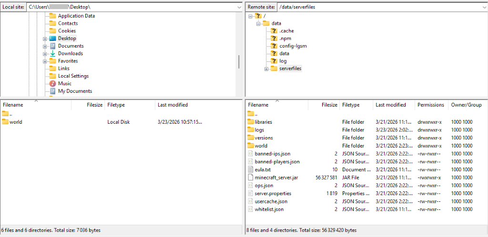
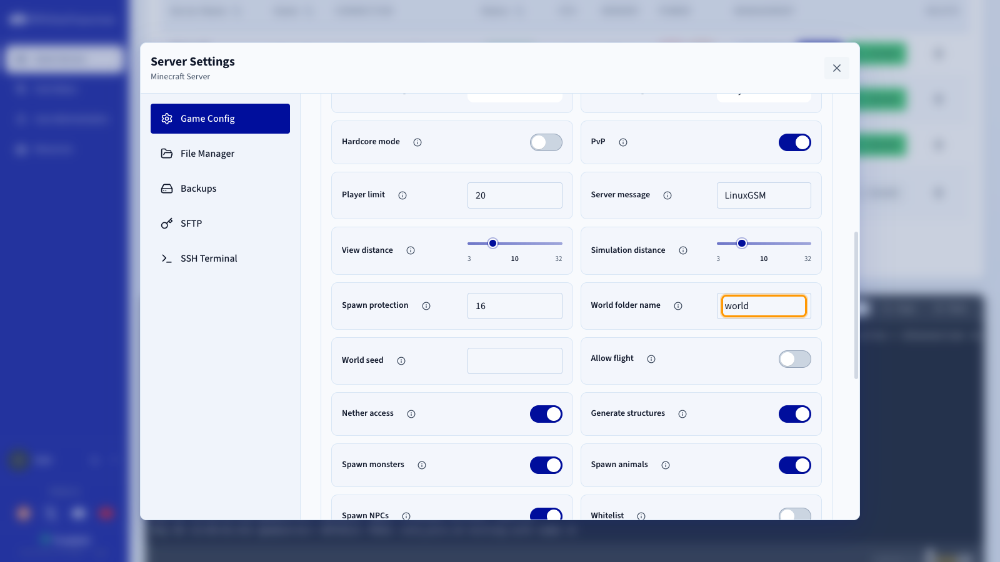

## Objectif

Le Game Panel d'OVHcloud vous permet de téléverser un monde Minecraft personnalisé en transférant les fichiers via SFTP et en ajustant la configuration du dossier du monde.

**Ce guide vous explique comment téléverser une carte personnalisée sur votre serveur Minecraft hébergé sur le Game Panel d'OVHcloud.**

## Prérequis

- Un [VPS](/links/bare-metal/vps) dans votre compte OVHcloud avec la fonctionnalité Game Panel activée.
- Un serveur Minecraft déployé sur le Game Panel. Consultez le guide [Déployer un serveur Minecraft sur le Game Panel](/pages/bare_metal_cloud/virtual_private_servers/game-panel-quick-start-minecraft).
- Le SFTP activé sur le Game Panel. Consultez le guide [Activer le SFTP sur le Game Panel](/pages/bare_metal_cloud/virtual_private_servers/game-panel-enable-sftp).
- Un client SFTP tel que [FileZilla](https://filezilla-project.org/).

> [!warning]
>
> Assurez-vous que votre serveur Minecraft est **arrêté** avant d'effectuer l'une des actions suivantes.

## En pratique

### Étape 1 — Se connecter à votre serveur via SFTP

Connectez-vous à votre serveur Minecraft via SFTP. Consultez le guide [Activer le SFTP sur le Game Panel](/pages/bare_metal_cloud/virtual_private_servers/game-panel-enable-sftp) pour les instructions de configuration.

### Étape 2 — Localiser le dossier du monde

Une fois connecté à votre serveur via FileZilla, sur le panneau de droite (serveur distant), naviguez jusqu'à :

```
data > serverfiles
```

Dans ce répertoire, vous verrez un dossier nommé `world`. Ce dossier contient votre carte Minecraft actuelle et est créé par défaut.

{.thumbnail}

### Étape 3 — Préparer le serveur pour votre nouvelle carte

Avant de téléverser votre propre carte, vous devez libérer le nom de dossier `world`. Trois options s'offrent à vous :

- **Le supprimer** (clic droit > `Delete`{.action}) si vous n'en avez plus besoin.
- **Le renommer** (clic droit > `Rename`{.action}) pour le conserver comme sauvegarde.
- **Le télécharger en local** en glissant-déposant le dossier depuis le panneau de droite (serveur) vers le panneau de gauche (votre ordinateur).

### Étape 4 — Téléverser votre carte personnalisée

Dans FileZilla, repérez le dossier de votre carte sur le panneau de gauche (votre ordinateur) et faites-le glisser dans `data > serverfiles` sur le panneau de droite (serveur distant).

### Étape 5 — Configurer le nom du monde (si nécessaire)

Si le dossier de votre carte ne s'appelle pas `world`, vous devez mettre à jour la configuration du serveur :

1. Retournez sur le Game Panel.
2. Ouvrez les `Settings`{.action} de votre serveur.
3. Allez dans l'onglet `Game Config`{.action}.
4. Repérez l'option **World folder name**.
5. Saisissez le nom exact du dossier de votre carte.

{.thumbnail}

> [!primary]
>
> **Utiliser plusieurs cartes** : vous pouvez stocker plusieurs cartes sur votre serveur et basculer facilement entre elles. Modifiez le champ **World folder name** dans la section Game Config pour charger une carte différente. N'oubliez pas de redémarrer le serveur après avoir modifié ce paramètre.

### Étape 6 — Démarrer le serveur

Redémarrez votre serveur depuis le Game Panel. Votre carte Minecraft personnalisée est désormais prête à être utilisée.

## Aller plus loin

- [Déployer un serveur Minecraft sur le Game Panel](/pages/bare_metal_cloud/virtual_private_servers/game-panel-quick-start-minecraft)
- [Créer une sauvegarde sur le Game Panel](/pages/bare_metal_cloud/virtual_private_servers/game-panel-create-backup)

Échangez avec notre [communauté d'utilisateurs](/links/community).