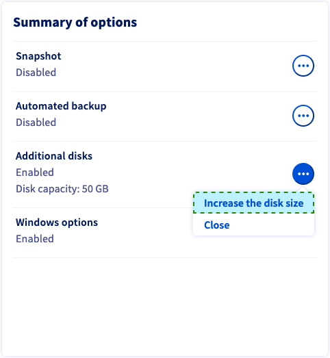
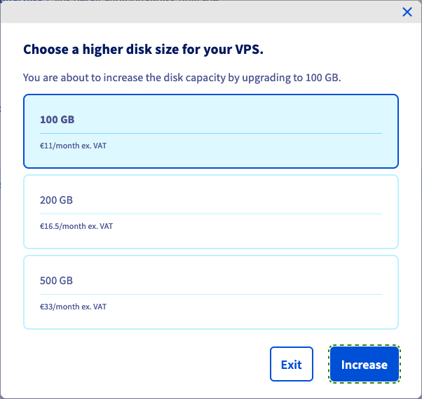
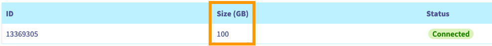
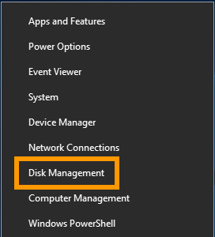
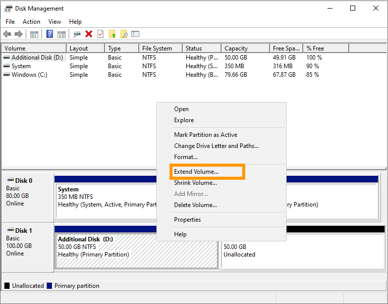

> [!primary]
> Esta tradução foi automaticamente gerada pelo nosso parceiro SYSTRAN. Em certos casos, poderão ocorrer formulações imprecisas, como por exemplo nomes de botões ou detalhes técnicos. Recomendamos que consulte a versão inglesa ou francesa do manual, caso tenha alguma dúvida. Se nos quiser ajudar a melhorar esta tradução, clique em "Contribuir" nesta página.
>


## Objetivo

Se atingiu a capacidade máxima do seu disco adicional, pode adicionar armazenamento aumentando o seu tamanho.

**Este guia explica como aumentar o tamanho de um disco adicional e alargar a partição principal em conformidade.**

## Requisitos

- Um [VPS](https://www.ovhcloud.com/pt/vps/) na sua conta OVHcloud.
- Um [disco adicional](/pages/bare_metal_cloud/virtual_private_servers/config_additional_disk) configurado no VPS.
- Ter acesso à [Área de Cliente OVHcloud](https://www.ovh.com/auth/?action=gotomanager&from=https://www.ovh.pt/&ovhSubsidiary=pt).
- Ter acesso ao VPS por SSH ou RDP para a administração.

## Instruções

Os passos abaixo sugerem que configurou um disco adicional seguindo as instruções [deste manual](/pages/bare_metal_cloud/virtual_private_servers/config_additional_disk).

### Modificar o tamanho do disco <a name="extend"></a>

Ligue-se à sua [Área de Cliente OVHcloud](https://www.ovh.com/auth/?action=gotomanager&from=https://www.ovh.pt/&ovhSubsidiary=pt), vá à secção `Bare Metal Cloud`{.action} e selecione o seu servidor entre os `Servidores privados virtuais`{.action}.

No quadro **Resumo das opções**, clique no botão `...`{.action} na secção `Discos adicionais`. Selecione `Aumentar o tamanho do disco`{.action}.

{.thumbnail}

Escolha o novo tamanho de disco na nova janela e clique em `Aumentar`{.action}.

{.thumbnail}

Irá aparecer uma mensagem para confirmar o seu pedido. Clique na ligação dentro da mensagem e siga o processo de encomenda. É possível que um novo separador de navegação para a encomenda tenha sido aberto automaticamente.

{.thumbnail}

O aumento da capacidade do disco demorará alguns minutos após a validação do pagamento. Pode verificar o progresso no separador `Discos adicionais`{.action}\: se o novo tamanho escolhido for apresentado, o disco está pronto.

{.thumbnail}

> [!warning]
>
> Guarde os seus dados situados no disco adicional antes de continuar.
>

### Extensão da partição

> [!warning]
> A responsabilidade sobre a configuração e a gestão dos serviços que a OVHcloud disponibiliza recai sobre o utilizador. Assim, é da sua responsabilidade assegurar o seu bom funcionamento.
>
> Este manual fornece as instruções necessárias para realizar as operações mais habituais. No entanto, se precisar de ajuda, recomendamos que recorra a um [fornecedor especializado](https://partner.ovhcloud.com/pt/directory/) ou que recorra à [nossa comunidade](https://community.ovh.com/en/).
>

#### Num VPS Linux

> [!primary]
>
> Note que esta secção descreve uma abordagem geral das etapas necessárias, baseada num sistema operativo Ubuntu Server. Algumas encomendas podem necessitar de uma personalização para a distribuição que utiliza.
>

Se estiver instalada uma distribuição GNU/Linux no VPS, aceda SSH ao servidor a partir do terminal da linha de comando ou utilizando uma aplicação cliente SSH.

Os exemplos abaixo pressupõem que está ligado enquanto utilizador com autorizações elevadas.

Certifique-se de que o disco não foi montado com o seguinte comando:

```bash
ubuntu@server:~$ sudo umount /mnt/disk
```

Substitua `/mnt/disk` pelo seu caminho de montagem real para o disco adicional, se necessário.

Determine os nomes dos discos e das partições:

```bash
ubuntu@server:~$ lsblk
NAME    MAJ:MIN RM   SIZE RO TYPE MOUNTPOINTS
loop0     7:0    0  63.2M  1 loop /snap/core20/1623
loop1     7:1    0  63.3M  1 loop /snap/core20/1828
loop2     7:2    0 111.9M  1 loop /snap/lxd/24322
loop3     7:3    0  49.8M  1 loop /snap/snapd/18357
loop4     7:4    0   103M  1 loop /snap/lxd/23541
sda       8:0    0   160G  0 disk
├─sda1    8:1    0 159.9G  0 part /
├─sda14   8:14   0     4M  0 part
└─sda15   8:15   0   106M  0 part /boot/efi
sdc       8:32   0   100G  0 disk
└─sdc1    8:33   0    50G  0 part 
```

Neste exemplo, o disco é chamado `sdc` e tem o novo tamanho de disco correto de 100GB após o melhoramento explicado na [primeira parte](#extend) deste guia. A partição `sdc1` existe no disco e utiliza 50 GB.

Recree a partição no disco ao executar `fdisk`:

```bash
ubuntu@server:~$ sudo fdisk /dev/sdc
```

Introduza os seguintes comandos ao convite `fdisk`:

```console
Welcome to fdisk (util-linux 2.37.2).
Changes will remain in memory only, until you decide to write them.
Be careful before using the write command.

Command (m for help): d
Selected partition 1
Partition 1 has been deleted.

Command (m for help): n
```

Confirme cada um dos valores predefinidos apoiando-se em `Entrada`:

```console
Partition type
   p   primary (0 primary, 0 extended, 4 free)
   e   extended (container for logical partitions)
Select (default p):

Using default response p.
Partition number (1-4, default 1):
First sector (2048-209715199, default 2048):
Last sector, +/-sectors or +/-size{K,M,G,T,P} (2048-209715199, default 209715199):

Created a new partition 1 of type 'Linux' and of size 100 GiB.
```

Introduza `n` e, por fim, `w`:

```console
Partition #1 contains a ext4 signature.

Do you want to remove the signature? [Y]es/[N]o: n

Command (m for help): w

The partition table has been altered.
Calling ioctl() to re-read partition table.
Syncing disks.
```

Verifique a partição e alargue o sistema de ficheiros:

```bash
ubuntu@server:~$ sudo e2fsck -f /dev/sdc1
e2fsck 1.46.5 (30-Dec-2021)
/dev/sdc1: recovering journal
Pass 1: Checking inodes, blocks, and sizes
Pass 2: Checking directory structure
Pass 3: Checking directory connectivity
Pass 4: Checking reference counts
Pass 5: Checking group summary information
/dev/sdc1: 11/3276800 files (0.0% non-contiguous), 284558/13106944 blocks
```
```bash
ubuntu@server:~$ sudo resize2fs /dev/sdc1
resize2fs 1.46.5 (30-Dec-2021)
Resizing the filesystem on /dev/sdc1 to 26214144 (4k) blocks.
The filesystem on /dev/sdc1 is now 26214144 (4k) blocks long.
```

Por fim, monte o disco:

```bash
ubuntu@server:~$ sudo mount /dev/sdc1 /mnt/disk/
```

A partição 1 utiliza agora o tamanho máximo do disco.

```bash
ubuntu@server:~$ df -h
Filesystem      Size  Used Avail Use% Mounted on
tmpfs           776M  992K  776M   1% /run
/dev/sda1       155G  2.2G  153G   2% /
tmpfs           3.8G     0  3.8G   0% /dev/shm
tmpfs           5.0M     0  5.0M   0% /run/lock
/dev/sda15      105M  5.3M  100M   5% /boot/efi
tmpfs           776M  4.0K  776M   1% /run/user/1000
/dev/sdc1        99G   24K   94G   1% /mnt/disk
```

#### Num VPS Windows

Se estiver instalado um SO Windows no seu VPS, estabeleça uma ligação RDP (Remote Desktop) com o seu servidor.

Uma vez ligado, clique com o botão `Menu Iniciar`{.action} e abra a `Gestão dos discos`{.action}.

{.thumbnail}

O [disco ampliado](#extend) apresenta a capacidade adicional sob a forma de espaço não atribuído. Faça um clique com o botão direito sobre o volume do seu disco adicional e selecione `Expanda o volume`{.action} no menu contextual.

{.thumbnail}

No assistente de extensão de volume, clique em `Seguinte`{.action} para continuar.

Pode alterar o espaço de disco nesta etapa, se necessário. Clique em `Seguinte`{.action}.

{.thumbnail}

Clique em `Terminar`{.action} para terminar o processo.

O volume redimensionado inclui agora o espaço de disco adicional.

{.thumbnail}

## Quer saber mais?

Junte-se à nossa comunidade de utilizadores em <https://community.ovh.com/en/>.
