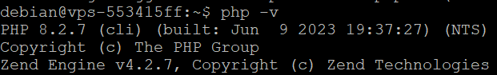
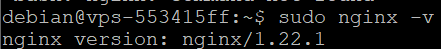

## Objective

If you would like to install a CMS (**C**ontent **M**anagement **S**ystem) on your VPS (e.g. WordPress), you will need to install a web development environment on your VPS or dedicated server in advance. The main services to install are:

- **PHP**: PHP is one of the most widely used languages for building websites. You need to install PHP so that your website can run scripts and dynamic features. It is best to install the most recent PHP version.
- **Web server**: The web server is essential for serving your website pages. The most popular web servers include Apache and Nginx, each with their own advantages in terms of flexibility, performance and ease of configuration.
- **DBMS**: To store, manage and retrieve your data efficiently, you will need a DBMS (**D**ata**B**ase **M**anagement **S**ystem). MySQL, PostgreSQL and MariaDB are the most widely used DBMS in web development.

**Find out how to manually install a web development environment on an OVHcloud VPS or dedicated server.**

> [!warning]
> This tutorial will show you how to use one or more OVHcloud solutions with external tools, and the changes you need to make in specific contexts. You may need to adapt the instructions according to your situation.
>
> We recommend that you contact a [specialist service provider](https://partner.ovhcloud.com/en-gb/directory/) or reach out to [our community](https://community.ovh.com/en/) if you face difficulties or doubts concerning the administration, usage or implementation of services on a server.
>

## Requirements

- A [VPS] solution (https://www.ovhcloud.com/en-gb/vps/) or a [dedicated server](https://www.ovhcloud.com/en-gb/bare-metal/) in your [OVHcloud Control Panel](/links/manager)
- Administrative (sudo) access to your server via SSH

## Instructions

Log in to your VPS via SSH with your username and password.

### Install PHP

Install PHP:

```sh
sudo apt install php php-cli php-mysql php-xml php-gd php-curl -y
```

To check that PHP is installed properly, enter the following command:

```sh
sudo php -v
```

If PHP is correctly installed, you should see this message:

{.thumbnail}

### Install a web server

> [!primary]
>
> For this guide, we choose Nginx, but you are free to install the web server of your choice.
>

Install Nginx:

```sh
sudo apt install nginx -y
```

To verify that Nginx is installed properly, enter the following command:

```sh
sudo nginx -v
```

If Nginx is correctly installed, you should see a message like this:

{.thumbnail}

If you have any queries, please refer to [Nginx official website](https://www.nginx.com/).

### Install a DBMS (**D**ata**B**ase **M**anagement **S**ystem)

> [!primary]
>
> For this guide, we choose MariaDB, but you are free to install the DBMS of your choice.
>

Install MariaDB:

```sh
sudo apt install mariadb-server -y
```

Secure and configure MariaDB:

```sh
sudo mysql_secure_installation
```

Set a password for your DBMS and follow the instructions on the screen. Once the MariaDB installation is complete, you should see the following message:

{.thumbnail}

### Conclusion

You have just installed PHP, an Nginx server and MariaDB DBMS. You now have a functional web development environment on your VPS or OVHcloud dedicated server. If you wish, you can now install the CMS (**C**ontent **M**anagement **S**ystem) of your choice, such as WordPress. To find out more, please read the guides “[How to install WordPress with WP-CLI on a VPS or a dedicated server](/pages/bare_metal_cloud/virtual_private_servers/install_wordpress_site_on_vps)” and “[How to install WordPress with Docker on a VPS or a dedicated server](/pages/bare_metal_cloud/virtual_private_servers/install_wordpress_docker_on_vps)”.

For some general tips on securing a GNU/Linux-based server, see our guides:

- [Securing a VPS](/pages/bare_metal_cloud/virtual_private_servers/secure_your_vps)
- [Securing a dedicated server](/pages/bare_metal_cloud/dedicated_servers/securing-a-dedicated-server)

## Go further <a name="go-further"></a>

[How to install WordPress with WP-CLI on a VPS or a dedicated server](/pages/bare_metal_cloud/virtual_private_servers/install_wordpress_site_on_vps)

[How to install WordPress with Docker on a VPS or a dedicated server](/pages/bare_metal_cloud/virtual_private_servers/install_wordpress_docker_on_vps)

[Securing a VPS](/pages/bare_metal_cloud/virtual_private_servers/secure_your_vps)

[Securing a dedicated server](/pages/bare_metal_cloud/dedicated_servers/securing-a-dedicated-server)

For specialised services (SEO, development, etc.), contact [OVHcloud partners](https://partner.ovhcloud.com/en-gb/directory/).

Join our community of users on <https://community.ovh.com/en/>.
