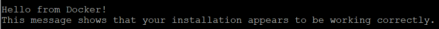
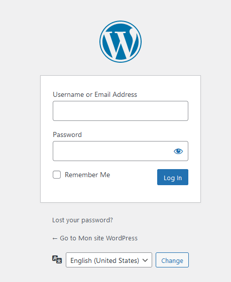

## Objective

Installing WordPress on a VPS or dedicated server has several advantages, such as full customization of the environment, performance optimization, and enhanced security. There are several ways to install WordPress on a VPS or dedicated server, depending on your technical level and the time you want to devote to it. One of the quickest and most efficient ways to do this is to use Docker. Docker makes it easy to deploy applications by 'containerizing' them, making WordPress installation fast, easy, and repeatable in any environment.

**Find out how to install WordPress manually with Docker on a VPS or an OVHcloud Dedicated Server.**

> [!warning]
> This tutorial will show you how to use one or more OVHcloud solutions with external tools, and the changes you need to make in specific contexts. You may need to adapt the instructions according to your situation.
>
> We recommend that you contact a [specialist service provider](https://partner.ovhcloud.com/en/directory/) or reach out to [our community](https://community.ovh.com/en/) if you face difficulties or doubts concerning the administration, usage or implementation of services on a server.
>

## Requirements

- A [VPS](https://www.ovhcloud.com/en/vps/) solution  or a [dedicated server](https://www.ovhcloud.com/en/bare-metal/) in your [OVHcloud Control Panel](/links/manager)
- Administrative (sudo) access to your server via SSH
- A domain name (registered with OVHcloud or another registrar)

## Instructions

> [!primary]
>
> The VPS used for this guide has a Debian distribution in version 11 (Bullseye). For more information, see the [official Docker website](https://docs.docker.com/get-docker/).
>

### Install Docker

Update the package manager:

```sh
sudo apt update
```

Install the required packages to allow `apt` to use a repository over HTTPS:

```sh
sudo apt install apt-transport-https ca-certificates curl software-properties-common
```

Add the official Docker GPG key:

```sh
curl -fsSL https://download.docker.com/linux/debian/gpg | sudo gpg --dearmor -o /usr/share/keyrings/docker-archive-keyring.gpg
```

Add the Docker repository to your system:

```sh
echo "deb [arch=amd64 signed-by=/usr/share/keyrings/docker-archive-keyring.gpg] https://download.docker.com/linux/debian bullseye stable" | sudo tee /etc/apt/sources.list.d/docker.list > /dev/null
```

Update the `apt` package index and install the Docker Engine:

```sh
sudo apt update
sudo apt install docker-ce docker-ce-cli containerd.io -y
```

Verify that Docker is installed and configured:

```sh
docker –version
```

Test Docker with a simple command:

```sh
sudo docker run hello-world
```

If the Docker installation is successful, you will receive a message like this:

{.thumbnail}

### Install Docker Compose

Download the latest version of Docker Compose (replace 1.29.2 with the latest available version):

```sh
sudo curl -L "https://github.com/docker/compose/releases/download/1.29.2/docker-compose-$(uname -s)-$(uname -m)" -o /usr/local/bin/docker-compose
```

Make the binary executable:

```sh
sudo chmod +x /usr/local/bin/docker-compose
```

Check the Docker Compose installation:

```sh
docker-compose –version
```

If the Docker Compose installation is successful, you will receive a message like this:

{.thumbnail}

### Deploy WordPress with Docker Compose

Create a folder for your WordPress project and navigate to it:

```sh
mkdir wordpress-docker && cd wordpress-docker
```

Create a `docker-compose.yml` file with your preferred text editor:

```sh
nano docker-compose.yml
```

Copy and paste the following configuration into the `docker-compose.yml` file:

```yaml
version: '3.8'

services:
  db:
    image: mysql:5.7
    volumes:
      - db_data:/var/lib/mysql
    environment:
      MYSQL_ROOT_PASSWORD: wordpress
      MYSQL_DATABASE: wordpress
      MYSQL_USER: wordpress
      MYSQL_PASSWORD: wordpress

  wordpress:
    depends_on:
      - db
    image: wordpress:latest
    ports:
      - "8000:80"
    environment:
      WORDPRESS_DB_HOST: db:3306
      WORDPRESS_DB_USER: wordpress
      WORDPRESS_DB_PASSWORD: wordpress
    volumes:
      - wordpress_data:/var/www/html

volumes:
  db_data: {}
  wordpress_data: {}
```

This Compose file creates a WordPress service and a MySQL service. 

Launch the services with Docker Compose:

```sh
sudo docker-compose up -d
```

The Docker image used in this example is the official version `wordpress:latest`. This specific image is designed to work with an Apache web server. The official WordPress images on [Docker Hub](https://hub.docker.com/) are regularly updated to include the latest stable PHP versions compatible with the current version of WordPress.

To find out the exact PHP version included in the `wordpress:latest` image at a specific time, you can run a container based on this image and check the PHP version directly.

Launch a temporary container with the image `wordpress:latest`:

```sh
docker run --rm wordpress:latest php -v
```

This command gives you an answer like this:

```sh
PHP 8.2.16 (cli) (built: Feb 16 2024 21:54:41) (NTS)
```

As a reminder, Docker images are updated regularly. The version of the components in `wordpress:latest` can therefore change over time, as new versions are published and integrated into the image. 

If you wish, you can use another Docker image.

### Use a specific Docker image

Go to the [Docker Hub WordPress section](https://hub.docker.com/_/wordpress) and identify the image that fits your needs. For example, if you choose to use the image `wordpress:5-php7.4-fpm`, you will need to edit your `docker-compose.yml` file with a text editor. Once the file is open, find the section of the `wordpress` service and modify the line `image:` to use the specific tag of the `wordpress:5-php7.4-fpm` image you have chosen. For example:

```yaml
version: '3.8'

services:
  wordpress:
    image: wordpress:5-php7.4-fpm
    container_name: wordpress
...
```

#### Apply changes

Launch or update your containers with Docker Compose. If this is your first time launching the project, use:

```sh
docker-compose up -d
```

If your containers are already running and you want to apply the changes, use:

```sh
docker-compose up -d --force-recreate
```

Check that everything is working as expected. You can check the logs of your WordPress container to ensure that it starts correctly and that there are no errors:

```sh
docker logs wordpress
```

### Access WordPress

You can now access WordPress from a browser. There are two ways of doing this:

- Via the IP address of your VPS: `<VPS_IP_ADDRESS>:8000`
- Via your website’s domain name: `<DOMAIN_NAME>:8000`

#### Link the domain name to the IP address of the VPS or dedicated server

To access your website from a browser, first link the domain name of your WordPress website to the IP address of your VPS. Go to your [OVHcloud Control Panel](/links/manager). 

In the left-hand menu, click `Domain names`{.action}, then select the domain name you have chosen for your WordPress website.

Click the `DNS zone`{.action} tab. In the table, identify the row with the value `A`, click on the button `...`{.action} and select `Modify record`{.action}.

{.thumbnail}

In the window that pops up, enter the IP address of your VPS or dedicated server in the `Target`{.action} field, then click `Next`{.action}. Check that the information you have entered is correct, then click `Confirm`{.action}.

{.thumbnail}

#### Initialize your WordPress website

When you log in for the first time, your browser must redirect you to `<VPS_IP_ADDRESS>:8000/wp-admin/install.php` (or `<DOMAIN_NAME>:8000/wp-admin/install.php` if you use the domain name). This means that WordPress is ready for the initial configuration phase. This page is the starting point for configuring your WordPress website, where you need to define key elements such as:

- Language
- The title of your website
- The username for site administration
- An associated password
- An email address
- etc.

#### Complete the installation of your WordPress website

Once all the necessary information has been completed and the form has been submitted, WordPress will finalize the installation. You will then be redirected to the login screen (wp-login.php), where you can log in with the username and password you have just created.

{.thumbnail}

### Conclusion

You have just installed WordPress on your VPS or OVHcloud dedicated server with a Docker image. You can now access your WordPress website from a browser.

For some general tips on securing a GNU/Linux-based server, see our guides:

- [Securing a VPS](/pages/bare_metal_cloud/virtual_private_servers/secure_your_vps)
- [Securing a dedicated server](/pages/bare_metal_cloud/dedicated_servers/securing-a-dedicated-server)

## Go further <a name="go-further"></a>

[How to install a web development environment on a VPS or a dedicated server](/pages/bare_metal_cloud/virtual_private_servers/install_env_web_dev_on_vps)

[How to install WordPress with WP-CLI on a VPS or a dedicated server](/pages/bare_metal_cloud/virtual_private_servers/install_wordpress_site_on_vps)

[Securing a VPS](/pages/bare_metal_cloud/virtual_private_servers/secure_your_vps)

[Securing a dedicated server](/pages/bare_metal_cloud/dedicated_servers/securing-a-dedicated-server)

For specialised services (SEO, development, etc.), contact [OVHcloud partners](https://partner.ovhcloud.com/en/directory/).

Join our [community of users](/links/community).
