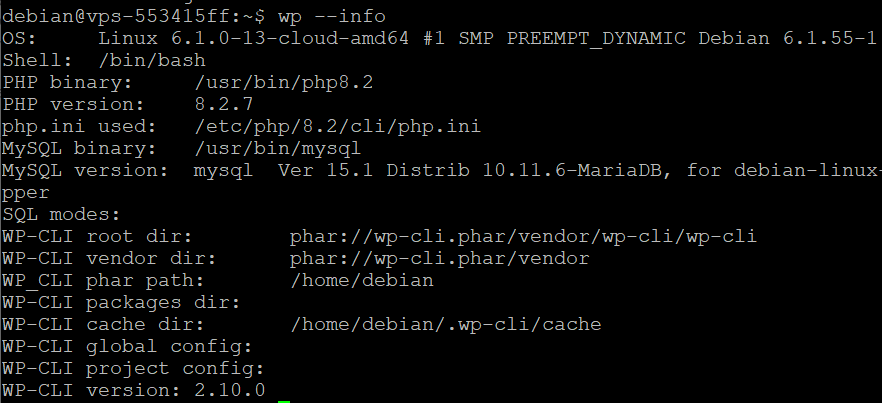
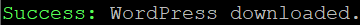
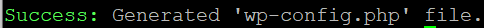
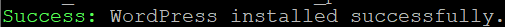

## Objective

Installing WordPress on a VPS or dedicated server has several advantages, such as full customization of the environment, performance optimization, and enhanced security. Whether you are an experienced developer or a beginner looking to launch your first website, this guide will show you step by step how to install WordPress on an OVHcloud VPS with WP-CLI. WP-CLI is a command-line interface for manually installing WordPress on your OVHcloud VPS.

**Find out how to install WordPress with WP-CLI on a VPS or an OVHcloud dedicated server.**

> [!warning]
> This tutorial will show you how to use one or more OVHcloud solutions with external tools, and the changes you need to make in specific contexts. You may need to adapt the instructions according to your situation.
>
> We recommend that you contact a [specialist service provider](https://partner.ovhcloud.com/en-sg/directory/) or reach out to [our community](https://community.ovh.com/en/) if you face difficulties or doubts concerning the administration, usage or implementation of services on a server.
>

<a name="requirements"></a>

## Requirements

- A [VPS](https://www.ovhcloud.com/en-sg/vps/) solution or a [dedicated server](https://www.ovhcloud.com/en-sg/bare-metal/) in your [OVHcloud Control Panel](/links/manager)
- Administrative (sudo) access to your server via SSH
- A [web development environment configured on your VPS or your dedicated server](/pages/bare_metal_cloud/virtual_private_servers/install_env_web_dev_on_vps)
- A domain name (registered with OVHcloud or another registrar)

## Instructions

> [!primary]
>
> As detailed in the [Requirements](#requirements), we assume that you already have a [web development environment configured on your VPS or dedicated server](/pages/bare_metal_cloud/virtual_private_servers/install_env_web_dev_on_vps). For this guide, the following components are already installed on the VPS:
>
> - PHP (version 8.2.7)
> - Nginx web server
> - MariaDB DBMS
>

Log in to your VPS via SSH with your username and password.

### Install WP-CLI

Download WP-CLI using `curl` or `wget`:

```sh
curl -O https://raw.githubusercontent.com/wp-cli/builds/gh-pages/phar/wp-cli.phar
```

Make the downloaded file executable:

```sh
sudo chmod +x wp-cli.phar
```

Move the executable file to use it as a 'wp' command:

```sh
sudo mv wp-cli.phar /usr/local/bin/wp
```

Test the installation of WP-CLI by running the command:

```sh
wp –info
```

If WP-CLI has installed successfully, a message like this will appear:

{.thumbnail}

### Install WordPress with WP-CLI

#### Create the WordPress database

Log in to MariaDB:

```sh
sudo mysql -u root -p
```

Create the database for your WordPress website:

```sql
CREATE DATABASE <database_name>;
```

Create a new MariaDB user and assign database privileges:

```sql
GRANT ALL PRIVILEGES ON database_name.* TO 'wordpress_user'@'localhost' IDENTIFIED BY '<strong_password>';
FLUSH PRIVILEGES;
EXIT;
```

#### Install WordPress

Navigate to the directory where you want to install WordPress, for example:

```sh
cd /var/www/html
```

Download WordPress with WP-CLI:

```sh
wp core download --locale=en_GB
```

The following error may occur:

```sh
Error: '/var/www/html/' is not writable by current user.
```

This means that your user (the one on your OVHcloud VPS) does not have permission to write to the directory `/var/www/html`. A simple and secure way to fix this problem is to change the owner of the directory `/var/www/html` to match your user.

To grant permissions, enter the following command:

```sh
sudo chown -R your_user:your_group /var/www/html/
```

Replace `your_user` and `your_group` with your current user name and user group. On many Linux systems, the default user group for a user is the same as the user name. You can find your username with the command `whoami` and your group with `groups`.

Try downloading WordPress again:

```sh
wp core download
```

If the WordPress download was successful, you should see the following message:

{.thumbnail}

Create the configuration file “wp-config.php”:

```sh
wp config create --dbname=wordpress_db --dbuser=wordpress_user --dbpass=strong_password --dbhost=localhost
```

Replace `wordpress_db`, `wordpress_user`, and `strong_password` with the values you previously set.

If everything went smoothly, the following message should appear:

{.thumbnail}

Launch the WordPress installation:

```sh
wp core install --url=your_domain.com --title="Your website title" --admin_user="admin" --admin_password="another_strong_password" --admin_email="your_email@example.com"
```

If the WordPress installation is successful, you should see the following message:

{.thumbnail}

### Configure Nginx

#### Create a configuration file for your website

Browse to the directory of available Nginx sites:

```sh
cd /etc/nginx/sites-available/
```

Create a new configuration file for your WordPress website. This must be your domain name:

```sh
sudo nano your_domain.com
```

In the file you have just created, add the following configuration (this configuration is a basic example for a WordPress website):

```sh
server {
    listen 80;
    server_name your_domain.com www.your_domain.com;
    root /var/www/html;
    index index.php index.html index.htm;

    location / {
        try_files $uri $uri/ /index.php?$args;
    }

    location ~ \.php$ {
        include snippets/fastcgi-php.conf;
        fastcgi_pass unix:/var/run/php/php8.2-fpm.sock;
        fastcgi_param SCRIPT_FILENAME $document_root$fastcgi_script_name;
        include fastcgi_params;
    }

    location ~ /\.ht {
        deny all;
    }
}
```

If you are using a PHP version other than 8.2.X, replace the line:

```console
fastcgi_pass unix:/var/run/php/php8.2-fpm.sock;
```

with the line:

```console
fastcgi_pass unix:/var/run/php/php<your_php_version>-fpm.sock;
```

To have Nginx load your website’s configuration, create a symbolic link to your configuration file in the directory `/etc/nginx/sites-available/`:

```sh
sudo ln -s /etc/nginx/sites-available/your_domain.com /etc/nginx/sites-enabled/
```

#### Test the Nginx configuration

Before restarting Nginx to apply the changes, it is important to test your configuration to ensure that there are no errors:

```sh
sudo nginx -t
```

If no errors were detected, the following message is displayed:

{.thumbnail}

#### Restart Nginx

Once the configuration has been tested and validated, restart Nginx to apply the changes:

```sh
systemctl restart nginx
```

### Access your website

#### Link the domain name to the IP address of the VPS or dedicated server

To access your website from a browser, first link the domain name of your WordPress website to the IP address of your VPS or dedicated server.

Log in to your [OVHcloud Control Panel](/links/manager), then go to the `Web Cloud`{.action} section.

In the left-hand menu, click `Domain names`{.action}, then select the domain name you have chosen for your WordPress website. 

Click on the `DNS Zone`{.action} tab, then, in the table that appears, identify the row with the value `A` as its type. Click the `...`{.action} button and select `Modify record`{.action}.

{.thumbnail}

In the window that pops up, enter the IP address of your VPS or dedicated server in the `Target`{.action} field, then click `Next`{.action}. Check that the information you have entered is correct, then click `Confirm`{.action}.

{.thumbnail}

### Conclusion

You have just installed WordPress on your OVHcloud VPS or dedicated server with WP-CLI. You can now access your WordPress website from a browser.

## Go further <a name="go-further"></a>

[How to install a web development environment on a VPS or a dedicated server](/pages/bare_metal_cloud/virtual_private_servers/install_env_web_dev_on_vps)

[How to install WordPress with Docker on VPS or a dedicated server](/pages/bare_metal_cloud/virtual_private_servers/install_wordpress_docker_on_vps)

For specialised services (SEO, development, etc.), contact [OVHcloud partners](https://partner.ovhcloud.com/en-sg/directory/).

Join our [community of users](/links/community).
