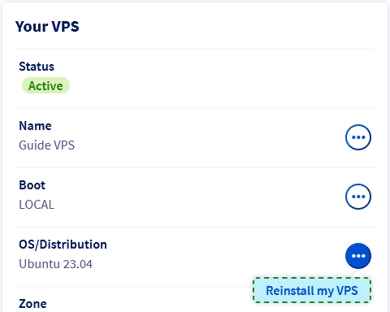
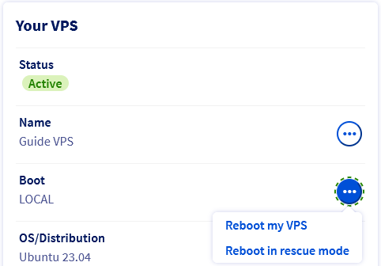

## Objective

A Virtual Private Server (VPS) is a virtualised dedicated server. Unlike OVHcloud web hosting offers which are managed on the technical level by OVHcloud, the setup and maintenance of a VPS system is your responsibility as server administrator.

**This guide provides all the information required for your first steps with a VPS.**

## Requirements

- A [Virtual Private Server](https://www.ovhcloud.com/en-gb/vps) in your OVHcloud account
- Access to the [OVHcloud Control Panel](/links/manager)

## Instructions

### Content overview

- [Control Panel interface](#controlpanel)
- [VPS functions available in the "Home" tab](#hometab)
- [Connecting to your VPS (GNU/Linux-based OS)](#connect)
- [Connecting to your Windows VPS](#winconnect)
- [Securing your VPS](#secure)
- [Attaching a domain name](#domain)

Log in to the [OVHcloud Control Panel](/links/manager), go to the `Bare Metal Cloud`{.action} section and select your server from `Virtual Private Servers`{.action}.

<a name="controlpanel"></a>

### Control Panel interface

This dashboard (tab `Home`{.action}) contains important information about your service and allows you to perform essential operations.

{.thumbnail}

#### Your VPS <a name="yourvps"></a>

In this section you can find basic information about the VPS and the state of the service. Click the tabs below to view details.

> [!tabs]
> Name
>>
>> If you click on `...`{.action} and then select `Change the name`{.action}, you can enter a distinguishing name for this VPS. This is useful for easier Control Panel navigation in case you are managing multiple VPS services but it has no impact otherwise. The internal service name remains in the format *vps-XXXXXXX.vps.ovh.net*.
>>
> Boot
>>
>> The boot mode displayed here is either the "normal" mode, in which the system loads the installed operating system (*LOCAL*) or the **rescue mode** provided by OVHcloud for troubleshooting purposes. Use the `...`{.action} button to [restart the VPS](#reboot-current-range) or boot it into rescue mode.
>>
>> You can find further information in our [rescue mode guide](/pages/bare_metal_cloud/virtual_private_servers/rescue).
>>
> OS/Distribution
>>
>> This is the operating system currently installed. Use the `...`{.action} button to [reinstall the same OS or select a different one from the available options](#reinstallvps).
>>
>> Be advised that a reinstallation will erase all data currently hosted on the VPS (additional disks excluded).
>>
>> > [!primary]
>> >
>> > If you have ordered a **Windows** VPS, you can only choose a Windows OS for reinstallation. Correspondingly, if Windows was not selected in the order process, it cannot be installed after the VPS is delivered.
>>
>>
>> Once an operating system is installed, you assume the responsibility to implement security updates. You can find further information [below](#reinstallvps) and in our guide [Securing a VPS](/pages/bare_metal_cloud/virtual_private_servers/secure_your_vps).
>> 
> Zone / Location
>>
>> These sections show information about where your VPS is located. This might be useful, for example, to identify impacts on your service mentioned in [status reports](https://bare-metal-servers.status-ovhcloud.com/).
>>
 
#### Your configuration

Click the tabs below to view details for this section.

> [!tabs]
> Model
>>
>> This item shows the commercial reference which identifies the VPS model corresponding to the [VPS offers on our website](https://www.ovhcloud.com/en-gb/vps).
>>
> vCores / Memory / Storage
>> 
>> The current resources of your VPS are displayed here and can be upgraded separately by clicking on the respective button. Note that upgrades are limited by the chosen VPS model and might only be available by upscaling the service to a [higher range](https://www.ovhcloud.com/en-gb/vps).
>> 

#### IP

Click the tabs below to view details for this section.

> [!tabs]
> IPv4
>>
>> The primary public IPv4 address of the VPS is configured automatically at installation. Find out more information about IP management in our guide [Configuring IP aliasing](/pages/bare_metal_cloud/virtual_private_servers/configuring-ip-aliasing).
>>
> IPv6 / Gateway
>> 
>> Here you can see the public IPv6 address and the associated gateway address. These are automatically attached to the VPS at installation. Find more information in [this guide](/pages/bare_metal_cloud/virtual_private_servers/configure-ipv6).
>> 
> Secondary DNS
>>
>> This feature is useful for hosting DNS services. Our guide [Configuring OVHcloud Secondary DNS on a VPS](/pages/bare_metal_cloud/virtual_private_servers/adding-secondary-dns-on-vps) describes it in detail.

#### Summary of options

These options refer to additional VPS services which can be ordered in the Control Panel.

- The `Snapshot` option allows you to create a manual snapshot as a singular restoration point.
- The `Automated Backup` option enables you to keep multiple snapshots of your VPS (excluding additional disks).
- The `Additional disks` option attaches storage space to your VPS, for example to store backup data.

You can find all information on the available backup solutions for your service on the [product page](https://www.ovhcloud.com/en-gb/vps/options/) and in the [respective guides](/products/bare-metal-cloud-virtual-private-servers-backups).

#### Subscription

These sections show the most important information regarding the billing of your service. Please find all the information about this topic in the [corresponding documentation](/products/account-and-service-management-managing-billing-payments-and-services).

<a name="hometab"></a>

### VPS functions available in the "Home" tab

> [!warning]
> OVHcloud is providing you with services for which you are responsible, with regard to their configuration and management. It is therefore your responsibility to ensure that they function correctly.
>
> This guide is designed to assist you in common tasks as much as possible. Nevertheless, we recommend that you contact a [specialist service provider](https://partner.ovhcloud.com/en-gb/directory/) or reach out to [our community](https://community.ovh.com/en/) if you face difficulties or doubts concerning the administration, usage or implementation of services on a server.
>

#### Reinstalling your VPS <a name="reinstallvps"></a>

You can carry out reinstallations in your Control Panel. Click on `...`{.action} next to **OS/Distribution**, and then on `Reinstall my VPS`{.action}.

{.thumbnail}

In the popup window, choose an operating system from the drop-down list. The options offered represent [images compatible with an OVHcloud VPS](/pages/public_cloud/compute/image-life-cycle) and are immediately functional after installation.

You can also select an **SSH key** to install on the system, if you have stored one previously in your [OVHcloud Control Panel](/links/manager). To find out all about this topic, please consult our guide [Creating and using SSH keys](/pages/bare_metal_cloud/dedicated_servers/creating-ssh-keys-dedicated).


> [!primary]
>
> **Licences**
>
> Some proprietary operating systems or platforms such as Plesk or cPanel require licences which generate additional fees. Licences can be managed from the OVHcloud Control Panel: Go to the `Bare Metal Cloud`{.action} section, then click on `Licences`{.action} in the left-hand navigation.
>
> In order to have a **Windows** operating system running on a VPS, it has to be **selected in the order process**. A VPS with another OS installed cannot be reinstalled with Windows in the way described above.
>

A progress bar for the installation will appear in your Control Panel. Please note that this process may take up to 30 minutes.

#### Restarting your VPS <a name="reboot-current-range"></a>

A reboot might become necessary in order to apply updated configurations or to fix an issue. Whenever feasible, perform a "soft reboot" from the server's GUI (Windows, Plesk, etc.) or via the command line:

```bash
sudo reboot
```

However, you can carry out a "hard reboot" at any time in your [OVHcloud Control Panel](/links/manager). From the `Home`{.action} tab, click on `...`{.action} next to `Boot` in the **Your VPS** section. Select `Reboot my VPS`{.action} and click on `Confirm`{.action} in the popup window.

{.thumbnail}

<a name="connect"></a>

### Connecting to your VPS (GNU/Linux-based OS)

At the first installation or when reinstalling from the Control Panel, a user with elevated permissions is created automatically. This user will be named according to the operating system, for example "ubuntu" or "rocky".

You will then receive an email containing the username and password needed to connect to your VPS with SSH. SSH is a secure communication protocol, used to establish encrypted connections to a remote host.

Most current desktop operating systems will have an **Open SSH** client natively installed. This means that your access credentials allow you to quickly establish a connection to your VPS in the appropriate command line application (`Terminal`, `Command prompt`, `Powershell`, etc.). Enter the following command:

```bash
ssh username@IPv4_VPS
```

Example:

```bash
ssh ubuntu@169.254.10.250
```

You can use any third-party application compatible with **Open SSH** as well.

Once connected, you can replace the predefined password for the current user with a better passphrase by using this command:

```bash
passwd
```

On a GNU/Linux distribution, **a password prompt will not display your keyboard inputs**.

Type your current password and press `Enter`{.action}. Enter the new passphrase and type it again at the next prompt to confirm it.

```console
Changing password for ubuntu.
Current password:
New password: 
Retype new password: 
passwd: password updated successfully
```

> [!warning]
> 
> **Activating the root user account**
>
> It is not necessary to use the "root" user account to get started with administrating your server. This account has to be enabled first in the server OS in order to use it. Moreover, SSH connections with the user "root" are **disabled** by default as a security measure.
> 
Unless stated otherwise, all administrative actions described in our documentation can be accomplished by the default user account, i.e. typing `sudo` followed by the respective command. Learn more about this topic in our guide on [How to configure user accounts and root access on a server](/pages/bare_metal_cloud/dedicated_servers/changing_root_password_linux_ds).
>

**We recommend the following steps to proceed**:

- Become more familiar with SSH connections by reading our guide [Getting started with SSH](/pages/bare_metal_cloud/dedicated_servers/ssh_introduction).
- Consider using SSH keys as an advanced, more convenient method for remote connections with the help of our guide [Creating and using SSH keys](/pages/bare_metal_cloud/dedicated_servers/creating-ssh-keys-dedicated).
- Use our guide [Securing a VPS](/pages/bare_metal_cloud/virtual_private_servers/secure_your_vps) to harden your system against automated *brute force* attacks and other common threats.

> [!primary]
>
Please note that if you have selected a **distribution with application** (Plesk, cPanel, Docker), generic security measures might not apply to your system. We recommend to refer to our guides [First steps with preinstalled applications](/pages/bare_metal_cloud/virtual_private_servers/apps_first_steps) and [Deploying cPanel on a VPS](/pages/bare_metal_cloud/virtual_private_servers/cpanel), as well as the official documentation of the respective publisher.
>

<a name="winconnect"></a>

### Connecting to your Windows VPS

#### Step 1: Finish the Windows setup

After the Windows operating system is installed, you receive an email with the account name of the default `Windows user`.

You will then need to finish the Windows installation process by defining your display language, your keyboard layout and your administrator password.

This is done in the VPS KVM console: Click on `...`{.action} next to the name of your VPS in the section [Your VPS](#yourvps) and select `KVM`{.action}. You can find more information about this tool in our [KVM guide](/pages/bare_metal_cloud/virtual_private_servers/using_kvm_for_vps).

To complete the initial setup of your Windows VPS, follow the steps below by navigating through the tabs:

> [!tabs]
> 1. **Locale settings**
>>
>> Once the KVM session is established, you can complete the initial setup of Windows by configuring your **country/region**, the preferred **Windows language**, and your **keyboard layout**. Then click on the button `Next`{.action} at the bottom right.<br><br>
>>{.thumbnail}<br>
>>
> 2. **Administrator password**
>>
>> Set a password for your Windows `Administrator` / `admin` account and confirm it, then click on `Finish`{.action}.<br><br>
>>{.thumbnail}<br>
>>
> 3. **Login screen**
>>
>> Windows will apply your settings and then display the login screen. Click on the `Send CtrlAltDel`{.action} button in the top right corner to sign in.<br><br>
>>{.thumbnail}<br>
>>
> 4. **Administrator login**
>>
>> Enter the `Administrator` password you have created in the previous step and click on the `Arrow` button.<br><br>
>>{.thumbnail}<br>
>>

#### Step 2: Connect to the server with RDP

On your local Windows device, you can use the `Remote Desktop Connection` client application to connect to the VPS.

{.thumbnail}

Enter the IPv4 address of your VPS, then your username and passphrase. Usually a warning message will appear, asking to confirm the connection because of an unknown certificate. Click on `Yes`{.action} to log in.

You can use also use any third-party application compatible with RDP. This is a requirement if your local device does not have Windows installed.

> [!primary]
>
If you experience any issues with this procedure, verify that remote (RDP) connections are allowed on your device by checking your system settings, firewall rules and possible network restrictions.
>

#### Enabling Windows boot logs (optional)

Windows boot logs can be helpful for server error diagnostics.

To activate them, follow the steps below by navigating through the tabs:

> [!tabs]
> 1. **Connect to the server**
>>
>> Connect to your server via a Remote Desktop or [KVM](/pages/bare_metal_cloud/virtual_private_servers/using_kvm_for_vps) session.<br>
>>
> 2. **Open the "Run" utility**
>>
>> Open the Windows start menu and click on `Run`{.action}.<br><br>
>>{.thumbnail}<br>
>>
> 3. **Open "msconfig"**
>>
>> Enter "msconfig" and click on `OK`{.action}.<br><br>
>>{.thumbnail}<br>
>>
> 4. **Activate logs**
>>
>> In the new window, activate the logs option next to `Boot log`. Click on `OK`{.action}.<br><br>
>>{.thumbnail}<br>
>>

The next time your server boots, logs will be saved into a `.txt` file. The file path is: `C:\Windows\ntbtlog.txt`.

To access the log file in rescue mode, please follow the instructions in the [VPS rescue mode guide](/pages/bare_metal_cloud/virtual_private_servers/rescue).

<a name="secure"></a>

### Securing your VPS

As administrator of your VPS you are responsible for the security of the applications and data hosted on it.

Please refer to our guide [Securing a VPS](/pages/bare_metal_cloud/virtual_private_servers/secure_your_vps) for essential advice to protect your system.

> [!primary]
>
Please note that if you have selected a **distribution with application** (Plesk, cPanel, Docker), generic security measures might not apply to your system. We recommend to refer to our guides [First steps with preinstalled applications](/pages/bare_metal_cloud/virtual_private_servers/apps_first_steps) and [Deploying cPanel on a VPS](/pages/bare_metal_cloud/virtual_private_servers/cpanel), as well as the official documentation of the respective publisher.
>

<a name="domain"></a>

### Attaching a domain name

Making your VPS available on the web usually includes attaching a domain name to it via DNS. If you manage your domain name at OVHcloud, you can refer to our guide on [Editing an OVHcloud DNS zone](/pages/web_cloud/domains/dns_zone_edit) for instructions.

#### Securing a domain name with an SSL certificate

Once you have configured your VPS, you may want to secure your domain name and your website as well. This will require an SSL certificate, allowing Internet access to your VPS via *HTTPS* instead of unsecured *HTTP*.

You can install this SSL certificate manually, directly on the VPS. Please refer to the official documentation of your VPS distribution.

To automate this process, OVHcloud also offers the SSL Gateway solution. Please refer to the [product page](https://www.ovh.co.uk/ssl-gateway/) or our [documentation](/products/web-cloud-ssl-gateway) for further information.

## Go further

[VPS FAQ](/pages/bare_metal_cloud/virtual_private_servers/vps-faq)

[Introduction to SSH](/pages/bare_metal_cloud/dedicated_servers/ssh_introduction)

[Securing a VPS](/pages/bare_metal_cloud/virtual_private_servers/secure_your_vps)

Join our community of users on <https://community.ovh.com/en/>.
