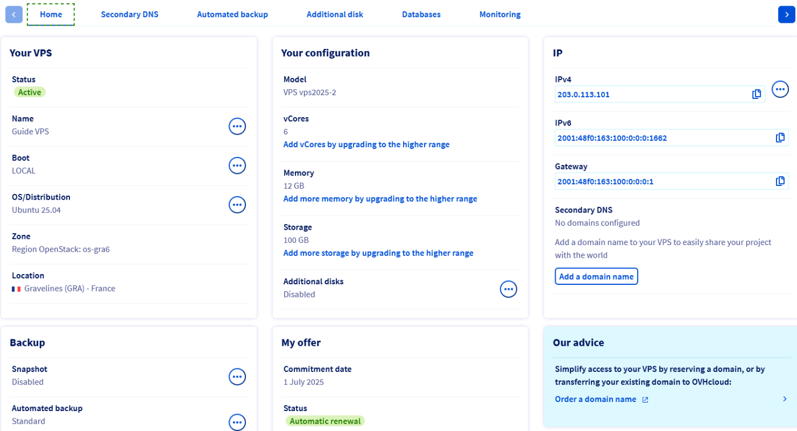
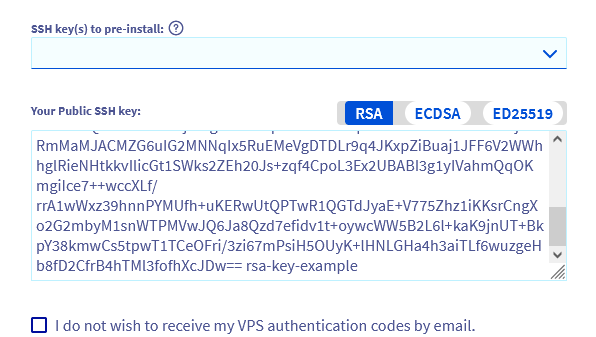

## Ziel

- Das VPS-Dashboard verstehen.
- Wesentliche Informationen identifizieren.
- Erfahren, wie Sie die wichtigsten Aktionen ausführen können.

## Voraussetzungen

- Sie haben einen [VPS](/links/bare-metal/vps) in Ihrem Kunden-Account.

> [!warning]
> Einige VPS-Funktionen, die auf dieser Seite erwähnt werden, sind in den OVHcloud Local Zones nicht verfügbar.
>
> Weitere Informationen finden Sie auf unserer [Local Zones Seite](/links/bare-metal/vps-lz).

<!-- CP-NAV-START:baremetal-vps -->
---

### Zugriff auf das OVHcloud Kundencenter

- **Direkter Link:** [VPS-Verwaltung](/links/control-panel/baremetal-vps)
- **Navigationspfad:** `Bare Metal Cloud`{.action} > `Virtual Private Server`{.action} > Wählen Sie Ihren VPS aus

---
<!-- CP-NAV-END:baremetal-vps -->

## In der praktischen Anwendung

Diese Anleitung hilft Ihnen dabei, **das VPS-Verwaltungsfenster im OVHcloud Kundencenter zu verstehen**, wesentliche Informationen zu identifizieren und die wichtigsten verfügbaren Aktionen (Neuinstallation, Neustart, Backup, Konfiguration) zu nutzen.

**Inhaltsübersicht**

- [Dashboard](#controlpanel)
- [Ihr VPS](#myvps)
- [Ihre Konfiguration](#myconf)
- [IP](#ip)
- [Backup](#save)
- [Mein Angebot](#myoffer)
- [Neustart Ihres VPS](#rebootvps)
- [Neuinstallation Ihres VPS](#reinstallvps)

### Dashboard <a name="controlpanel"></a>

Der Tab `Start`{.action} ist das **Dashboard** Ihres VPS.

Er bündelt **wichtige Informationen zum Dienst** und bietet Zugang zu **wesentlichen Verwaltungsfunktionen**.

{.thumbnail}

#### Ihr VPS <a name="myvps"></a>

Unten finden Sie grundlegende Informationen zu Ihrem VPS und den Dienst-Status. Klicken Sie auf die untenstehenden Tabs, um die Details anzuzeigen.

> [!tabs]
> Name
>>
>> Um den Namen Ihres VPS anzupassen, klicken Sie auf den Button `...`{.action} und wählen Sie `Name ändern`{.action}. Diese Funktion ist nützlich, um bei der Verwaltung mehrerer VPS-Dienste im Kundencenter einfacher navigieren zu können. Der interne Dienstname bleibt jedoch im Format *VPS-XXXXXXX.VPS.ovh.net*.
>>
> Boot
>>
>> Der angezeigte Startmodus ist:
>>
>> - **Normaler Modus** (*LOCAL*), bei dem der Server das installierte Betriebssystem lädt.
>> - **Rescue-Modus**, der von OVHcloud bereitgestellt wird, um Probleme zu beheben.
>>
>> Nutzen Sie den Button `...`{.action}, um den [VPS neu zu starten](#rebootvps) oder ihn im Rescue-Modus zu starten, falls erforderlich.
>>
>> Falls erforderlich, finden Sie weitere Informationen in unserer Anleitung zu [Rescue-Modus](/pages/bare_metal_cloud/virtual_private_servers/rescue).
>>
> Betriebssystem / Distribution 
>>
>> Dies ist das aktuell installierte Betriebssystem. Nutzen Sie den Button `...`{.action}, um [das gleiche Betriebssystem neu zu installieren oder eine andere Option aus den verfügbaren Möglichkeiten auszuwählen](#reinstallvps).
>>
>> > [!warning]
>> >
>> > Eine Neuinstallation löscht alle Daten, die aktuell auf dem VPS gespeichert sind (mit Ausnahme zusätzlicher Disks).
>>
>> > [!primary]
>> >
>> > Wenn Sie einen **Windows**-VPS bestellt haben, können Sie bei der Neuinstallation nur ein Windows-Betriebssystem auswählen. Ebenso können Sie Windows nicht nachträglich installieren, wenn es bei der Bestellung nicht ausgewählt wurde.
>>
>> Nach der Installation des Systems sind Sie verantwortlich für die Anwendung der Sicherheitsupdates für das Betriebssystem. Weitere Informationen finden Sie im Abschnitt "[Neuinstallation Ihres VPS](#reinstallvps)" sowie in unserer Anleitung "[Sicherung eines VPS](/pages/bare_metal_cloud/virtual_private_servers/secure_your_vps)".
>> 
> Zone/Standort
>>
>> Diese Abschnitte liefern Informationen zum Standort Ihres VPS. Dies kann hilfreich sein, um potenzielle Auswirkungen auf Ihren Dienst zu identifizieren und einzuschätzen, wie z. B. in [Vorfällen oder Wartungsberichten](https://bare-metal-servers.status-ovhcloud.com/).
>>

#### Ihre Konfiguration <a name="myconf"></a>

<iframe class="video" width="560" height="315" src="https://www.youtube-nocookie.com/embed/BbyE52W7aBo?si=mmgSmaqIxx0zzGz2" title="YouTube video player" frameborder="0" allow="accelerometer; autoplay; clipboard-write; encrypted-media; gyroscope; picture-in-picture; web-share" referrerpolicy="strict-origin-when-cross-origin" allowfullscreen></iframe>

Klicken Sie auf die untenstehenden Tabs, um die Details dieses Abschnitts anzuzeigen.

> [!tabs]
> Modell
>>
>> Dieser Punkt gibt die kommerzielle Referenz an, die das VPS-Modell identifiziert, das dem [VPS-Angebot auf unserer Website](/links/bare-metal/vps) entspricht.
>>
> vCores/Arbeitsspeicher/Speicher
>> 
>> Die aktuellen Ressourcen Ihres VPS werden hier angezeigt und können durch Klicken auf den entsprechenden Link separat aktualisiert werden. Beachten Sie, dass Upgrades durch das ausgewählte VPS-Modell begrenzt sind und nur durch Wechsel zu einem [höheren Bereich](/links/bare-metal/vps) verfügbar sein können.
>>
> Zusätzliche Disks
>> 
>> Fügen Sie Ihrem VPS zusätzliche Disks hinzu, um die Speicherkapazität des Servers über die im ursprünglichen Setup enthaltene hinaus zu erhöhen. Sie können z. B. Backup-Daten darauf speichern.

#### IP <a name="ip"></a>

Klicken Sie auf die untenstehenden Tabs, um die Details dieses Abschnitts anzuzeigen.

> [!tabs]
> IPv4
>>
>> Die Haupt-IPv4-Adresse des VPS wird automatisch bei der Installation konfiguriert. Weitere Informationen zur IP-Verwaltung finden Sie in unserer Anleitung "[Konfigurieren einer Alias-IP-Adresse](/pages/bare_metal_cloud/virtual_private_servers/configuring-ip-aliasing)".
>>
> IPv6/Gateway
>> 
>> Hier finden Sie die öffentliche IPv6-Adresse und die zugehörige Gateway-Adresse. Diese werden automatisch beim Installieren des VPS angehängt. Weitere Informationen finden Sie in unserer Anleitung "[Konfigurieren von IPv6 auf einem VPS-Server](/pages/bare_metal_cloud/virtual_private_servers/configure-ipv6)".
>> 
> Sekundärer DNS
>>
>> Diese Funktion ist nützlich, um DNS-Dienste zu hosten. Weitere Informationen zu diesem Thema finden Sie in unserer Anleitung "[Konfigurieren eines sekundären OVHcloud DNS auf einem VPS](/pages/bare_metal_cloud/virtual_private_servers/adding-secondary-dns-on-vps)".

#### Backup <a name="save"></a>

Diese Optionen beziehen sich auf zusätzliche VPS-Dienste für das Backup und die Wiederherstellung Ihres Systems.

> [!tabs]
> Snapshot
>>
>> Ein Snapshot auf einem VPS ist ein Momentaufnahme-Backup des Serverzustands, das es Ihnen ermöglicht, das System bei Problemen schnell wiederherzustellen. Die Option `Snapshot` ermöglicht es Ihnen, einen manuellen Snapshot als einzelnen Wiederherstellungspunkt zu erstellen.
>>
> Automatisches Backup
>>
>> Ein tägliches Systembackup (mit Ausnahme zusätzlicher Disks) wird automatisch durchgeführt und 24 Stunden lang gespeichert (gilt nur für Dienste, die ab dem 7. August 2025 bestellt wurden). Wenn Sie sich für die Option "**Premium Automated Backup**" entscheiden, haben Sie die letzten 7 täglichen Backups Ihres VPS, die Sie für das Einhängen und Wiederherstellen nutzen können.  
>> Im Vergleich zu manuellen Snapshots erhöht diese Funktion die Datensicherheit, indem mehrere Wiederherstellungspunkte zu regelmäßigen Zeitintervallen erstellt werden.
>>

Finden Sie alle Informationen zu den Backup-Lösungen, die für Ihren Dienst verfügbar sind, auf der [VPS-Produktseite](/links/bare-metal/vps-options) und in [unseren entsprechenden Anleitungen](/products/bare-metal-cloud-virtual-private-servers-configuration).

#### Mein Angebot <a name="myoffer"></a>

Dieser Abschnitt stellt die wichtigsten Informationen zur Abrechnung Ihres Dienstes bereit. Weitere Informationen zu diesem Thema finden Sie in [unseren entsprechenden Anleitungen](/products/account-and-service-management-managing-billing-payments-and-services).

<a name="hometab"></a>

### VPS-Funktionen im Tab "Start"

> [!warning]
>OVHcloud stellt Ihnen Dienstleistungen zur Verfügung, für deren Konfiguration und Verwaltung Sie verantwortlich sind. Es liegt somit bei Ihnen, sicherzustellen, dass diese ordnungsgemäß funktionieren.
>
>Diese Anleitung soll Sie bei allgemeinen Aufgaben bestmöglich unterstützen. Wir empfehlen jedoch, einen [spezialisierten Dienstleister](/links/partner) zu kontaktieren oder Ihre Fragen an die [OVHcloud Community](/links/community) zu richten, wenn Sie bei der Administration Ihres Systems Hilfe benötigen.
>

#### Neustart Ihres VPS <a name="rebootvps"></a>

Ein Neustart kann erforderlich sein, um Konfigurationsaktualisierungen anzuwenden oder ein Problem zu beheben. Falls möglich, führen Sie einen "Software-Neustart" über die grafische Benutzeroberfläche des Servers (Windows, Plesk etc.) oder über den folgenden Befehl durch:

```bash
sudo reboot
```

Sie können jedoch jederzeit einen gezwungenen Neustart in Ihrem [OVHcloud Kundencenter](/links/manager) durchführen. Gehen Sie zum Tab `Home`{.action} und klicken Sie auf den Button `...`{.action} neben `Boot` im Abschnitt **Ihr VPS**. Wählen Sie `VPS neu starten`{.action} und klicken Sie auf `Bestätigen`{.action} im erscheinenden Fenster.

{.thumbnail}

#### Neuinstallation Ihres VPS <a name="reinstallvps"></a>

Die Neuinstallation Ihres VPS kann über Ihr Kundencenter erfolgen. Dieser Vorgang wird in der Regel bei Systemproblemen, bei Änderungen der Umgebung oder um mit einer sauberen Installation zu beginnen, durchgeführt.

Klicken Sie auf den Button `...`{.action} rechts neben `Betriebssystem / Distribution`{.action}, dann auf `VPS installieren`{.action}.

{.thumbnail}

Im erscheinenden Fenster wählen Sie ein Betriebssystem aus der Dropdown-Liste aus. Die angebotenen Optionen sind [Images, die mit einem OVHcloud VPS kompatibel sind](/pages/public_cloud/compute/image-life-cycle) und funktionieren nach der Installation sofort.

Wenn Sie ein kompatibles Betriebssystem ausgewählt haben, können Sie einen **öffentlichen Schlüssel** angeben, der automatisch installiert wird. Zwei Optionen stehen zur Verfügung:

- Kopieren Sie den Schlüsseltext manuell und fügen Sie ihn in das Feld `Ihr öffentlicher SSH-Schlüssel` ein.
- Wenn Sie zuvor [einen öffentlichen Schlüssel gespeichert haben](/pages/bare_metal_cloud/dedicated_servers/import-keys-control-panel) in Ihrem [OVHcloud Kundencenter](/links/manager), wählen Sie den gewünschten Schlüssel aus dem Dropdown-Menü `SSH-Schlüssel für die Vorinstallation` aus.

{.thumbnail}

Weitere Informationen zu diesem Thema finden Sie in unseren Anleitungen:

- [Erstellen und Verwenden von Authentifizierungsschlüsseln für SSH-Verbindungen zu OVHcloud Servern](/pages/bare_metal_cloud/dedicated_servers/creating-ssh-keys-dedicated)
- [Tutorial - Wie Sie PuTTY für SSH-Verbindungen und -Authentifizierung verwenden](/pages/web_cloud/web_hosting/ssh_using_putty_on_windows)

Wenn Sie einen SSH-Schlüssel ausgewählt haben und kein Passwort zum Verbinden benötigen, aktivieren Sie die Option `Ich möchte meine VPS-Authentifizierungsdaten nicht per E-Mail erhalten`.

> [!warning]
>
> Die Neuinstallation formatiert alle Disks des Servers. Es wird dringend empfohlen, vor dem Fortfahren einen Snapshot Ihres VPS zu erstellen, damit Sie im Falle eines Problems zum vorherigen Zustand zurückkehren können.
>

> [!primary]
>
> **Lizenzen**
>
> Einige Betriebssysteme oder proprietäre Plattformen, wie z. B. Plesk oder cPanel, benötigen Lizenzen, die zusätzliche Kosten verursachen. Lizenzen können über Ihr Kundencenter verwaltet werden: Gehen Sie in den Bereich `Bare Metal Cloud`{.action} und klicken Sie auf `Lizenzen`{.action} in der linken Navigationsleiste.
>
> Um ein **Windows**-Betriebssystem auf einem VPS zu betreiben, müssen Sie es bereits **im Bestellprozess** ausgewählt haben. Ein VPS mit einem anderen Betriebssystem kann nicht über die oben beschriebene Methode mit Windows neu installiert werden.
>

Der Neuinstallationsvorgang kann einige Minuten dauern.

## Weiterführende Informationen

[VPS FAQ](/pages/bare_metal_cloud/virtual_private_servers/vps-faq)

[SSH-Einführung](/pages/bare_metal_cloud/dedicated_servers/ssh_introduction)

[Sicherung eines VPS](/pages/bare_metal_cloud/virtual_private_servers/secure_your_vps)

[So rufen Sie den Serverzugriff bei verlorenem Benutzerpasswort wiederherstellen](/pages/bare_metal_cloud/dedicated_servers/replacing-user-password)

Treten Sie unserer [User Community](/links/community) bei.