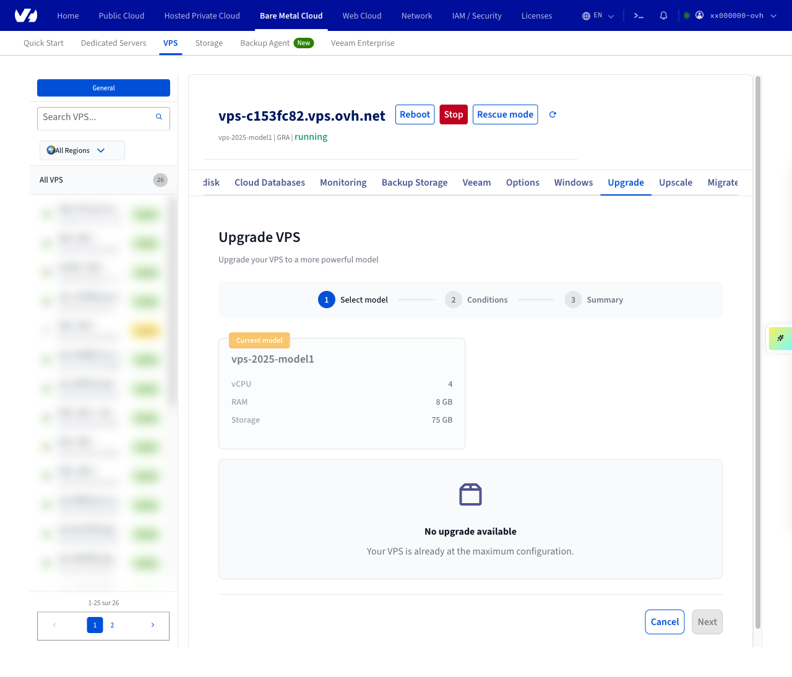
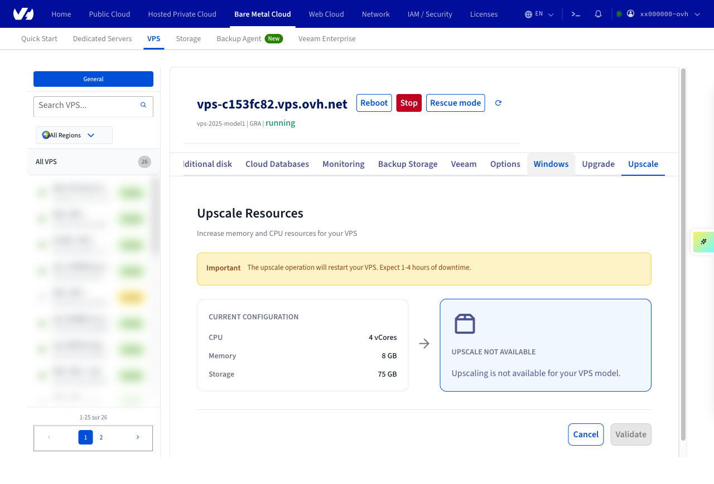

## Objective

Our VPS services offer flexibility, reliability, and performance for a variety of hosting needs. You can proceed with upgrading your RAM, vCPU, or storage in the [OVHcloud Control Panel](/links/manager).

**Learn how to add vCores, memory, and storage to your VPS service.** 

## Requirements

- A [Virtual Private Server](/links/bare-metal/vps) in your OVHcloud account

<!-- CP-NAV-START:baremetal-vps -->
---

### OVHcloud Control Panel Access

- **Direct link:** [VPS management](/links/control-panel/baremetal-vps)
- **Navigation path:** `Bare Metal Cloud`{.action} > `Virtual private servers`{.action} > Select your VPS

---
<!-- CP-NAV-END:baremetal-vps -->

## Instructions

<!-- CP-STEPS-START:instructions-overview -->
> [!primary]
>
> The upgrade options available in your OVHcloud account depend on the range and model of the selected VPS. The screenshots below are for the purpose of illustration and do not refer to a concrete VPS upgrade scenario.

In the OVHcloud Manager, click **Bare Metal Cloud** in the left-hand sidebar, then click **Virtual private servers** and select your VPS from the list. From the VPS management page, you can access the upgrade options via the **Upgrade** and **Upscale** tabs.

{.thumbnail}
<!-- CP-STEPS-END:instructions-overview -->

### 1. To add **vCores**

<!-- CP-STEPS-START:add-vcores -->
Click the **Upgrade** tab. A 3-step wizard is displayed: **Select model**, **Conditions**, and **Summary**.

Select a higher-range model using the radio card selector, then click `Next`{.action}.

Accept the terms and conditions, then click `Next`{.action}.

Review your changes and click `Validate upgrade`{.action}.

> ⚠️ **To document**: The upgrade model selection cards (steps 2–3 of the wizard: Conditions and Summary) could not be captured because the `/availableUpgrade` API returned an error for the test VPS (already at maximum configuration). Screenshots of the model selection cards, the Conditions step, and the Summary/confirmation step with the `Validate upgrade` button are needed from a VPS that has available upgrades.
<!-- CP-STEPS-END:add-vcores -->

### 2. To upgrade **Memory**

<!-- CP-STEPS-START:upgrade-memory -->
Click the **Upscale** tab. An orange warning banner is displayed indicating that the upscale operation will restart your VPS.

Use the memory slider to select the desired memory size. The **New Configuration** panel updates to reflect your selection.

Click `Validate`{.action} to confirm the upscale operation.

{.thumbnail}
<!-- CP-STEPS-END:upgrade-memory -->

### 3. To upgrade **Storage**

<!-- CP-STEPS-START:upgrade-storage -->
Click the **Upscale** tab. The current storage configuration is displayed in the **Current Configuration** card.

Select the desired configuration, then click `Validate`{.action} to confirm the operation.

> ⚠️ **To document**: The storage upgrade flow could not be fully captured. The Upscale tab displays storage as a fixed value (no independent storage upgrade control was observed). It is unclear whether storage can be independently upgraded via the Upscale tab or whether it requires a full model upgrade via the Upgrade tab. A screenshot showing storage upgrade options is needed from a VPS that supports storage upscaling.
<!-- CP-STEPS-END:upgrade-storage -->

See our dedicated guide for the next steps: [How to repartition a VPS after a storage upgrade](/pages/bare_metal_cloud/virtual_private_servers/upsize_vps_partition)

## FAQ

/// details | Will I have the same IP address?

Yes, you will keep the same IP address after upgrading your VPS.

///

/// details | Do I keep my data on the server?

Yes, after an upgrade you will still have your data. When upgrading your drive you may have to expand the partitions.

///

/// details | What happens to the backup/snapshot? Can I use it on the new VPS?

Yes. After upgrades you will still have access to your backups and snapshots.

///

/// details | What happens to the software license on the old VPS? Can they be automatically moved over to the new VPS?

If you have an active license, it will remain attached to the VPS. The pricing may change based on the license agreement or requirements with the provider.  
If there are any changes to the license, they will be explained before upgrading the VPS.

///

/// details | Would the bandwidth change?

In some cases the bandwidth may change, specifically when moving from a lower‑tier VPS to the next tier.

///

/// details | Would this upgrade be immediate, or would I have time to use both at the same time (configure, transfer data, etc.)?

The upgrade will be effective immediately, keeping all of your data. Upgrading will allocate more resources to your existing VPS.

///

## Go further

[VPS FAQ](/pages/bare_metal_cloud/virtual_private_servers/vps-faq)

Join our [community of users](/links/community).