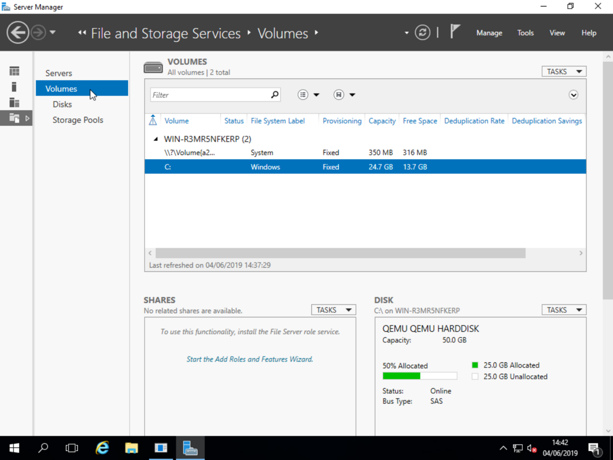
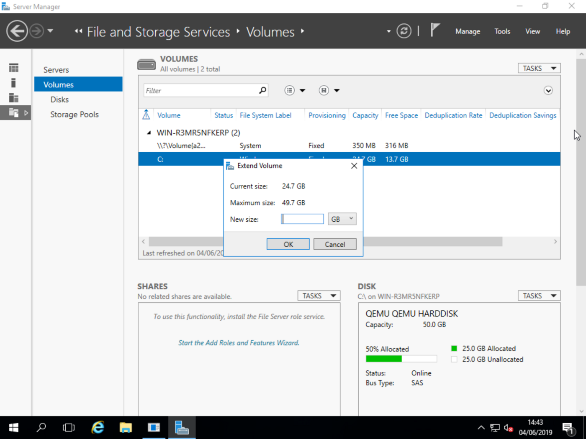

## Objective

After upgrading the storage capacity of your VPS, you will need to repartition the disk space to take advantage of the full size. The following steps describe how to do this.

> [!warning]
>
> Repartitioning could permanently damage your data. OVHcloud cannot be held responsible for any loss or damage to your data. Before doing anything, make sure you back up all of your data. 

**This guide explains how to increase your storage space after a disk upgrade.**

## Requirements

- Administrative access to your VPS ([Windows](#windows))
- [Rescue mode](/pages/bare_metal_cloud/virtual_private_servers/rescue) activated on the VPS (Linux only)

## Instructions

After a memory (RAM) or processor (vCores) upgrade, these resources of your VPS are automatically adjusted. The usable disk space however is not automatically increased when you upgrade the storage of your VPS.

### Linux

#### Back up your data

Attempting to extend a partition can lead to data loss. It is therefore **strongly recommended** that you back up the data on your VPS.

#### Activate rescue mode and verify the partitions

If the VPS is not already in rescue mode, activate it by using [our guide](/pages/bare_metal_cloud/virtual_private_servers/rescue).

You can then verify the configuration of the disks:

```bash
lsblk
```

The partition corresponding to rescue mode (`sda1` in this example) is mounted in the directory `/` and the disk of the VPS is named `sdb` and should have no mount point.

Example:

```console
NAME MAJ:MIN RM SIZE RO TYPE MOUNTPOINT
sda 254:0 0 10G 0 disk
└─sda1 254:1 0 10G 0 part /
sdb 254:16 0 25G 0 disk
└─sdb1 254:17 0 25G 0 part
```

If your result looks similar to the output above and the column `MOUNTPOINT` is empty in the corresponding line, you can proceed with the [next step](#checkfs).

However, if your result shows that there is a mount point for the VPS partition, it needs to be unmounted first.

Example:

```console
sdb 254:16 0 25G 0 disk
└─sdb1 254:17 0 25G 0 part /mnt/sdb1
```

In the example output above, the partition `sdb1` is mounted at `/mnt/`. In order to resize the partition, this partition must not be mounted.

To unmount your partition, use the following command:

```bash
umount /dev/partition_name
```

In this example configuration, the command would be:

```bash
umount /dev/sdb1
```

#### Check the filesystem <a name="checkfs"></a>

Before you proceed, it is recommended to check the filesystem to see if there are errors in the partition. The command is as follows:

```sh
e2fsck -yf /dev/sdb1
```

```console
e2fsck 1.42.9 (4-Feb-2014)
Pass 1: Checking inodes, blocks, and sizes
Pass 2: Checking directory structure
Pass 3: Checking directory connectivity
Pass 4: Checking reference counts
Pass 5: Checking group summary information
/dev/sdb1: 37870/1310720 files (0.2% non-contiguous), 313949/5242462 blocks
```

If you see any errors, take note of them and resolve them as required. Below is a (non-exhaustive) list of the most common errors you might see:

- `bad magic number in superblock`: Do not continue. Please read and follow our instructions on [How to fix a **bad magic number in superblock** error](/pages/bare_metal_cloud/virtual_private_servers/upsize_vps_partition#how-to-fix-a-bad-magic-number-in-superblock-error).

- `/dev/vdb1 has unsupported feature(s): metadata_csum` followed by `e2fsck: Get a newer version of e2fsck!`: Update e2fsck. If the latest version is not available via `apt` (or another package manager), you will need to compile it from source.

#### Launch the fdisk application

If the filesystem check is completed successfully, launch the `fdisk` application. In the settings, you need to enter the name of the disk and not the name of the partition. For example, if your partition is `sdb1`, the disk name will be `/dev/sdb`.

```sh
fdisk -u /dev/sdb
```

> [!primary]
>
> This application offers several commands, which you can view by entering `m`.
>

#### Delete the old partition

Before deleting the old partition, it is recommended that you write down the number corresponding to the first sector of the partition. You can find this information through the command `p`{.action}. The information is listed under the `Start` field. Save this data for later.

```console
Command (m for help): p
 
Disk /dev/sdb: 21.5 GB, 21474836480 bytes
54 heads, 49 sectors/track, 15851 cylinders, total 41943040 sectors
Units = sectors of 1 * 512 = 512 bytes
Sector size (logical/physical): 512 bytes / 512 bytes
I/O size (minimum/optimal): 512 bytes / 512 bytes
Disk identifier: 0x000132ff
 
Device Boot Start End Blocks Id System
/dev/sdb1 * *2048* 41941745 20969849 83 Linux
```

> [!warning]
>
> If you have not backed up your data, this is the point of no return.
>

Then delete the partition with the command `d`{.action}.

```console
Command (m for help): d
Selected partition 1
```

The single partition will automatically be deleted.

#### Create a new partition

You now need to create a new partition with the command `n`{.action}. It is recommended that you use the default values.

```console
Command (m for help): n
Partition type:
p primary (0 primary, 0 extended, 4 free)
e extended
Select (default p): p
Partition number (1-4, default 1): 1
First sector (2048-41943039, default 2048): 2048
Last sector, +sectors or +size{K,M,G} (2048-41943039, default 41943039): 41943039.
```

On the `First sector` line, check that the default value is the same as the one you have previously written down. If it is different, use the value you have written down.

#### Make the partition bootable

You now need to ensure that the partition is bootable. You can do this using the command `a`{.action}.

```console
Command (m for help): a
 
Partition number (1-4): 1
```

Save your changes and exit the application with the command `w`{.action}:

```console
Command (m for help): w
 
The partition table has been altered!
 
Calling ioctl() to re-read partition table.
Syncing disks.
```

#### Extend the filesystem on the partition

The partition has been extended, but the filesystem still occupies the same space as before. To extend it, simply enter the following command:

```sh
resize2fs /dev/sdb1
```

```console
resize2fs 1.42.9 (4-Feb-2014)
Resizing the filesystem on /dev/sdb1 to 5242624 (4k) blocks.
The filesystem on /dev/sdb1 is now 5242624 blocks long.
```

#### Check the results

In order to check if the extension has been successful, you can mount the newly created partition and verify its size.

```sh
mount /dev/sdb1 /mnt
```
```sh
df -h
```

```console
Filesystem Size Used Avail Use% Mounted on
/dev/sda1 991M 793M 132M 86% /
none 4.0K 0 4.0K 0% /sys/fs/cgroup
udev 1.9G 12K 1.9G 1% /dev
tmpfs 386M 360K 386M 1% /run
none 5.0M 0 5.0M 0% /run/lock
none 1.9G 0 1.9G 0% /run/shm
none 100M 0 100M 0% /run/user
/dev/sdb1 50G 842M 48G 2% /mnt
```

You will find the new partition size listed below the label `size`.

#### How to fix a bad magic number in superblock error

If the command `e2fsck`{.action} returns the error message `bad magic number in superblock`, you should check and repair the filesystem by using a backup of the superblock. To see which backups of the superblock are available, enter the following command:

```sh
dumpe2fs /dev/sdb1 | grep superblock
```

```console
Primary superblock at 0, Group descriptors at 1-6
Backup superblock at 32768, Group descriptors at 32769-32774
Backup superblock at 98304, Group descriptors at 98305-98310
Backup superblock at 163840, Group descriptors at 163841-163846
Backup superblock at 229376, Group descriptors at 229377-229382
Backup superblock at 294912, Group descriptors at 294913-294918
Backup superblock at 819200, Group descriptors at 819201-819206
Backup superblock at 884736, Group descriptors at 884737-884742
Backup superblock at 1605632, Group descriptors at 1605633-1605638
Backup superblock at 2654208, Group descriptors at 2654209-2654214
Backup superblock at 4096000, Group descriptors at 4096001-4096006
Backup superblock at 7962624, Group descriptors at 7962625-7962630
Backup superblock at 11239424, Group descriptors at 11239425-11239430
Backup superblock at 20480000, Group descriptors at 20480001-20480006
Backup superblock at 23887872, Group descriptors at 23887873-23887878
```

Then use the first superblock backup to check and repair the filesystem:

```sh
fsck -b 32768 /dev/sdb1
```

### Windows <a name="windows"></a>

#### Access File and Storage Services

You can find this in the Server Manager:

{.thumbnail}

#### Resize the volume

Right click on the C: volume and select `Extend Volume...`{.action}.

You will then be prompted to choose your new volume size:

{.thumbnail}

Enter your desired size and click `OK`{.action}. Your volume will now be extended.

## Go further

Join our community of users at <https://community.ovh.com/en/>.
