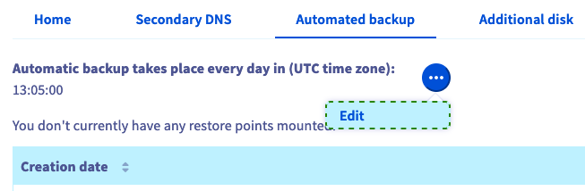
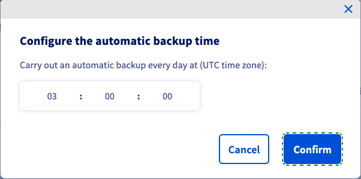
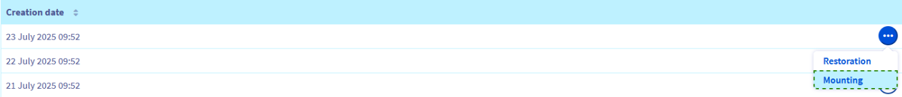
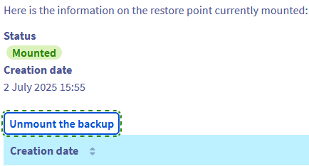
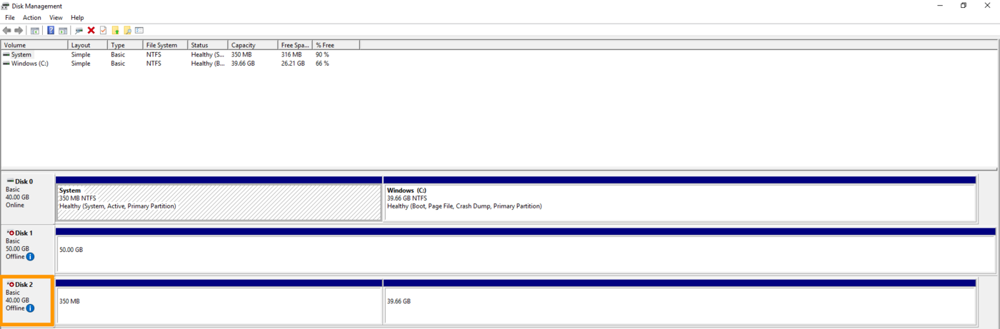
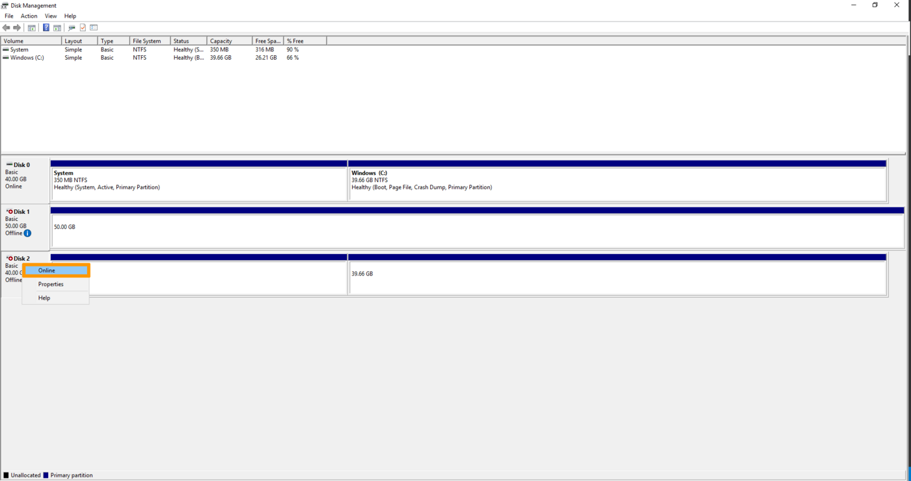
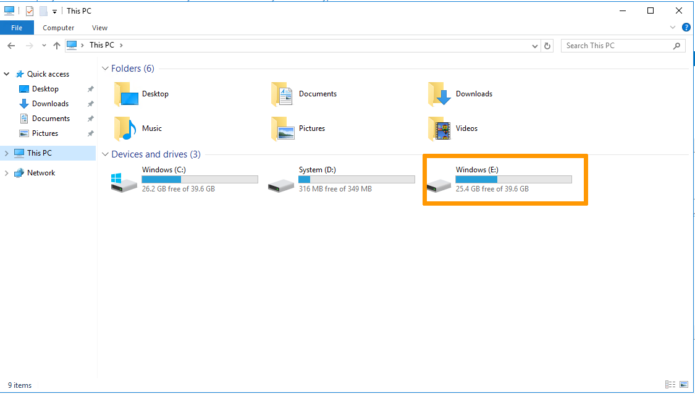

<style>
.grid-gallery {
  display: grid;
  grid-template-columns: repeat(2, 1fr);
  gap: 1rem;
}
.grid-gallery img {
  width: 100%;
  height: auto;
  object-fit: cover;
}
</style>

## Objective

The Automated backup option for VPS offers a convenient way to have complete system backups available from your OVHcloud Control Panel without having to connect to the server to create and restore them manually. Another advantage is that you can also choose to mount a backup and then access its files remotely.

**This guide explains the Automated backup option for your OVHcloud VPS.**

> [!primary]
> Before applying a backup strategy, we recommend consulting the [product pages and FAQ](/links/bare-metal/vps-options) for pricing comparisons and further details.
>

## Requirements

- An active [Virtual Private Server](/links/bare-metal/vps) in your OVHcloud account
- Administrative access (sudo) via SSH to your VPS (optional).

<!-- CP-NAV-START:baremetal-vps -->
---

### OVHcloud Control Panel Access

- **Direct link:** [VPS management](/links/control-panel/baremetal-vps)
- **Navigation path:** `Bare Metal Cloud`{.action} > `Virtual private servers`{.action} > Select your VPS

---
<!-- CP-NAV-END:baremetal-vps -->

> [!warning]
> This feature is currently unavailable for Virtual Private Servers in [Local Zones](/links/bare-metal/vps-lz).
>

## Instructions

### Content overview

- [How to upgrade to Premium Automated Backup](#premium)
- [How to configure the backup time](#time)
- [How to restore a backup from the OVHcloud Control Panel](#restore)
- [How to mount and access a backup](#mount)
    - [Using Secure Shell](#shell)
    - [Using Windows](#windows)
- [Best practice for using Automated backups](#bestpractice)
    - [Configuring the QEMU agent on a VPS](#qemu)
        - [Debian-based distributions](#deb)
        - [Redhat-based distributions](#red)
        - [Windows](#win)


When you order a VPS, a single daily Automated backup is included as a free service option. This standard backup option allows you to:

- Mount and restore the daily backup.
- Set the time of day this backup will be created.

For more flexibility with your backups, you can activate the Premium Automated Backup option.

<a name="premium"></a>

### How to subscribe to Premium Automated Backup

The Premium Automated Backup option creates a backup of your VPS every 24 hours at the specified time.  
You will have access to all daily backups of the last 7 days. Once 7 backups are created, each new backup will replace the oldest one.

<!-- CP-STEPS-START:block-subscribe-premium-backup -->

Log in to the [OVHcloud Control Panel](/links/manager), go to the **Bare Metal Cloud** section and click on **Virtual private servers** in the left-hand sidebar. Select your VPS from the list.

Click the `Automated backup`{.action} tab.

Click the `Enable`{.action} button in the **Backup Status** card.

> [!warning]
>
> **To document**: The **Automated backup** tab is implemented in the New Manager but is not yet visible in the tab bar. Navigation to this tab and the exact button labels could not be confirmed at the time of writing. Screenshots will be added once the feature is fully surfaced in the interface.
>

<!-- CP-STEPS-END:block-subscribe-premium-backup -->

<a name="time"></a>

### How to configure the backup time

You can change the time of day at which the backup will take place.

<!-- CP-STEPS-START:block-configure-backup-time -->
After selecting your VPS, click on the `Automated backup`{.action} tab in the horizontal menu.

Click on `...`{.action} above the table and then on `Edit`{.action}.

{.thumbnail}

In the window that appears, edit the time of day (24-hour UTC time standard). Click on `Confirm`{.action}.

{.thumbnail}

> [!primary]
>
> Once confirmed in the Control Panel, the change will come into effect after 24 to 48 hours.
>
<!-- CP-STEPS-END:block-configure-backup-time -->

<a name="restore"></a>

### How to restore a backup from the OVHcloud Control Panel

<!-- CP-STEPS-START:block-restore-backup -->

Log in to the [OVHcloud Control Panel](/links/manager), go to the **Bare Metal Cloud** section and click on **Virtual private servers** in the left-hand sidebar. Select your VPS from the list.

Click the `Automated backup`{.action} tab.

In the **Restore Points** table, click the `Restore`{.action} button on the desired backup entry.

If you recently changed your root password, make sure to tick the option "Modify the root password on restoration" in the popup window to preserve your current root password. You will receive an email as soon as the task is complete. The restoration might take a while, depending on the disk space used.

> [!warning]
>
> **To document**: The **Automated backup** tab is implemented in the New Manager but is not yet visible in the tab bar. Navigation to this tab and the restore flow could not be confirmed at the time of writing. Screenshots will be added once the feature is fully surfaced in the interface.
>

<!-- CP-STEPS-END:block-restore-backup -->

> [!alert]
>
> Please note that the automated backups will not include your additional disks.
>

<a name="mount"></a>

### How to mount and access a backup

It is not necessary to completely overwrite your existing service with a restoration. The "Mounting" option allows you to access the backup data to retrieve your files. 

> [!warning]
>
> OVHcloud provides services for which you are responsible with regard to their configuration and management. It is therefore your responsibility to ensure that they function correctly.
>
> This guide is designed to help you with common tasks. Nevertheless, we recommend contacting a [specialist service provider](/links/partner) or reaching out to the [OVHcloud community](/links/community) if you encounter any difficulties. You can find more information in the [Go further](#go-further) section of this guide.
>

<!-- CP-STEPS-START:block-mount-access-backup -->
After selecting your VPS, click on the `Automated backup`{.action} tab in the horizontal menu.
Click on `...`{.action} next to the backup you need to access and select `Mounting`{.action}.

{.thumbnail}

When you use this option, a read-write copy of the backup is created and mounted. The original backup will remain available unchanged for future restorations.

After the process is completed, you will receive an email. You can now connect to your VPS and access the partition where your backup is located.

<a name="shell"></a>

#### Using Secure Shell

First, connect to your VPS via SSH.

You can use the following command to verify the name of the newly attached device:

```bash
lsblk
```

Here is a sample output of this command:

```console
NAME    MAJ:MIN RM  SIZE RO TYPE MOUNTPOINT
sda       8:0    0   25G  0 disk 
├─sda1    8:1    0 24.9G  0 part /
├─sda14   8:14   0    4M  0 part 
└─sda15   8:15   0  106M  0 part 
sdb       8:16   0   25G  0 disk 
├─sdb1    8:17   0 24.9G  0 part 
├─sdb14   8:30   0    4M  0 part 
└─sdb15   8:31   0  106M  0 part /boot/efi
```

In this example, the partition containing your backup filesystem is named "sdb1".  
Next, create a directory for this partition and define it as the mountpoint:

```bash
sudo mkdir -p /mnt/restore
sudo mount /dev/sdb1 /mnt/restore
```

You can now switch to this folder and access your backup data.

Remember to unmount the backup once you have finished using it. Click on the button `Unmount the backup`{.action} in the `Automated backup`{.action} tab, then confirm in the popup window.

{.thumbnail}

<a name="windows"></a>

#### Using Windows

Establish an RDP connection to your server.

Once logged in, right-click on the `Start Menu`{.action} button, and then click `Disk Management`{.action}.

{.thumbnail}

When the disk management tool opens, your mounted backup will appear as a basic disk with the same storage space as your main disk.

{.thumbnail}

The disk will appear as `Offline`, right-click on the disk and select `Online`{.action}.

{.thumbnail}

Once done, your mounted backup will be accessible in the `File Explorer`.

{.thumbnail}

Remember to unmount the backup once you have finished using it. Click on the button `Unmount the backup`{.action} in the `Automated backup`{.action} tab, then confirm in the popup window.

{.thumbnail}
<!-- CP-STEPS-END:block-mount-access-backup -->

> [!warning]
>
> Please note that a server reboot will occur when the backup is unmounted.
>

<a name="bestpractice"></a>

### Best practice for using Automated backups

The Automated Backup functionality is based on VPS snapshots. We recommend following the steps below to prevent any issues before using this option.

<a name="qemu"></a>

#### Configuring the QEMU agent on a VPS

Snapshots are instantaneous images of your running system ("live snapshot"). To ensure the availability of your system when the snapshot is created, the QEMU agent is used to prepare the filesystem for the process.

The "**qemu-guest-agent**" agent is not installed by default on most distributions. Moreover, licensing restrictions may prevent OVHcloud from including it in the available OS images. Therefore, it is best practice to verify and install the agent if it is not activated on your VPS. Connect to your VPS via SSH and follow the instructions below, according to your operating system.

<a name="deb"></a>

##### **Debian-based distributions (Debian, Ubuntu)**

Use the following command to check whether the system is properly set up for snapshots:

```bash
file /dev/virtio-ports/org.qemu.guest_agent.0
```

The expected output is:

```console
/dev/virtio-ports/org.qemu.guest_agent.0: symbolic link to ../vport2p1
```

If the output is different, for example "No such file or directory", install the latest version of the package:

```bash
sudo apt-get update
sudo apt-get install qemu-guest-agent
```

Reboot the VPS:

```bash
sudo reboot
```

Start the service to ensure it is running:

```bash
sudo service qemu-guest-agent start
```

<a name="red"></a>

##### **Redhat-based distributions (Centos, Fedora)**

Use the following command to check whether the system is properly set up for snapshots:

```bash
file /dev/virtio-ports/org.qemu.guest_agent.0
```

The expected output is:

```console
/dev/virtio-ports/org.qemu.guest_agent.0: symbolic link to ../vport2p1
```

If the output is different, for example "No such file or directory", install and enable the agent:

```bash
sudo yum install qemu-guest-agent
sudo chkconfig qemu-guest-agent on
```

Reboot the VPS:

```bash
sudo reboot
```

Start the agent and verify that it is running:

```bash
sudo service qemu-guest-agent start
sudo service qemu-guest-agent status
```

<a name="win"></a>

##### **Windows**

You can install the agent via MSI file, available from the Fedora project website: <https://fedorapeople.org/groups/virt/virtio-win/direct-downloads/latest-qemu-ga/>.

Verify that the service is running by using this PowerShell command:

```console
PS C:\Users\Administrator> Get-Service QEMU-GA
Status   Name               DisplayName
------   ----               -----------
Running  QEMU-GA            QEMU Guest Agent
```

<a name="go-further"></a>

## Go further

[How to use snapshots on a VPS](/pages/bare_metal_cloud/virtual_private_servers/using-snapshots-on-a-vps)

Join our [community of users](/links/community).