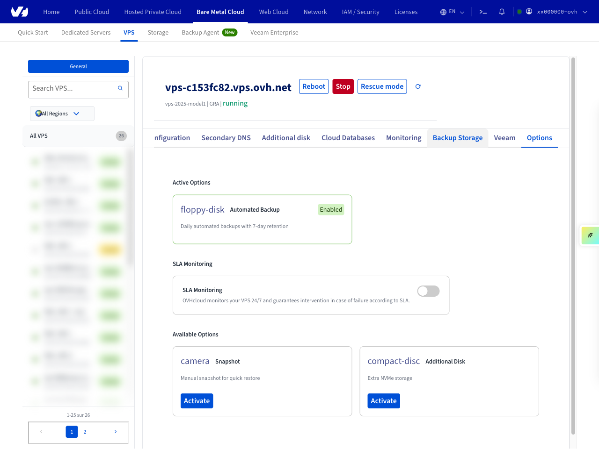
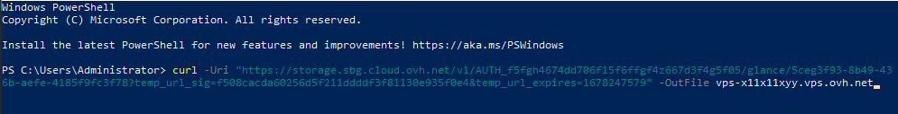

## Objective

Creating a snapshot is a fast and simple way to secure a functioning system before making changes that might have undesired or unforeseen consequences, for example testing a new configuration or software. It does not, however, constitute a complete system backup strategy.

**This guide explains the usage of snapshots for your OVHcloud VPS.**

> [!primary]
>
Before applying backup options, we recommend consulting the [product pages and FAQ](/links/bare-metal/vps-options) for pricing comparisons and further details.
>

## Requirements

- An active [Virtual Private Server](/links/bare-metal/vps) in your OVHcloud account

> [!warning]
> This feature is currently unavailable for Virtual Private Servers in [Local Zones](/links/bare-metal/vps-lz).
>

<!-- CP-NAV-START:baremetal-vps -->
---

### OVHcloud Control Panel Access

- **Direct link:** [VPS management](/links/control-panel/baremetal-vps)
- **Navigation path:** `Bare Metal Cloud`{.action} > `Virtual private servers`{.action} > Select your VPS

---
<!-- CP-NAV-END:baremetal-vps -->

## Instructions

### Step 1: Subscribing to the snapshot option

<!-- CP-STEPS-START:subscribe-snapshot-option -->
In your OVHcloud Control Panel, go to the **Bare Metal Cloud** section, then click **VPS** in the sections bar. Select your VPS from the list on the left, then click the **Options** tab.

If "Snapshot" is already listed under **Active Options**, go directly to step 2. If the snapshot option is not yet enabled, locate the **Snapshot** card in the **Available Options** section and click `Activate`{.action}.

{.thumbnail}

You will be guided through the subscription process and receive a confirmation email. Once activated, the Snapshot card moves to the **Active Options** section.
<!-- CP-STEPS-END:subscribe-snapshot-option -->

### Step 2: Taking a snapshot

<!-- CP-STEPS-START:take-snapshot -->
In your OVHcloud Control Panel, go to the **Bare Metal Cloud** section, then click **VPS** in the sections bar. Select your VPS from the list on the left, then navigate to the **Snapshot** tab.

Once the option is enabled, click `Create snapshot`{.action}. You can optionally enter a description that will be attached to your snapshot. The time it takes to create the snapshot depends on the storage space in use. Afterwards, refresh your page to see the timestamp of the creation.

> [!primary]
>
> The **Snapshot** tab is accessible at the URL `/bare-metal/vps/{serviceName}/snapshot` in the New Manager. If the tab is not yet visible in the navigation bar, it can be reached directly via this URL.
>

> ⚠️ **To document**: Capture a screenshot of the Snapshot tab showing the `Create snapshot` button and, if possible, the `TakeSnapshotModal` with the description field and confirm button. The Snapshot tab did not render during automated capture because the snapshot option was not subscribed on the test VPS.
<!-- CP-STEPS-END:take-snapshot -->

### Step 3: Deleting or restoring a snapshot

<!-- CP-STEPS-START:delete-restore-snapshot -->
In your OVHcloud Control Panel, go to the **Bare Metal Cloud** section, then click **VPS** in the sections bar. Select your VPS from the list on the left, then navigate to the **Snapshot** tab.

Since you can only have one snapshot activated at a time, the existing snapshot must be deleted before creating a new one. Click `Delete`{.action} (displayed in red) and confirm the deletion in the popup window.

If you want to reset your VPS to the status of the snapshot, click `Restore`{.action} and confirm the restoration task in the popup window.

> [!alert]
>
> Please note that when you restore a VPS from a snapshot, the snapshot will be deleted. If you wish to keep the same snapshot, you should take a new one before making changes to the restored system.
>
> If the snapshot function is too limited for your project, consider switching to the option [Automated Backups](/pages/bare_metal_cloud/virtual_private_servers/using-automated-backups-on-a-vps).

> ⚠️ **To document**: Capture a screenshot of the Snapshot tab showing a snapshot present, with the `Restore`, `Download`, and `Delete` action buttons visible. The Snapshot tab did not render during automated capture because the snapshot option was not subscribed on the test VPS.
<!-- CP-STEPS-END:delete-restore-snapshot -->

### Downloading a snapshot

<!-- CP-STEPS-START:download-snapshot -->
In your OVHcloud Control Panel, go to the **Bare Metal Cloud** section, then click **VPS** in the sections bar. Select your VPS from the list on the left, then navigate to the **Snapshot** tab.

Click `Download`{.action} next to your snapshot. A modal window opens and automatically generates the download link — no additional button click is required. Once the link is ready, click `Download`{.action} in the modal to open the snapshot download link in a new browser tab.

The size of the snapshot and the expiration date of the link will also be displayed.

Note that the download link will expire after **24 hours**.

> ⚠️ **To document**: Capture screenshots of (1) the Snapshot tab with the `Download` button visible, (2) the `DownloadSnapshotModal` while loading, and (3) the modal with the download link ready showing the expiry date. The Snapshot tab did not render during automated capture because the snapshot option was not subscribed on the test VPS.
<!-- CP-STEPS-END:download-snapshot -->

The download command uses `curl`, in the following format:

```bash
curl "https://storage.sbg.cloud.ovh.net/v1/AUTH_f5fgh4674dd706f15f6ffgf4z667d3f4g5f05/glance/5ceg3f93-8b49-436b-aefe-4185f9fc3f78?
temp_url_sig=f508cacda60256d5f211ddddf3f81130e935f0e4&temp_url_expires=1678247579" --output vps-x11x11xyy.vps.ovh.net --fail
```

It should work from any command line terminal.

When using Windows *PowerShell* however, you will need to adjust the command as follows:

```powershell
curl -Uri "https://storage.sbg.cloud.ovh.net/v1/AUTH_f5fgh4674dd706f15f6ffgf4z667d3f4g5f05/glance/5ceg3f93-8b49-436b-aefe-4185f9fc3f78?
temp_url_sig=f508cacda60256d5f211ddddf3f81130e935f0e4&temp_url_expires=1678247579" -OutFile vps-x11x11xyy.vps.ovh.net
```

{.thumbnail}

> [!primary]
>
> We recommend not downloading snapshots directly to the VPS, to avoid using up the storage space.
>
> The downloaded file can be imported into your Public Cloud Project as an image (QCOW2) via [OpenStack](/products/public-cloud-compute-instance-management). (Find an example of use in [this guide](/pages/public_cloud/compute/upload_own_image).) 
>

### Best practice for using snapshots

#### Configuring the QEMU agent on a VPS

Snapshots are instantaneous images of your running system ("live snapshot"). To ensure the availability of your system when the snapshot is created, the QEMU agent is used to prepare the filesystem for the process.

The required *qemu-guest-agent* is not installed by default on most distributions. Moreover, licensing restrictions may prevent OVHcloud from including it in the available OS images. Therefore, it is best practice to verify and install the agent if it is not activated on your VPS. Connect to your VPS via SSH and follow the instructions below, according to your operating system.

##### **Debian-based distributions (Debian, Ubuntu)**

Use the following command to check whether the system is properly set up for snapshots:

```bash
file /dev/virtio-ports/org.qemu.guest_agent.0
/dev/virtio-ports/org.qemu.guest_agent.0: symbolic link to ../vport2p1
```

If the output is different ("No such file or directory"), install the latest package:

```bash
sudo apt-get update
sudo apt-get install qemu-guest-agent
```

Reboot the VPS:

```bash
sudo reboot
```

Check the service to ensure it is running:

```bash
sudo service qemu-guest-agent status
```

##### **Redhat-based distributions (Centos, Fedora)**

Use the following command to check whether the system is properly set up for snapshots:

```bash
file /dev/virtio-ports/org.qemu.guest_agent.0
/dev/virtio-ports/org.qemu.guest_agent.0: symbolic link to ../vport2p1
```

If the output is different ("No such file or directory"), install and enable the agent:

```bash
sudo yum install qemu-guest-agent
sudo chkconfig qemu-guest-agent on
```

Reboot the VPS:

```bash
sudo reboot
```

Check the agent and verify that it is running:

```bash
sudo service qemu-guest-agent status
```

##### **Kernel issues on cPanel**

Consult our [cPanel auto backup](/pages/bare_metal_cloud/virtual_private_servers/cpanel_snapshot) guide to find out how to fix issues with cPanel servers getting stuck during an OVHcloud automated backup.

##### **Windows**

You can install the agent via MSI file, available from the Fedora project website: <https://fedorapeople.org/groups/virt/virtio-win/direct-downloads/latest-qemu-ga/>.

Verify that the service is running by using this *PowerShell* command:

```powershell
PS C:\Users\Administrator> Get-Service QEMU-GA

Status   Name               DisplayName
------   ----               -----------
Running  QEMU-GA            QEMU Guest Agent
```

## Go further

[How to use automated backups on a VPS](/pages/bare_metal_cloud/virtual_private_servers/using-automated-backups-on-a-vps)

Join our [community of users](/links/community).
