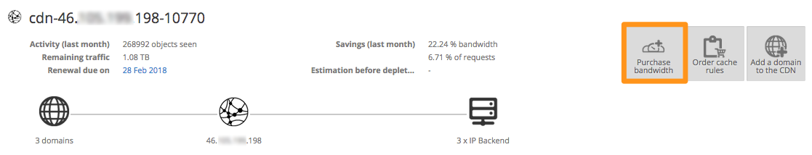
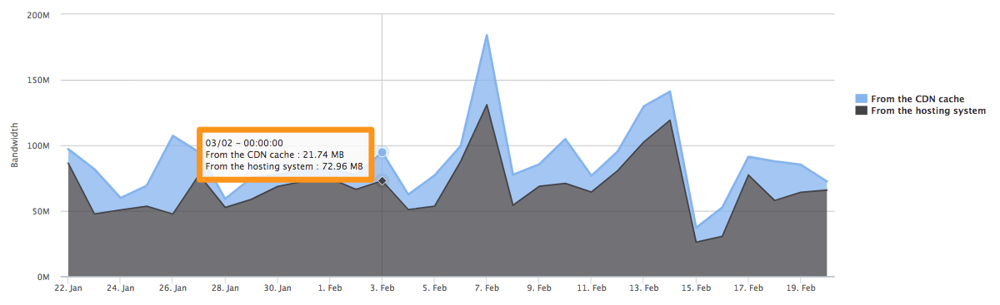

**Last updated 22nd February 2018**

## Objective

With the Content Delivery Network (CDN), you can optimise your website’s response times for all of your users. Whenever a user visits your website, a volume of traffic is generated. This uses a portion of your quota (a limit on the total volume of incoming and outgoing traffic for your CDN).

**This guide will provide detailed information on how to manage your CDN’s quota.**

## Requirements

- access to the [OVH Control Panel](https://www.ovh.com/auth/?action=gotomanager){.external}

## Instructions

### Order your quota.

When you place an order, it comes with a **1 TB** quota allowance for traffic. It is important to note that this quota is not renewed monthly with your solution. Once you have used up this quota allowance (regardless of duration), you will need to add more quota allowance.

If you need additional quota, you can order it directly via the [OVH Control Panel](https://www.ovh.com/auth/?action=gotomanager){.external}:

{.thumbnail}

You can view the prices for quota allowance on our [website](https://www.ovh.co.uk/cdn/infrastructure/){.external}.

You are automatically notified when you have **100 GB** of quota remaining, so that you have time to order more bandwidth in advance. If you run out of quota allowance, the  `bypass` is automatically enabled until you order more quota.

### Traffic billed on the CDN solution.

> [!primary]
>
> You are billed for all outgoing traffic on your CDN.  
>

Here is an example:

{.thumbnail}

- **189595 Bytes** represents files that have already been cached. The CDN has been able to respond directly to requests for these files.

- **705431 Bytes** represents files called directly from the CDN’s back-end. The caching rules applied to your domain will determine which files are called from the back-end, and which files are cached.

Whether the files are stored in the cache or called from the back-end through the CDN, **the traffic generated will be subtracted from your quota allowance in both instances.** For this reason, we recommend creating a specific subdomain that will be called for files to be cached, and keeping the domains pointed to your CDN’s back-end for all other files.

## Go further

Join our community of users on <https://community.ovh.com/en/>.
