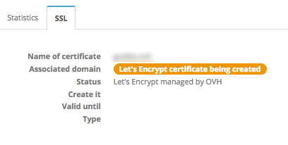
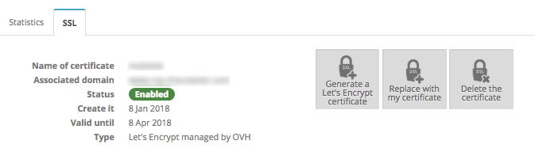
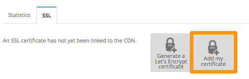
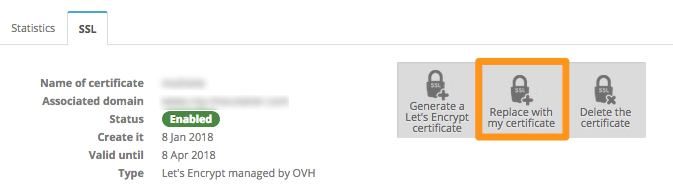

**Last updated 22nd February 2018**

## Objective

You can add an [SSL certificate](https://www.ovh.co.uk/ssl/){.external} to your Content Delivery Network (CDN), so that your users can connect securely, even if they do so via the CDN.

**In this guide, we will show you how to do this with a Let's Encrypt certificate, delivered by OVH.**

## Requirements

- an [OVH CDN solution](https://www.ovh.co.uk/cdn/){.external}
- the permissions needed to manage your domain’s DNS zone

## Instructions

### Order the Let’s Encrypt certificate supplied by OVH for your subdomains using the CDN.

- If you have not configured any certificates and you are adding your first subdomain to the CDN, a Let's Encrypt certificate will be created automatically for the domain name.
- If you are adding another subdomain to the CDN, the certificate will be automatically regenerated to include the new subdomain that you have just added.

To ensure that the certificate is generated properly, the subdomain you add will need to point correctly to the CDN. To check that this is the case, please follow the instructions listed in our guide to [Configuring a domain name for the first time](https://docs.ovh.com/gb/en/cdn-infrastructure/first-domain-configuration-on-cdn/){.external}.

The certificate is renewed automatically 20 days before its expiry date.

> [!warning]
>
> The Let’s Encrypt certificate supplied by OVH can include the first 100 domains or subdomains configured on the CDN. If you would like to do this for more than 100 domains, you will need to configure your own wildcard/multi-domain SSL certificate.
>

### How long does it take to generate a certificate?

On average, it takes two hours for an SSL certificate to be generated (or regenerated) and deployed in all of our points of presence.

{.thumbnail}

If the generation seems to be taking longer than it should, please check that the domain name configured on your solution points to the CDN. If this is not the case, our system will be unable to generate the certificate properly.

If you correct the address that the domain name points to while the certificate is being generated, our system will automatically retry the generation for a 48-hour period. If the certificate still cannot be generated after 48 hours, the generation task will be cancelled.

A new generation attempt will be launched if you add a new domain name, or if you request a certificate manually.

Once the certificate has been activated, you will receive this result:

{.thumbnail}

### Add your own certificate.

If you have not added a domain name yet, or if you do not own a certificate, you can use the `Add my certificate`{.action} option in your CDN’s SSL tab:

{.thumbnail}

If you already have a Let's Encrypt certificate, then you can use the `Replace with my certificate`{.action} option:

{.thumbnail}

## Go further

[Configuring a domain name for the first time](https://docs.ovh.com/gb/en/cdn-infrastructure/first-domain-configuration-on-cdn/){.external}

Join our community of users on <https://community.ovh.com/en/>.