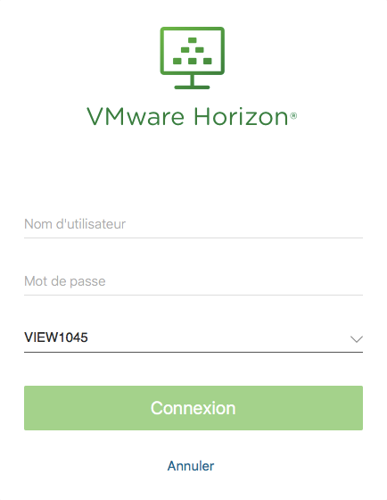
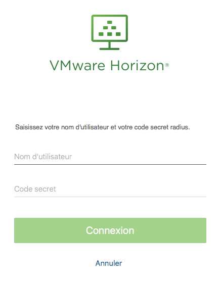

** Dernière mise à jour le 20/11/2017 **

## Objectif

VMware View vous permet d'accéder à un bureau virtuel à n'importe quel moment de la journée, quel que soit l'endroit où vous vous trouvez. Le challenge est de vous permettre d'y accéder de manière sécurisée grâce aux points d'accès, mais aussi en ajoutant une double authentification.

**Ce guide va vous expliquer comment l'activer.**

## Prérequis

- Avoir mis en place de votre côté un serveur d'authentification.
- Être connecté sur le [site d'API](https://api.ovh.com/).

## En pratique

Informations architecture : serveur Radius - 10.209.0.23.

Une fois la mise en place d'un serveur d'authentification de votre côté effectuée, suivez ce guide afin de l'ajouter sur vos points d'accès.

### Étape 1 : ajouter le réseau privé

Le serveur Radius a été créé dans un réseau privé.

Si vous souhaitez utiliser ce Radius sur un pool public, il est nécessaire d'ajouter le réseau privé, si ce n'est pas déjà fait. Pour cela référez-vous au guide sur l'[ajout d'un réseau privé](https://docs.ovh.com/fr/cloud-desktop-infrastructure/allow-virtual-desktop/).

### Étape 2 : réaliser le call dans l'APIv6 et dans l'espace client

Une fois le serveur d'authentification mis en place côté client, il est nécessaire de renseigner les points suivants dans le call :

>[!faq]
>
> Service:
>
>> > [!api]
>> >
>> > @api {POST} /horizonView/{serviceName}/accessPoint/{accessPointId}/enableTwoFA
>> >
>>
>
> Paramètres
>
>> accessPointId *
>>> Pool sur lequel le client va utiliser son serveur d'authentification
>> IP du Radius
>>> Doit être une IPv4
>> Chaîne d'authentification secrète
>>> Conditions requises : un caractère spécial, une majuscule, une minuscule et un chiffre
>

Lorsque le client exécutera le call, celui-ci lancera le robot : `add2FAOnAccessPoint.pl`.

Il est possible de surveiller la tâche depuis l'APIv6 ou depuis l'espace client.

### Étape 3 : se connecter

Rendez-vous sur votre point d'accès afin de tester votre double authentification.

- Saisissez vos identifiants Radius :

- Saisissez vos identifiants Active Directory :

## Aller plus loin

Échangez avec notre communauté d'utilisateurs sur <https://community.ovh.com>.