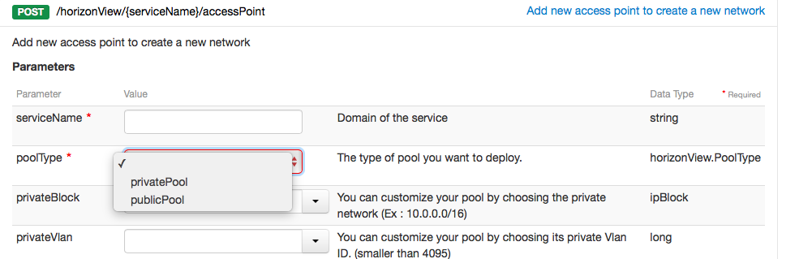
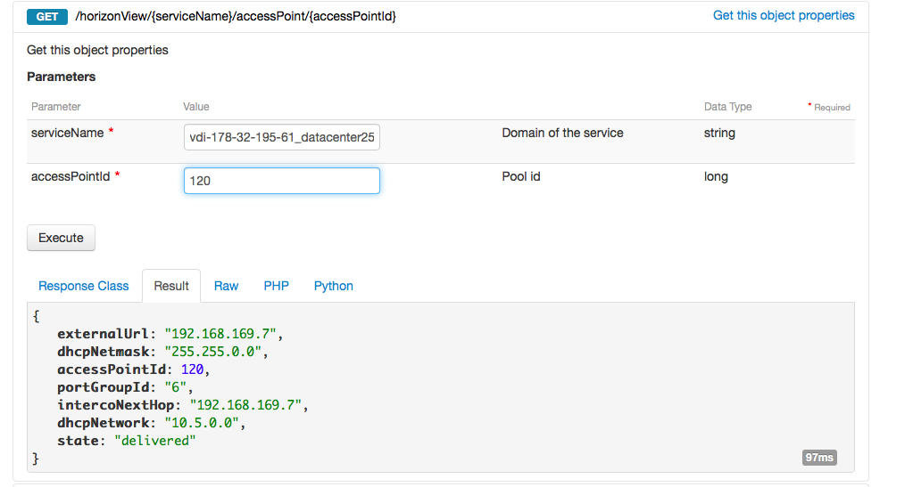
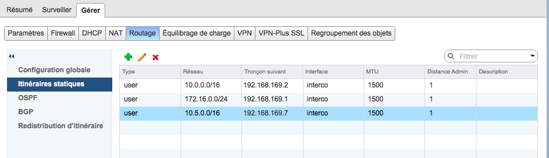
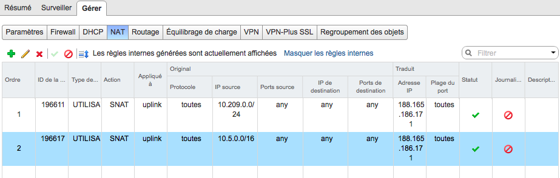

Afin d'accéder à vos desks uniquement par votre réseau interne, il est possible de déployer un pool privé.
Pour cela, il faudra mettre en place votre réseau d'interconnexion à l'aide de ce [guide](../interconnection-equipment/){.ref}.

## Procedure

### Étape 1
Une fois votre réseau d'interconnexion configuré :

- Sélectionnez l'appel suivant :

> [!api]
>
> @api {POST} /horizonView/{serviceName}/accessPoint
> 
- Choisissez le type "Pool Privé"

{.thumbnail}

- Vous pouvez personnaliser le réseau qui sera dédié à votre pool de machines virtuelles en précisant la plage d'adresse souhaitée et l'ID du VLAN privé sur le vRack.
- Puis, sélectionnez :  Execute

> [!primary]
>
> Des tâches en arrière-plan vont se lancer afin de déployer le nouveau pool sur votre infrastructure CDI.
> Vous recevrez un e-mail vous confirmant que tout est mis en place lorsque les tâches seront terminées.
> Une fois le pool provisionné, vous pouvez retrouver toutes ses caractéristiques depuis votre Sunrise Manager ou votre API.
> 

### Étape 2
Sélectionnez l'appel :

> [!api]
>
> @api {GET} /horizonView/{serviceName}/accessPoint/{accessPointId}
> 

{.thumbnail}

> [!primary]
>
> Puisqu'il s'agit d'un pool privé, l'URL de connexion au pool est une IP privée appartenant au réseau d'interconnexion.
> Afin de pouvoir accèder à vos desks, il est nécessaire de créer une route sur votre équipement faisant office de bridge entre votre infrastructure CDI et votre réseau interne.
> 

### Étape 3
L'exemple a été réalisé sur une **NSX Edge**, vous pouvez adapter la configuration sur l'équipement que vous avez choisis lors de la mise en place de l'interconnection :
- Rendez-vous dans l'onglet **Routage** de votre Edge
- Ajoutez une régle concernant votre réseau (dhcpNetwork) avec pour tronçon suivant l'IP **intercoNextHop**.

{.thumbnail}

Vous pouvez désormais vous connecter aux bureaux virtuels depuis votre réseau d'entreprise. Enfin, Il est possible de contrôler la sortie de vos bureaux virtuels.

Dans notre exemple, nous souhaitons rendre possible la connexion à Internet depuis les bureaux virtuels. Pour cela nous allons configurer sur notre Edge NSX  une règle NAT

{.thumbnail}