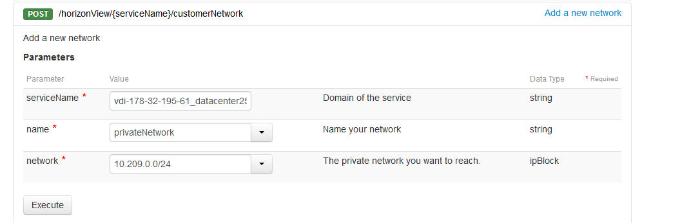
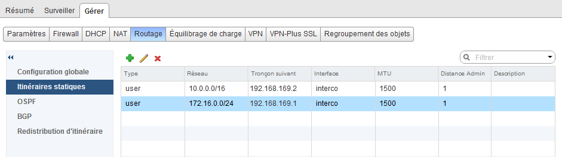
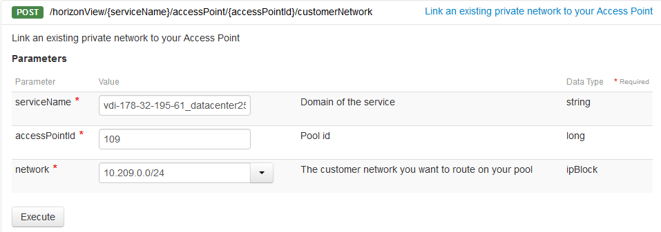

## Introduction
Afin d'utiliser votre serveur de fichier, ou votre KMS par exemple, sur vos bureaux virtuels, il est nécessaire de faire connaître votre réseau privé sur les différents points d'accès.

## Procedure

### Étape 1 &#58; Ajouter le reseau prive
Afin de faire communiquer vos bureaux virtuels avec un de vos réseaux privés au travers du vRack, il est nécessaire de le créer via l'[API d'OVH](https://www.api.ovh.com/){.external}.

Pour cela, rendez-vous dans la section `Customer Network`{.action} afin de créer le réseau.

> [!api]
>
> @api {POST} /horizonView/{serviceName}/customerNetwork
> 

{.thumbnail}

Appuyez ensuite sur `Execute`{.action}.

Une tâche s'effectuera, puis vous pourrez vous assurer de l'avoir créé en listant les réseaux privés déjà existant.

Il vous faudra alors procéder via la méthode API suivante :

> [!api]
>
> @api {GET} /horizonView/{serviceName}/customerNetwork
> 
Vous avez alors une liste d'ID. Afin d'avoir les informations décrivant chaque réseau privé, utilisez la méthode API ci-dessous :

> [!api]
>
> @api {GET} /horizonView/{serviceName}/customerNetwork/{customerNetworkId}
> 

### Étape 2 &#58; Faire transiter les flux jusqu'au reseau prive des bureaux virtuels
Afin de connaître le réseau privé des bureaux virtuels, réalisez l'appel suivant sur l'API OVH :

> [!api]
>
> @api {GET} /horizonView/{serviceName}/accessPoint/{accessPointId}
> 
Le réseau privé se présente de cette façon : **dhcpNetwork: "XXX.XXX.XXX.XXX**

Et le netmask :  **dhcpNetmask: "XXX.XXX.XXX.XXX"**

Le next hop est également renseigné dans cet appel : **intercoNextHop: "XXX.XXX.XXX.XXX"**

Afin de créer une route via NSX, il est possible de le faire comme suit :

{.thumbnail}

Dans notre cas, le réseau privé des bureaux virtuels est **10.0.0.0/16**, et le next hop est **192.168.169.2**.

### Étape 3 &#58; Créer le lien entre le point d'acces et le reseau prive
Afin de créer le lien, réalisez l'appel suivant sur l'API OVH :

> [!api]
>
> @api {POST} /horizonView/{serviceName}/accessPoint/{accessPointId}/customerNetwork
> 

{.thumbnail}

Ici, on précise l'ID du point d'accès sur lequel on souhaite faire communiquer le réseau privé.

Une fois l'appel exécuté, une tâche s'exécutera en arrière plan. Vous recevrez un email lorsque ce sera terminé.