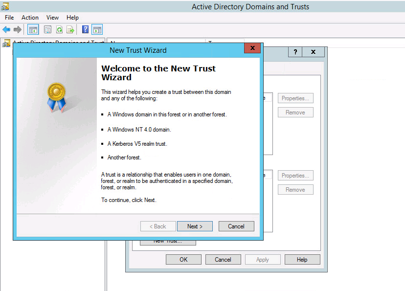
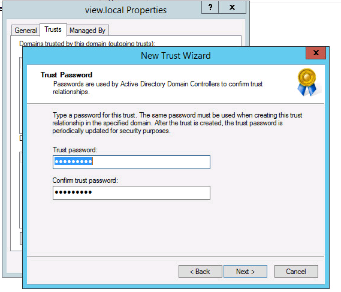

**Last updated 20th November 2017**

## Objective

It is sometimes useful for multiple users in your Active Directory to be able to access your virtual desktops on your Cloud Desktop Infrastructure solution. This guide will show you how to do this.

## Requirements

- You need to have set up an interconnection via vRack.

## In practice

Below are the settings we will use in this guide. You will need to replace them with your own settings:

- OVH AD Domain: *view1045.local*
- IP of OVH AD: *172.16.0.6*
- Customer AD Domain: *customer.local*
- IP of customer AD: *10.209.0.25*
- IP intercom customer router: *192.168.169.251*
- Customer Network: *10.209.0.0/24*

### Step 1: Create a network

If you have not yet defined the network in which your Active Directory is located, you need to create it via the [OVH API](https://www.api.ovh.com/){.external}.

To do this, go to the `Customer Network`{.action} section to create the network:

> [!api]
>
> @api {POST} /horizonView/{serviceName}/customerNetwork
> 

{.thumbnail}

Then press `Execute`{.action}.

A task will be executed. You can then make sure you have created your private network by listing the existing ones.
You will then have to proceed via the following API method:

> [!api]
>
> @api {GET} /horizonView/{serviceName}/customerNetwork
> 

The command returns a list of identifiers (ID). In order to see the information describing each private network, use the API call below:

> [!api]
>
> @api {GET} /horizonView/{serviceName}/customerNetwork/{customerNetworkId}
> 

### Step 2: Allow flows through your firewall

In order for the authorisation to work, it is necessary to allow data flows to pass through the ports used by the Active Directory.

We will, therefore, authorise the following ports towards the Directory:

- UDP: 53, 88, 137:138, 389, 445, 3389, 49152:65535
- TCP: 53, 88, 135, 389, 445, 636, 3268, 3269, 49152:65535

To see the IP of the Cloud Desktop Infrastructure Active Directory, issue the following call on the OVH API:


> [!api]
>
> @api {GET} /horizonView/{serviceName}
> 

The IP address of the Cloud Desktop Infrastructure Active Directory looks like this: **activeDirectoryIp : xxx.xxx.xxx.xxx**.


### Step 3: Route the data flows to the private administration network

We will configure the route that will allow us to direct the data flows towards the private administration network.

To see the private administration network, issue the following call on the OVH API:

> [!api]
>
> @api {GET} /horizonView/{serviceName}
> 

The private network looks like this: **adminPrivateNetwork: "xxx.xxx.xxx.xxx/xx"**.
The next hop is also populated in this call: **adminNetworkNextHop: "xxx.xxx.xxx.xxx"**.

If you need to create a route via NSX, you can do it this way:

{.thumbnail}

In our case, the private administration network is as follows: **172.16.0.0/24** and the next hop is **192.168.169.1**.


### Step 4: Create the Trust and open the data flows

Once the flows are open, you will need to open them on the OVH side.

To do this, go to our API:

> [!api]
>
> @api {POST} /horizonView/{serviceName}/domainTrust
> 

You will need the following information:

- The IP of your Active Directory;
- DNS 1 (optional);
- DNS 2 (optional);
- The domain of your Active Directory.


### Step 5: Configure the Active Directory Client

To carry out this step, you need to perform the following actions:


#### Create a Conditional Forwarder

For this, you will need to know the IP and domain of the OVH Active Directory. Then make the following call to the OVH API:

> [!api]
>
> @api {GET} /horizonView/{serviceName}
> 

The IP of the OVH Active Directory looks like this: **activeDirectoryIp: "xxx.xxx.xxx.xxx"**.
The domain name of the OVH Active Directory is: **adminDomain: "viewxxxx.local"**.

Once the information is retrieved, you can create the `Conditional Forwarder`.

- Either via the command line:

```
add-DnsServerConditionalForwarderZone -name view1045.local -MasterServers 172.16.0.6
```

- Or via the interface:

* Open the DNS console:
* right-click `Conditional Forwarder`{.action};
* click `New Conditional Forwarder`{.action};
* enter the domain name of the OVH Active Directory;
* add the IP address of the OVH Active Directory.

The `Conditional Forwarder` is then created.

#### Create the domain account

To carry out this step, you will need to generate a **complex** password, which you will enter when the Trust is created in the API.
You will also need to name this user **horizonUI**.

To create a domain account, proceed as follows:

- Via the command line:

```
New-ADServiceAccount -Name horizonUI -AccountPassword (ConvertTo-SecureString - AsPlainText "p@ssw0rd" -Force) -Enabled $true -Path "CN=Managed Service Accounts,DC=CUSTOMER,DC=LOCAL" -RestrictToSingleComputer
```
Note that "**DC**" designates the domain of your Active Directory.

### Step 6: Configure the Trust on your Active Directory

Once the call to the API is complete, a task will run on your Cloud Desktop Infrastructure. Once it has completed, you will receive an email confirming that the Trust is configured at OVH.

You will still have to follow the instructions in the email to finalise the authorisation, or follow the procedure below:

- log in to your Active Directory;
- open `Active Directory Domains and Trusts`{.action};
- on your domain, in our example **customer.local**, right-click and go to the `Trust`{.action} tab;
- select `New Trust`{.action};
- follow the instructions in the wizard.


{.thumbnail}

- Enter the domain name of the OVH Active Directory.
- Choose `Forest Trust`{.action}.
- Choose `One-way: incoming`{.action}.


{.thumbnail}

- Then select `This domain only`{.action}.
- Enter the passphrase you defined when creating the domain in the API.


{.thumbnail}

- Confirm the actions.

The Trust is now created.

### Step 7: Create a Trust in the OVH API

To create the Trust on the OVH Active Directory, you will need the following information:

- a complex password intended to be the passphrase of the Trust;
- the complex password that you used when you created the service account.

Enter this information in the API:

> [!api]
>
> @api {POST} /horizonView/{serviceName}/domainTrust/{domainTrustId}/createTrust
> 

A task will then execute, and you will receive an email once it has finished. The Active Directory trust is now created.

## Go further

Chat with our user community on <https://community.ovh.com/en/>.