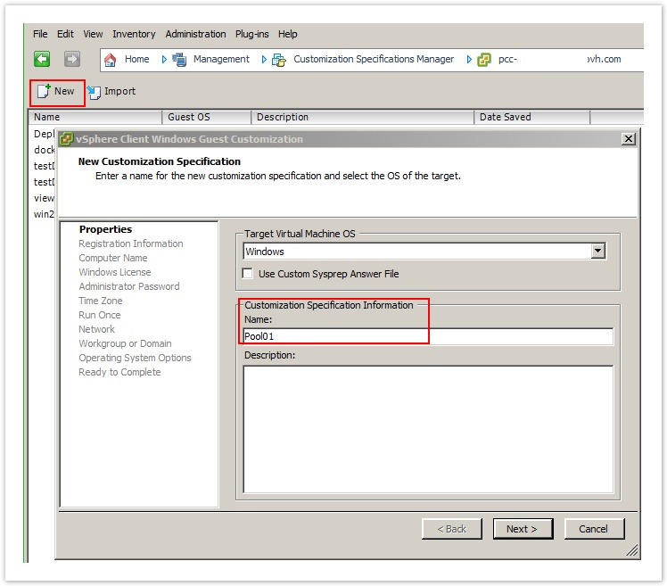
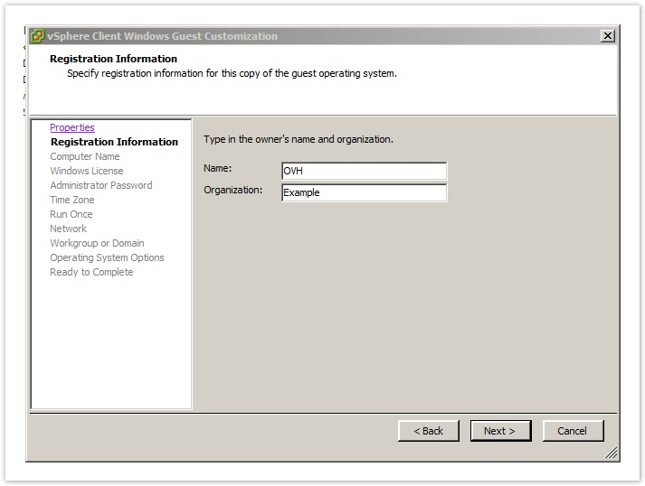
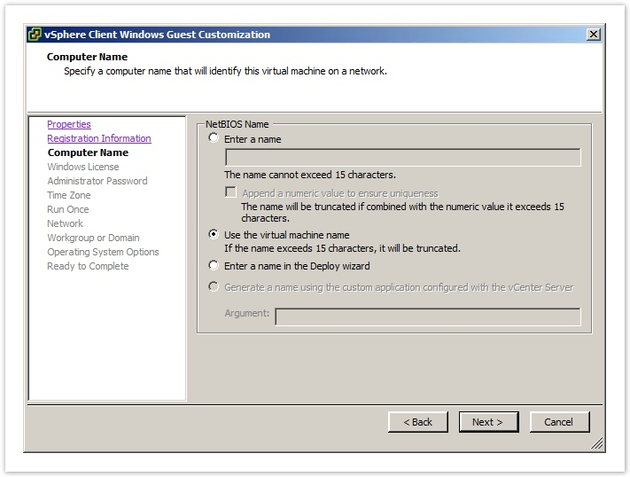
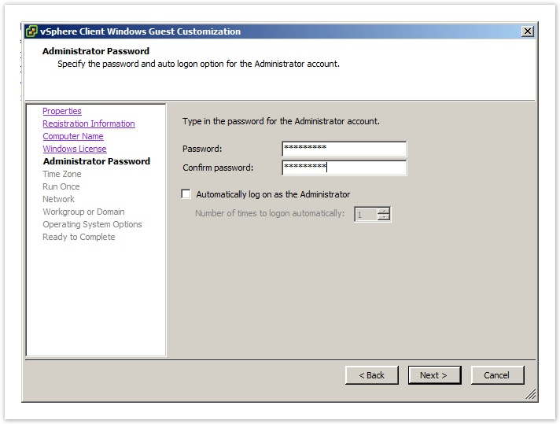
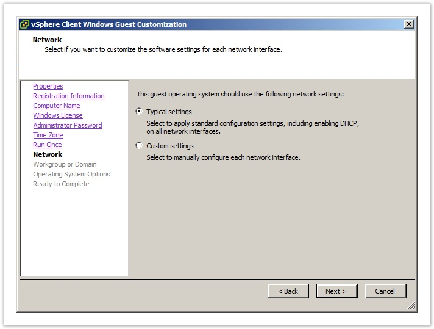
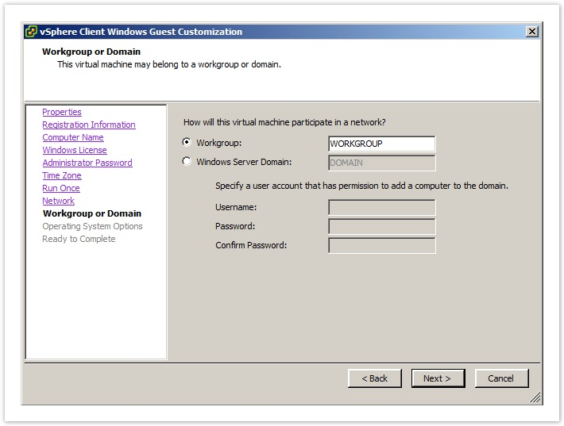
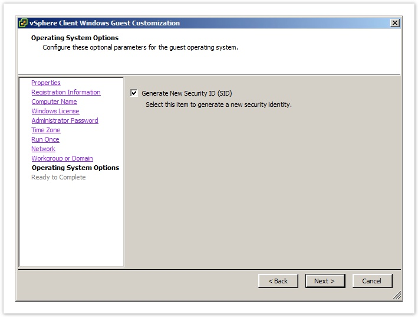
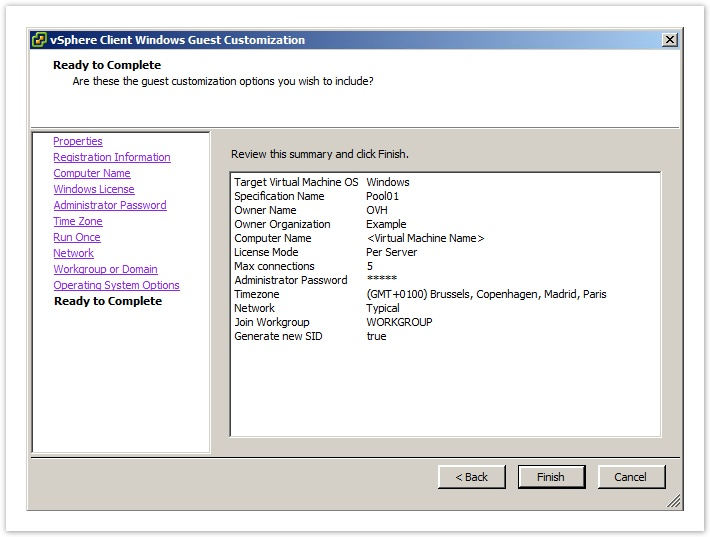

## Exemple de creation
- Connectez-vous au DedicatedCloud livré avec l'infrastructure Horizon puis rendez vous dans **"Home"**, **"Management"**, et enfin **"Customization specifications manager"**
- Cliquez sur **"New"** puis renseignez un type (Windows), un nom et éventuellement une description

{.thumbnail}

- Renseignez le nom du **Propriétaire** et l'**Organisation**

{.thumbnail}

- Sélectionnez **"Use the virtual machine name"**

{.thumbnail}

- (facultatif) Si nécessaire, renseignez une clé de licence. Si vous utilisez une méthode d'activation SPLA ou un template windows fournit par OVH, cette étape peut ne pas être nécessaire
- Renseignez le mot de passe **"Administrator"** local à appliquer

{.thumbnail}

- (facultatif) Dans **"Run once"**, il est possible de renseigner des commandes à effectuer lors de la personnalisation du futur bureau virtuel.
- Dans le choix de l'adressage réseau : sélectionnez **"Typical settings"**

{.thumbnail}

- Dans le choix du domaine ou du workgroup, laissez le choix par défaut : **"Workgroup: WORKGROUP"**

{.thumbnail}

- Cochez **"Generate New Security ID (SID)"**

{.thumbnail}

- Validez le formulaire pour créer le template de personnalisation, votre Sysprep est prêt

{.thumbnail}