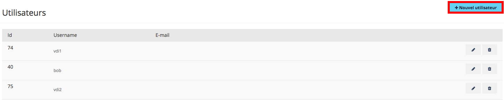
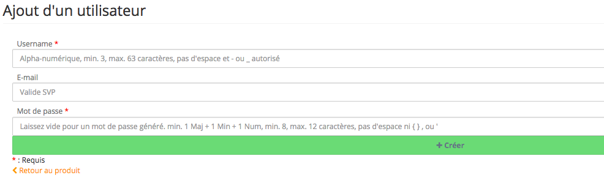

## Methode
Dans un premier temps, rendez-vous sur l'espace client, puis :

- Rendez-vous dans la section **Sunrise**
- Dans la section **Utilisateurs**, cliquez sur `Nouvel Utilisateur`{.action}

{.thumbnail}

- Renseignez les champs demandés puis cliquez sur `Créer`{.action}

{.thumbnail}

Après avoir créé vos utilisateurs, vous pourrez les associer à [des pools de bureaux virtuels](../step_four/guide.fr-fr.md){.ref}.