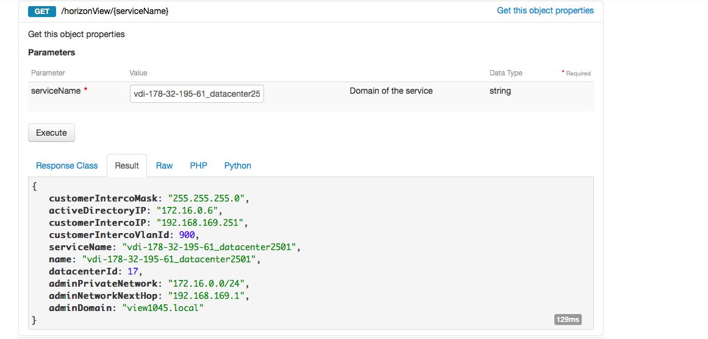
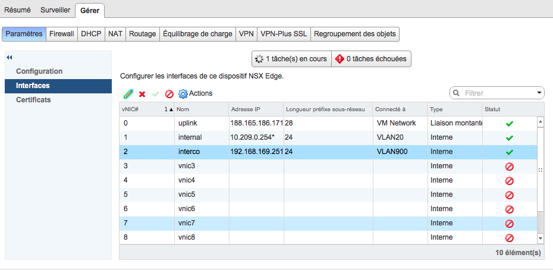

Vous souhaitez utiliser votre serveur de fichier ou vous connecter à vos applicatifs métier depuis vos bureaux virtuels ?
Créez votre réseau d'interconnexion et le tour est joué !

> [!primary]
>
> Le produit Cloud Desktop Infrastructure a été conçu pour vous permettre de faire communiquer vos bureaux virtuels avec votre infrastructure on-premise via le vRack. Pour créer cette communication, il vous faudra déployer un équipement permettant de faire bridge entre vos deux réseaux.
> Pour l'exemple, nous utilisons une Edge NSX, il vous faudra adapter cette configuration pour tout autre équipement.
> 

## Procedure
Dans votre web client vSphere, déployez une nouvelle Edge avec deux (accès interne + accès interco) ou trois cartes (accès internet + accès interne + accès interco). Dans notre cas, nous choisissons 3 cartes :
- Le VM Network
- Le réseau interne entreprise
- Le réseau d'interconnexion
Retrouvez la configuration associée à votre Edge dans votre API :

> [!api]
>
> @api {GET} /horizonView/{serviceName}
> 
Correspondance :
- **IP** : customerIntercoIp
- **Netmask** : customerIntercomask
- **VLAN ID** : customerIntercoVlanId

{.thumbnail}

Une fois déployée, vous pouvez vérifier la configuration de votre équipement :

{.thumbnail}

> [!primary]
>
> Votre équipement d'interconnexion est déployé.
> Pensez à ajouter vos réseaux internes dans l'API lorsque vous souhaitez faire communiquer votre infra interne et vos pools publics.
> 