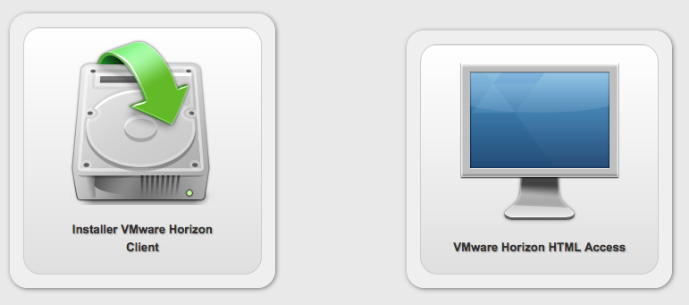

**Last updated 16th February 2018**

## Objective

If you have followed the previous steps, you will have [created a pool](https://docs.ovh.com/gb/en/cloud-desktop-infrastructure/how-to-create-pool/){.external}, and [provided your users with desktop access](https://docs.ovh.com/gb/en/cloud-desktop-infrastructure/assigning-desktop-access/){.external}. Now, you will need to log in to your virtual desktops.

**This guide will explain how you log in.**

## Requirements

- You need to have either the VMware Horizon client or your browser open.
- You need to know your access point's URL, which is available in your [OVH Control Panel](https://www.ovh.com/auth/?action=gotomanager){.external}.
- [Your user account must be authorised to access the desktop pool](https://docs.ovh.com/gb/en/cloud-desktop-infrastructure/assigning-desktop-access/){.external}.

## Instructions

### Logging in via a web client

> [!primary]
>
> Make sure you enabled this feature when you created the pool. You can find instructions for this in [step 3](https://docs.ovh.com/gb/en/cloud-desktop-infrastructure/assigning-desktop-access/){.external}.
> 

**You can access your virtual desktop through your preferred internet browser.**

To do this, click on the URL provided in the email you received when your [Cloud Desktop Infrastructure](https://www.ovh.co.uk/cloud/cloud-desktop/infrastructure/){.external} solution was delivered, under *Desktop Access*. Your default browser will open, and display a window where you can choose between installing the `VMware Horizon Client`, or using `VMware Horizon HTML Access`.

{.thumbnail}

- Click `VMware Horizon HTML Access`{.action}.
- The following window will prompt you to enter your login details. You will find your login details in the delivery email for your Cloud Desktop Infrastructure solution.
- Finally, click on the icon for your virtual desktop, and wait for it to launch.

### Logging in via the VMware Horizon Client

**To get access to a wider range of features, you can install a software client.**

The software client is available to download here: [VMware Horizon client](https://my.vmware.com/en/web/vmware/info/slug/desktop_end_user_computing/vmware_horizon_clients/4_0){.external}.

- Once the client has launched, click on either the `+`{.action} button, or the `Add server`{.action} button.
- Enter the login address for your virtual desktop (included in the email you received when  your [Cloud Desktop Infrastructure](https://www.ovh.com/gb/en/cloud/cloud-desktop/infrastructure/){.external} solution was delivered, under *Desktop Access*).
- Click on the server you have just added.
- Enter your login details, then click `Login`{.action}.

Wait a few minutes for your desktop to launch.

## Go further

Join our community of users on <https://community.ovh.com/en/>.