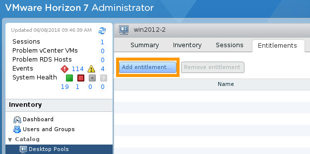
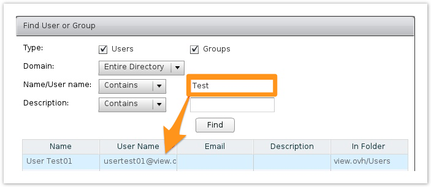

**Stand 24.08.2018**

## Einleitung

Jetzt, da [Ihr Pool erstellt ist](https://docs.ovh.com/de/cloud-desktop-infrastructure/pool-erstellen/){.external}, können Sie Benutzern Zugriffsrechte zu den verschiedenen virtuellen Desktops zuweisen.

**Hier erfahren Sie, wie Sie Ihren virtuellen Desktops Benutzer hinzufügen.**

## Voraussetzungen

- Sie haben Benutzer in Active Directory angelegt, falls zuvor [eine Vertrauensstellung (Trust) erstellt wurde](https://docs.ovh.com/gb/en/cloud-desktop-infrastructure/approval-ad/){.external} (Englisch), oder Sie haben Benutzer im [OVHcloud Kundencenter](https://www.ovh.com/auth/?action=gotomanager&from=https://www.ovh.de/&ovhSubsidiary=de) erstellt.
- Sie sind im VMware Horizon 7.1 Interface eingeloggt.

## Beschreibung

### Benutzer verwalten

Bei Lieferung der Plattform werden 10 generische Benutzer (*vdiXX*, wobei XX für die Benutzerzahl steht) erstellt. Die Zugriffsdaten sind in der Liefer-E-Mail angegeben.

### Virtuelle Desktops zuweisen

Die Einstellungen werden in VMware Horizon 7.1 vorgenommen. Im Tab `Berechtigungen`{.action} des Pools können Sie diesem Benutzer zuweisen, um ihnen Zugriff auf die eingerichteten virtuellen Desktops zu gewähren.

- Klicken Sie auf `Berechtigung hinzufügen`{.action}, um das Kontextmenü zu öffnen.

{.thumbnail}

- Suchen und wählen Sie die Benutzer, denen Sie Zugriff gewähren möchten, und bestätigen Sie.

{.thumbnail}

Die dem Pool zugewiesenen Benutzer können jetzt [auf die virtuellen Desktops zugreifen und diese verwenden](https://docs.ovh.com/de/cloud-desktop-infrastructure/virtueller-desktop-login/){.external}.

## Weiterführende Informationen

Für den Austausch mit unserer User Community gehen Sie auf <https://community.ovh.com/en/>.