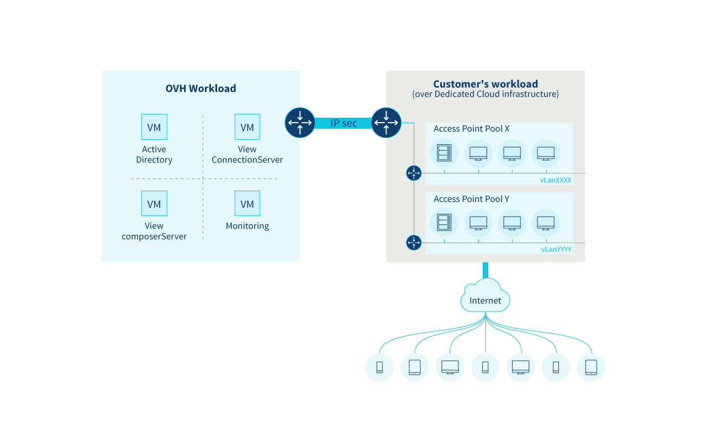

**Last updated 16th February 2018**

## Objective

In five detailed steps, we will explain how to manage your [Cloud Desktop Infrastructure](https://www.ovh.co.uk/cloud/cloud-desktop/infrastructure/){.external}.

**This first guide will explain how to get started with your VMware Horizon 7.1 platform**.

To find out more about developing your own Cloud Desktop Infrastructure, just watch this special [video presentation](https://www.youtube.com/watch?v=cFnpnANQHzQ&t){.external}.

## Requirements

- You need to have received an email containing your [Cloud Desktop Infrastructure](https://www.ovh.co.uk/cloud/cloud-desktop/infrastructure/){.external} credentials.

## Instructions

### General information

The VMware Horizon 7.1 platform has several parts:

- a VMware Horizon 7.1 administrator interface
- a URL for your first pool of virtual desktops
- a [Private Cloud](https://www.ovh.co.uk/private-cloud/){.external} platform for deploying virtual machines and virtual desktops

### Infrastructure

{.thumbnail}

The admin infrastructure (*View ConnectionServer*, *View composerServer*, *ActiveDirectory*) is deployed, managed and supervised by OVH, so that it doesn’t affect the resource capacities provided to you for deploying desktop pools.

OVH deploys virtual routers (OVH vRouter) and *AccessPoints*, so that your pools have full access to the Private Cloud resources delivered with your platform.

By default, a private network with an *AccessPoint* is configured when the platform is delivered. You can then add other *AccessPoints* via your Control Panel.

### Delivery

You will receive the email below within an hour of completing your purchase order. This will contain all the details you need to log in to your infrastructure, then create and manage your first pool.

> [!secondary]
>
> Dear Customer,
>
> Thank you for setting up the Virtual Desktop Infrastructure (VDI) option in your datacentre.
>
> 
> Below, you will find the credentials required for logging in to your service:
>
> 
> * desktop administration access: https://#URL#/admin
> 
> * username: #USERNAME#
> 
> * password: #PASSWORD#
> 
> 
> You will need to log in to your Private Cloud to manage your templates.
>
> You can log in:
> 
> - via the vSphere client
> 
>   * Download the client: https://#VPNHOSTNAME#/client/VMware-viclient.exe
> 
>   * IP address: #VPNHOSTNAME#
>
> 
> - via the vSphere web client
> 
>   *  https://#VPNHOSTNAME#/vsphere-client
>
> N.B.: vSphere uses the following access ports: 80, 443 and 8443. To create your first pool, you will need to use the following information:
>
> 
> * desktop access: https://#POOLURL#
> 
> * DHCP network: #PORTGROUP#
>
> 
> The 10 domain users are listed below:
> 
> * vdi1: #USER1#
> 
> * vdi2: #USER2#
> 
> * vdi3: #USER3#
> ...
>
> 
> If you need further support, please refer to our Cloud Desktop Infrastructure guides via the following link:
> 
>  
> https://www.ovh.co.uk/cloud/cloud-desktop/infrastructure/
>
> 
> You can also share details on your experience, and send any queries to our mailing list:
>
> 
> cdi@ml.ovh.net
> 
>  
> Thank you for choosing OVH, and please feel free to contact us if you have any queries.
> 
> The Cloud Desktop Infrastructure team
> 

Next, find out how to [create pool templates](https://docs.ovh.com/gb/en/cloud-desktop-infrastructure/create-pool/){.external}.

## Go further

Join our community of users on <https://community.ovh.com/en/>.