**Last updated 16th February 2018**

## Objective

If you have followed the previous steps, you will now know how to [log in to the VMWare Horizon platform](https://docs.ovh.com/gb/en/cloud-desktop-infrastructure/horizon-7-platform/){.external}, and your [pool template](https://docs.ovh.com/gb/en/cloud-desktop-infrastructure/create-pool/){.external} will be ready. It is now time to create your first pool.

**This guide will explain how to create pools using the VMware Horizon 7.1 platform.**

## Requirements

- You need to be logged in to VMware Horizon 7.1.

## Instructions

Once you have logged in to VMware Horizon, follow the steps below:

- Go to the `Catalog`{.action} section, then `Desktop Pool`{.action}, and click `Add`{.action} to open the form for creating a pool.

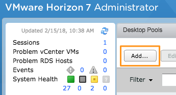{.thumbnail}

- Then choose the `pool type` (*automated* in this example).

> [!primary]
>
> There are three main desktop pool types: *automated*, *manual* and *RDS*.
> 
> - *Automated* desktop pools are created using the same template, or using a template snapshot of a virtual machine (VM).
> 
> - *Manual* desktop pools are a collection of VMs, physical computers or third-party VMs. In *automated* and *manual* desktop pools, each machine can only be accessed by one remote user at a time.
>
> - *RDS* desktop pools are not a collection of machines. Instead, they provide desktop sessions on RDS hosts. On an RDS host, several users can have different desktop sessions running simultaneously.
> 

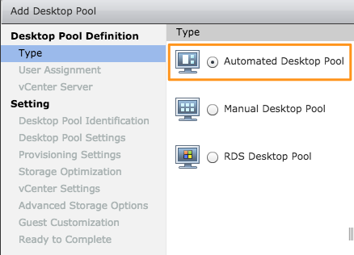{.thumbnail}

- Choose the `User Assignment`{.action} type for the virtual desktops:

    - *Dedicated:* the virtual desktops are assigned to a single, specific user.
    - *Floating:* the virtual desktops are distributed to users depending on availability when the user logs in.

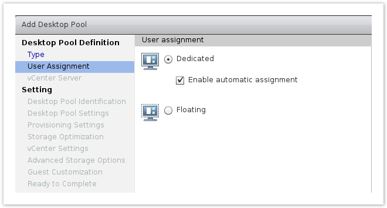{.thumbnail}

- Choose the type of clone you would like to create to provision the pool:

    - *Full virtual machines:* a full clone of the template VM will be created.
    - *View Composer linked clones:* a clone will be created from the parent snapshot. This conserves datastore space, uses less resources, and is quicker to deploy, but it maintains a strong link between the template VM and the desktop VM that has been deployed.

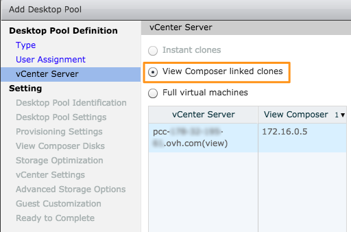{.thumbnail}

- Choose the desktop pool name (the *display name* can be edited at a later stage, but not the ID).

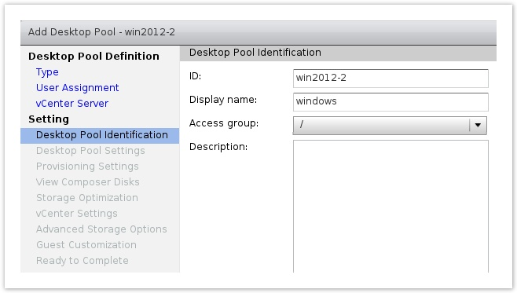{.thumbnail}

- Set up the pool configuration (and consider enabling HTML Access, if required).

> [!primary]
>
> We recommend using the **Blast** protocol as it provides you with significantly smoother performance (regardless of your bandwidth conditions), higher security, and much longer battery life if you are using a mobile device. For more information on this protocol, please refer to [this VMware documentation page](https://docs.vmware.com/en/VMware-Horizon-7/7.4/horizon-architecture-planning/GUID-F64BAD49-78A0-44FE-97EA-76A56FD022D6.html){.external}.
> 

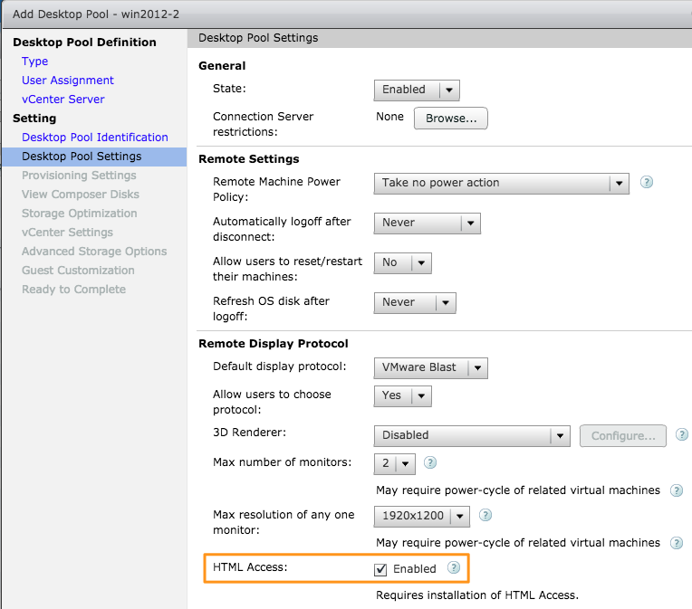{.thumbnail}

- You can now select the way your virtual desktops will be named, as well as the number of VMs to deploy.

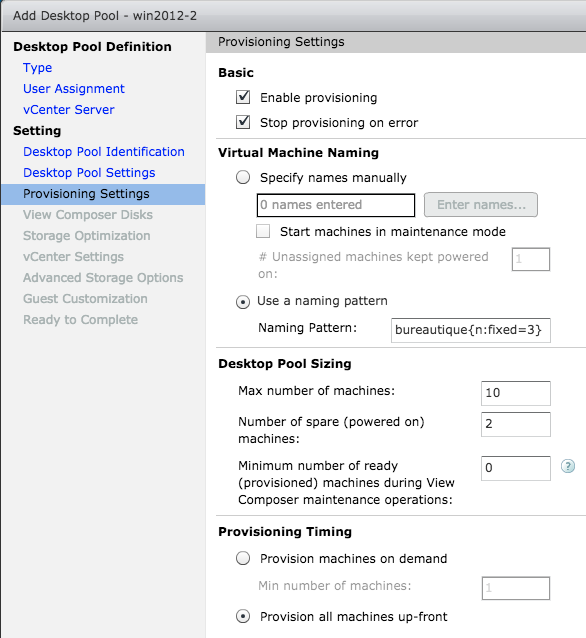{.thumbnail}

- In the next display window, you can choose whether user profiles will be stored on a persistent disk, and whether a separate disk will be used for disposable (i.e. temporary) files.

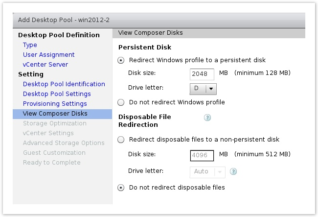{.thumbnail}

- You can then select the storage policy, including whether you would like to separate persistent and OS disks.

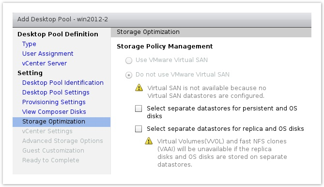{.thumbnail}

- Next, choose the *template VM* you would like to deploy.

> [!primary]
>
> If the VM does not appear, select `Show all parent VMs`{.action} to find out why.
> 

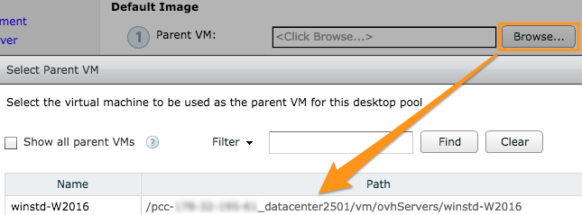{.thumbnail}

- You can then choose the *parent snapshot* (you can have different snapshots for version management, tests or production on each of your pools).

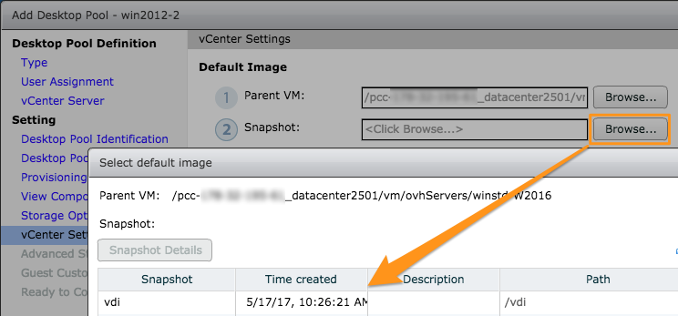{.thumbnail}

- Select your desktop pool’s *destination folder* (for vSphere organisation). A sub-folder will be created with your desktop pool name, and the VMs you have deployed will be stored there.

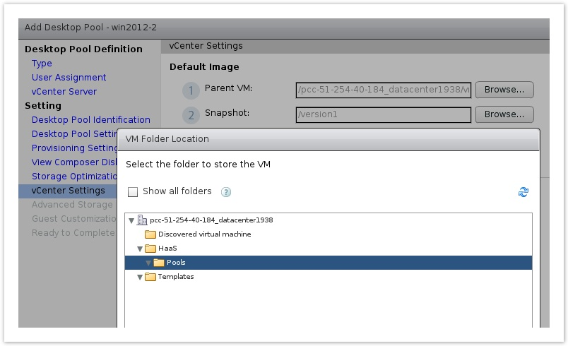{.thumbnail}

- Choose the *datastores* that will store the VMs.

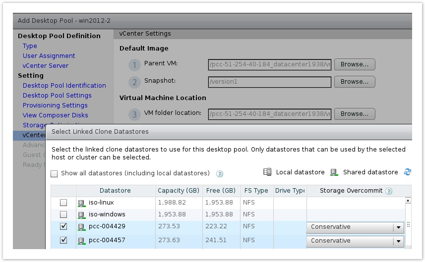{.thumbnail}

- In the next display window, you can choose advanced storage options for your remote desktops.

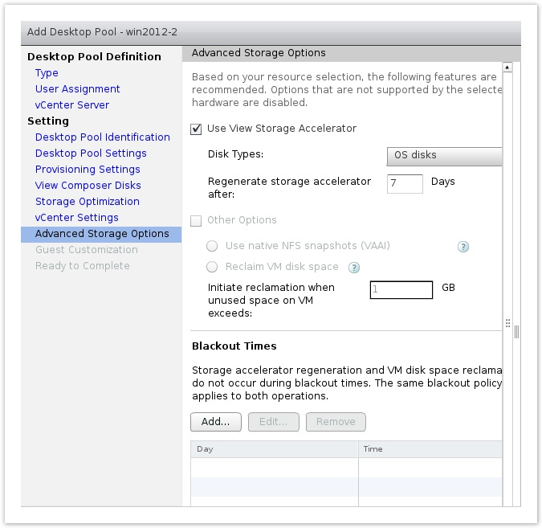{.thumbnail}

- You can then choose the Active Directory and VM customization deployment options (select sysprep customization from the specifications created in your Private Cloud).

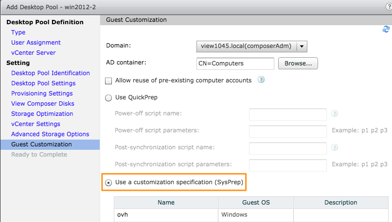{.thumbnail}

- You can also choose to associate users with the virtual desktop pool at this stage, or finish creating the pool, and associate users with it later on.

The creation of the desktop pool may require a long period of time to complete, depending on the template you have used. If any errors occur, the `Inventory` section of the desktop pool will provide details each VM's creation. This should help you find the root of the problem.

Now that you have created your desktop pool, find out how to [assign virtual desktop access to users](https://docs.ovh.com/fr/cloud-desktop-infrastructure/assigning-desktop-access/){.external}.

## Go further

Join our community of users on <https://community.ovh.com/en/>.