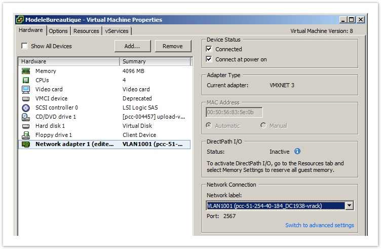
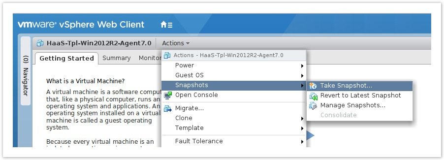
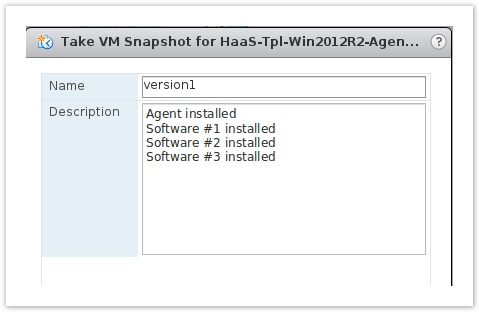

**Last updated 16th February 2018**

## Objective

You can now start using your [Cloud Desktop Infrastructure](https://www.ovh.co.uk/cloud/cloud-desktop/infrastructure/){.external} solution.

**This guide will show you how to deploy an automatic pool of linked clone machines.**

## Requirements

- You need a compatible operating system (OS). You can view the list of operating systems supported by VMware Horizon 7.1 [here](https://pubs.vmware.com/horizon-7-view/index.jsp?topic=%2Fcom.vmware.horizon-view.installation.doc%2FGUID-B45E1464-92B1-4AA8-B4BB-AD59EDF98530.html){.external}.
- You need to have installed the software you want to deploy in the pool.
- You need to have configured the network card address via the DHCP (Dynamic Host Configuration Protocol).
- You need to have associated the virtual machine (VM) template with the pool’s destination network (portgroup or VLAN).
- You need to have finished installing the VMware Horizon 7.1 agent.
- You need to have created a snapshot (with the virtual machine turned off) that will act as an unchangeable reference point.  
- You need to have created a customization template (sysprep). 

## Instructions

### Import a virtual machine (VM) template

You can create and import both fully and partially configured template VMs to the Private Cloud associated with your VMware Horizon 7.1 infrastructure.

### Associate the template with the pool’s destination network

In order to deploy virtual desktops properly and ensure that users can access them, it is important to configure the VM template on the correct virtual network. The details of this **DHCP network** are sent in the delivery email, and available through the `dvportgroup` in the vSphere interface.

To associate the VM template and the pool network, you need to do the following:

- Right-click on the VM, and choose `Edit settings`{.action}.
- Select the device corresponding to the network interface.
- In the `Network Connection`{.action} section, select the `Network label`{.action} listed in the **DHCP Network** delivery email (see image below).

{.thumbnail}

If you require an additional network that is isolated from the existing one, you can deploy a new access point with a dedicated network.

### Install the VMware Horizon 7.1 Agent

> [!primary]
>
> If you are using the HaaS solution, you can download the installation files for the Horizon Agent here: <https://files.horizonaas.com/>.
> 

Double-click the Horizon Agent installation file, then follow the installation process:

- Accept the VMware licence terms.
- Select `Install VMware Horizon Agent`{.action} in `My Computer Mode`{.action}.
- Choose the IPv4 protocol.
- Select the installation options (the default options are a good starting point).
- Don’t enable RDP when you are prompted to do so.
- Accept or change the destination folder.
- Finalise the installation.

If you would like more information about installing the Horizon 7.1 Agent on a virtual machine, please refer to the following VMware Horizon page: [Installing Horizon Agent on a virtual machine](http://pubs.vmware.com/horizon-7-view/index.jsp?topic=%2Fcom.vmware.horizon-view.desktops.doc%2FGUID-1F2D0C6E-6379-4B52-A7EA-C1EF09CE2F9B.html){.external}

### Create the parent snapshot

To ensure that it uses an unchangeable version of the virtual machine acting as a template for the pool, VMware Horizon relies on a snapshot. This way, the operations performed on the template will not directly affect the virtual desktop content.

- On the vSphere client interface (in this case, the web version), select the VM template, then the `Actions`{.action} menu. Lastly, click `Take Snapshot...`{.action}:

{.thumbnail}

- Give your snapshot a title (in this case, a version number), and a description:

{.thumbnail}

Now that you have created the template, find out how to [create a pool](https://docs.ovh.com/gb/en/cloud-desktop-infrastructure/how-to-create-pool/).

## Go further

Join our community of users on <https://community.ovh.com/en/>.