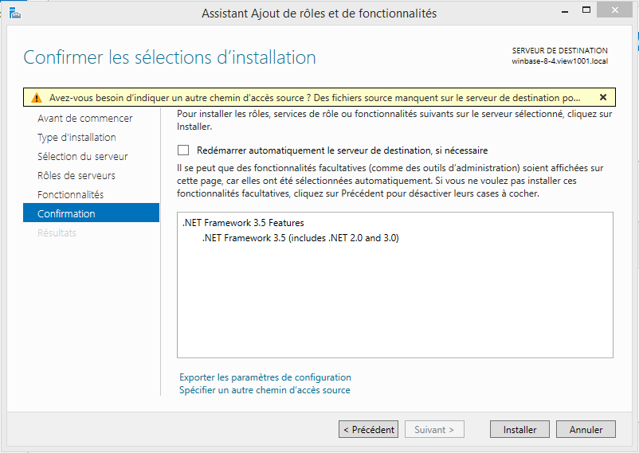

## Avertissement

> [!alert]
>
> Ce guide ne concerne que les bureaux virtuels livrés sous Windows Server 2012.
> Si vous disposez d'un Windows Server 2016, le Framework .NET 3.5 est déjà installé.
> 

## Activer Windows Update
Le bureau virtuel n'intègre pas le framework .NET 3.5. Avant de pouvoir l'utiliser, il vous faut tout d'abord l'installer. Son installation nécessite de réactiver Windows Update.

- Après avoir lancé votre bureau virtuel, rendez-vous dans le **Panneau de configuration**.
- Cliquez sur `Système et Sécurité`{.action}
- Cliquez sur `Windows Update`{.action}
- Cliquez sur `Activer les mises à jour automatiques`{.action}

La fenêtre change et Windows va chercher ses mises à jour. L'opération peut prendre plusieurs minutes.

> [!primary]
>
> Vous n'êtes pas forcé d'installer les mises à jour, la simple action de les
> activer suffit à débloquer l'installation du framework .NET 3.5.
> 

## Installer le Framework .NET 3.5
Maintenant que Windows Update est activé, voyons comment installer la plateforme .NET 3.5.

- Rendez-vous dans le Gestionnaire de serveur, par le biais du menu **"Démarrer"**

{.thumbnail}

- Cliquez sur `Ajouter des rôles et des fonctionnalités`{.action}

{.thumbnail}

- Cliquez sur `Sélection du serveur`{.action}. Ce clic débloque la partie **"Fonctionnalités"** sur la gauche
- Cliquez sur `Fonctionnalités`{.action} puis cochez la case **".NET Framework 3.5 Features"**
- Cliquez sur `Suivant`{.action}
- Cliquez ensuite sur `Installer`{.action}

{.thumbnail}

L'installation va prendre quelques minutes.

Suite à cela, il vous faudra redémarrer votre bureau virtuel. Réalisez cette opération depuis Windows directement.

Après redémarrage de votre bureau virtuel, le Framework .NET 3.5 sera disponible et utilisable.