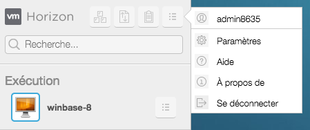
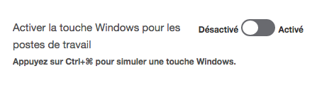

## Méthode
Afin de simuler l'usage de la touche `Windows`{.action} lorsque vous utilisez votre bureau virtuel avec le client web d'Horizon, un paramétrage spécifique doit-être appliqué.

Pour cela, une fois votre bureau virtuel démarré :

- Déployez le volet à gauche de l'écran en cliquant sur l'onglet ;
- Cliquez sur le bouton `Menu`{.action} de ce volet en haut à droite ;
- Cliquez sur `Paramètres`{.action}.

{.thumbnail}

- Cliquez enfin sur `Activer la touche Windows pour les postes de travail`{.action}

{.thumbnail}

Après avoir validé l'opération, l'utilisation de la touche Windows sera possible depuis le client Web.

Pour cela, il vous suffira d'appuyer simultanément sur CTRL+CMD (sous MacOS) ou CTRL+Windows (sous Windows).