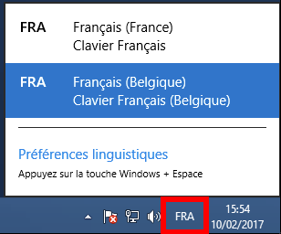

## Methode
**La modification de la disposition du clavier se réalise directement sur le bureau virtuel.**

- Après avoir lancé votre bureau virtuel, rendez-vous dans le **Panneau de configuration**.

Avant toute chose, vous devez ajouter à la liste des langues Windows celle qui vous intéresse. Elle sera utilisée ensuite pour devenir la langue de disposition de votre clavier.

Pour ce faire :

- Cliquez sur `Horloge, langue et région`{.action}
- Cliquez sur `Modifier les méthodes d'entrée`{.action}

Cette fenêtre vous permet de choisir une langue ou d'en ajouter.

- Cliquez sur `Ajouter une langue`{.action} puis sélectionnez la langue de votre choix.

Enfin, après avoir réalisé ces opérations, pour basculer vers le clavier à disposition "belge" (dans notre exemple), il suffit de cliquer sur le bouton des **"Préférences linguistiques"** qui se trouve dans la barre des tâches Windows et de choisir la disposition de votre choix.

{.thumbnail}