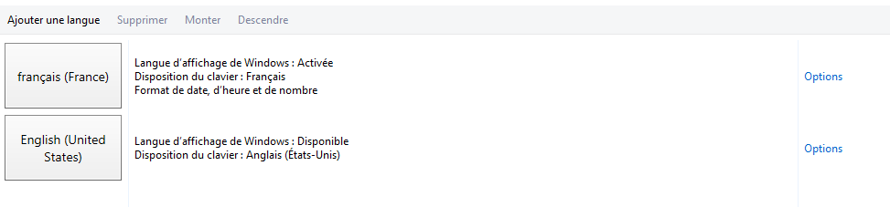
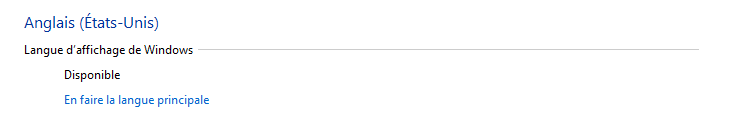

## Methode

**La modification de la langue utilisée par Windows se réalise directement sur le bureau virtuel.**

- Après avoir lancé votre bureau virtuel, rendez-vous dans le **Panneau de configuration**

Vous devez avant tout ajouter à Windows la langue dans laquelle vous souhaitez utiliser votre bureau virtuel.

- Cliquez sur `Horloge, langue et région`{.action}
- Cliquez sur `Modifier les méthodes d'entrée`{.action}

Cette fenêtre vous permet de choisir une langue ou d'en ajouter.

> [!alert]
>
> Si la langue souhaitée n'est pas présente, vous devez tout simplement l'ajouter manuellement.
> 

- Pour ce faire cliquez sur `Ajouter une langue`{.action} puis sélectionnez la langue de votre choix.

{.thumbnail}

- Après validation, la langue apparaît dans la liste, cliquez sur `Option`{.action}

Dans le cas où la langue sélectionnée doit être téléchargée, cliquez sur `Télécharger et installer le module linguistique`{.action}.

- Cliquez enfin sur `En faire la langue principale`{.action} puis, après vous être assuré d'avoir enregistré votre travail en cours, validez par `Fermer la session maintenant`{.action}.

{.thumbnail}

Cette dernière action met fin à la session en cours. Après redémarrage de votre bureau virtuel, ce dernier utilisera la langue choisie précédemment.