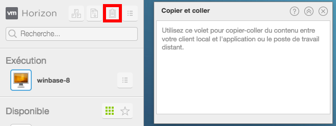

## Methode
Le client web dispose d'un outil permettant de copier/coller du texte entre votre machine physique et votre bureau virtuel.

Pour ce faire, une fois votre bureau virtuel démarré :

- Déployez le volet à gauche de l'écran en cliquant sur l'onglet
- Cliquez sur le bouton `Copier/coller`{.action} de ce volet en haut à droite

Cette fenêtre apparait. Elle vous permet de coller le texte présent dans votre presse papier. Il sera ensuite possible de le coller sur votre bureau virtuel.

{.thumbnail}