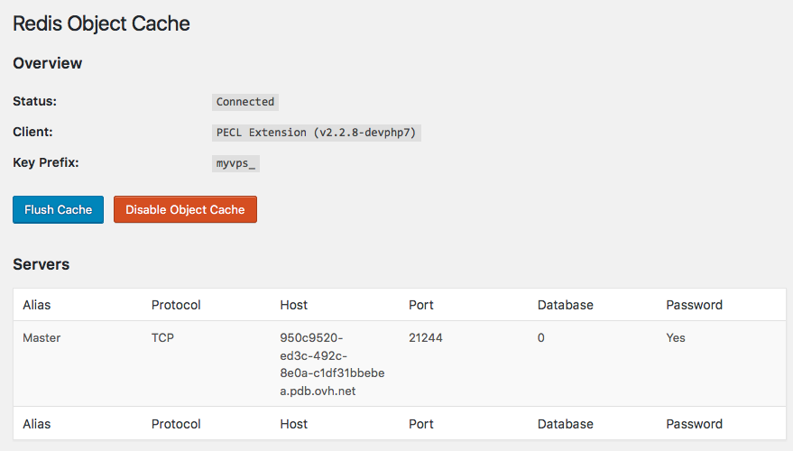

Do you have a website or blog powered by WordPress? Discover how to speed up page loading time using Redis! In this tutorial, we will set up a NoSQL Redis database and use it to cache WordPress objects. Not only will visitors have a better user experience, but WordPress administrators will also benefit from reduced page loading time.


> [!alert]
>
> This guide can only be used with the Beta SaaS Database Lab Runabove
> 


> [!warning]
>
> Any action carried out in this tutorial is at the user’s own risk.
> OVH shall not be held liable for any technical failure, loss of data, etc.
> Remember to back up your files prior to making any changes.
> 


This tutorial requires:
- a compatible Web hosting with the PHP-redis module installed or the possibility of installing it (currently this is not compatible with OVH shared webhosting plans): VPS, dedicated server, Public Cloud... with OVH or another provider.
- a WordPress administrator account to install a plugin.
- a WordPress version 4.x or above
- and of course, a Redis database, that you can activate on our lab!


## Wordpress + Redis = ??
Redis is an open source tool that makes it possible to maintain NoSQL databases in RAM and to cache objects. The aim is to increase speed. It is increasingly being used and has been adopted by Twitter, Github, Flickr, Pinterest, as well as many others. We are not going to go into more detail about what Redis is, more information can be found in the [official and comprehensive documentation](https://redis.io/documentation){.external} .

As for WordPress, it may be resource intensive: user sessions, queries in databases,... Their developers make it possible to cache these "objects", to store them in a non-persistent way, in order to go faster.

As you can well imagine, optimization will be more or less significant depending on your use of "objects". A website with static content, like a blog, will be much less optimizable than an e-commerce site, news portal, etc.

There are many plugins that make it possible to manage this cache, but the most popular one is W3 Total Cache (W3TC). However, it offers a local object cache (on your VPS, or server), which is not always suitable. Maintaining a Redis or Memcached database can be tedious and memory consuming.

In this tutorial, you will learn how to configure the Redis Lab provided by OVH, and link it to your WordPress installation. The aim is to improve the WordPress page loading times for both visitors and administrators.

Let’s get started!


## Signing up for the Lab and testing your Redis database
The first step is to get a Redis database and check that it is operational.

Go to [Runabove OVH labs](http://www.runabove.com.){.external} and then sign up for the Redis lab. Once it’s done, create a Redis database via the [OVH Sunrise Control Panel](https://www.ovh.com/manager/sunrise/){.external}, change the password, and leave the page open as we are going to use it.


{.thumbnail}


### Testing the connection to Redis using a terminal
Open the terminal of your choice and check if you have the redis-client installed:


```bash
which redis-cli
```

If not, install it. For Debian based distributions, it will be:


```bash
apt-get install redis-cli
```

Then, connect to your Redis database via the command line:


```bash
redis-cli -h my-instance-url -p my-port
```

This is what it looks like for me:


```bash
redis-cli -h 950c9520-ed3c-492c-8e0a-c1xxxxxxxxxx.pdb.ovh.net -p 21244
```

Then, authenticate yourself using the password set in your OVH Sunrise Control Panel. Redis works with a unique password, but no user is required.


```bash
auth MyPassWord
```

And lastly, let’s monitor what happens on your Redis database:


```bash
monitor
```

What happens in *real time* on your database will appear here.

At this stage, the only thing we know is that the Redis database is running! Let’s check whether we can connect to it using PHP.


### Testing the connection to Redis from a WordPress site
We are going to test the connection to Redis on the instance hosting your WordPress site using a very fast script.

Through the means of your choice (FTP, SSH, ...), create a phpinfo.php file at the root of your WordPress site and add in it:


```php
1. <?php
2.     phpinfo();
3. ?>
```

Then go to [http://www.mywebsite.com/wordpress/phpinfo.php](http://www.mywebsite.com/wordpress/phpinfo.php){.external} (can be changed depending on your configuration) and look for:


{.thumbnail}

This module enables PHP to communicate with the Redis database. If you don’t find any paragraph on Redis, it means that the appropriate component is missing. Install it (Debian/Ubuntu-compatible command):


```bash
sudo apt-get install php-redis
```

You should see the Redis box (if needed, update PHP and restart your instance).

Let’s now test the connection to Redis using PHP, from your hosting. Through the means of your choice (FTP, SSH, ...), create a redis.php file at the root of your WordPress site and add in it:


```php
1.  <?php
2.      //Connecting to Redis server on OVH
3.      $redis = new Redis();
4.      $redis->connect('xxxxxxxxx-xxxxxx-xxxxx-xxxxxxxxx.pdb.ovh.net', 12345);
5.      $redis->auth('MyPassword');
6.      echo "Connection to server ongoing";
7.      //check whether server is running or not
8.      echo "Server is running: ".$redis->ping();
9. ?>
```

Do not forget to fill in the access URL, the port and the password for your database, as they appear in your OVH Sunrise Control Panel. Then go to [http://www.mywebsite.com/wordpress/redis.php](http://www.mywebsite.com/wordpress/redis.php){.external}.

If the connection works, you should see "Server is running: +PONG"

And a "PING" in your terminal open with your Redis database.

Well done! Everything is working on the database side. We are now moving on to the configuration of Wordpress.


## Configuring Wordpress with Redis
The database is working, you now just need to configure Wordpress to use it. If you already have a caching plugin **remember to disable the Object Cache** (as with W3TC, for example).


### Changing WP-CONFIG.PHP
Open the wp-config.php file at the root of your WordPress using a text editor. We are going to add these 3 lines just after Key Salts.


```php
1. define('WP_REDIS_HOST', '950c9520-ed3c-492c-xxxxx-xxxxxxxxxx.pdb.ovh.net');
2. define('WP_REDIS_PORT', '12345');
3. define('WP_REDIS_PASSWORD', 'MyPassword');
```

Optional: let’s add a salt Key. When only one application uses Redis, this is not necessary, but if you have several WordPress sites, it will be required to determine *what-pushes-what*.


```php
1. define('WP_CACHE_KEY_SALT', 'myvps_' );
```


### Installing the Redis Object Cache plugin

{.thumbnail}

Then, to make it easier, we are going to install the [Redis Object Cache](https://wordpress.org/plugins/redis-cache/){.external}  plugin. For the curious ones, it is a fork of Eric Mann and Erick Hitter’s code: [Github Redis Object Cache](https://github.com/ericmann/Redis-Object-Cache){.external} .

If you hate plugins, do not hesitate to do a manual installation (pay attention to the names of parameters which are noticeably different in WP-CONFIG.PHP)

This plugin is going to add an object-cache.php file (or change the existing one) in the wp-content/ folder of your WordPress site. If the plugin is unable to do so, add it manually (see the plugin page for more information).


### Configuring the plugin
When everything is installed, go to your Wordpress Admin Area for Redis.

You should see something similar to that:

Notice the "Connected" status as well as your accurate Host, Port, Database and Password.


{.thumbnail}

All is clean as for configuration!


## Checking the increase in performance
If you haven’t closed the monitoring for your Redis database, the database activity should display.

Open another terminal or stop this monitoring, and enter the following commands on your Redis database:


```bash
keys *
```

This will allow you to analyze all key-value pairs stored in Redis. In my case:


```bash
...
48) "myvpswp_:comment:get_comments:9503889e74633f729bf0ed7217c233a4:0.53134300 1486125318"
49) "myvpswp_:comment:1"
50) "myvpswp_:term_meta:1"
51) "myvps_wp_:userlogins:bastien"
52) "myvpswp_:transient:feed_b9388c83948825c1edaef0d856b7b109"
53) "myvpswp_:posts:1"
...
```

and to analyze a specific key for example:


```bash
get myvpswp_:posts:1
```

As for performance, I opened the development tools and then "Network". As I started with a fully clean WordPress site with no content, the increase is not that significant but it is still noticeable!

The website displays in an average of 250 ms instead of 500 ms (hosted on an [OVH SSD VPS](https://www.ovh.com/fr/vps/vps-ssd.xml){.external} located in Strasbourg).


{.thumbnail}

There you are! Please do not hesitate to give us your feedback on your tests!


## DBaaS Help
- Documentation: [Guides](../guide.en-gb.md){.ref}
- Community hub: [https://community.ovh.com](https://community.ovh.com/c/mobile-hosting/database){.external}
- Mailing List: [paas.sql-subscribe@ml.ovh.net](mailto:paas.sql-subscribe@ml.ovh.net){.external}
- Create an account: [Try it for free!](https://www.runabove.com){.external}