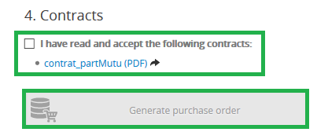

> [!faq]
>
> Potřebujete pro své webové stránky či aplikaci databázi, ale unavuje Vás zabývat se její správou a údržbou?
>> 
>> Nezoufejte! Služba CloudDB je tu pro Vás.
>> 
>

## Úvod

### Proč spravovaná databáze od OVH?

Inspirací pro vytvoření služby CloudDB byla zcela **triviální pravda**: dokonce i když víte, jak na to, nemusí být správa databáze vždy Vaší hlavní **prioritou**.

Zabezpečení, aktualizace, monitoring, správa uživatelských práv, optimalizace výkonu apod... ze všech těchto úkonů se může postupem času vyklubat až příliš velký žrout Vašeho času a pozornosti.

**Proč tedy nepřenechat komplexní správu své databáze na společnosti OVH a nezískat tak více prostoru pro to, co je skutečným předmětem Vašeho podnikání?**

To je hlavním smyslem této služby. Ať jste úplný začátečník, profesionál s omezenými požadavky či provozovatel rozsáhlého clusteru, naším cílem je poskytnout Vám ideální podmínky pro růst Vašeho podnikání.

### Výhody služby CloudDB

**Rychlost a jednoduchost:**

- Vytváření SQL databází prostřednictvím Zákaznického prostoru OVH.
- Neomezené množství databází (v závislosti na dostupném diskovém prostoru).
- Až 200 současných připojení.
- Správa uživatelů a uživatelských práv prostřednictvím Zákaznického prostoru OVH.
- Okamžitý přístup k metrikám a logům.

**Vysoký výkon:**

- Garantované zdroje RAM.
- Prověřená infrastruktura.

**Zabezpečení:**

- 24/7 monitoring zajišťovaný našimi bezpečnostními experty.
- Automatické zálohování na denní bázi.
- Povinná IP autorizace.

**Flexibilita:**

- Kompatibilita se všemi produkty společnosti OVH (kromě sdíleného webhostingu) a obecně se všemi produkty připojenými k internetu.
- Možnost volby verze SQL a přechodu na vyšší verzi služby (kdykoli).

### Nabízené databáze

V rámci služby CloudDB máte na výběr z několika databázových systémů (verzí serveru).

**SQL**

- MariaDB
- PostgreSQL
- MySQL

Každá instance disponuje svými vlastními dedikovanými zdroji. Tyto zdroje jsou přerozdělovány mezi jednotlivé databáze.

## Objednání služby CloudDB

### Přihlášení do Zákaznického prostoru OVH

Ze všeho nejdříve přejděte do Zákaznického prostoru OVH na adrese [https://www.ovh.cz/manager/web](https://www.ovh.cz/manager/web){.external}

### Vytvoření objednávky

V levém sloupci vyberte záložku **"Databáze"** a následně klikněte na tlačítko `Objednat databázi`{.action}.

{.thumbnail}

V rámci prvního kroku objednávky vyberte následující možnost:

- **"CloudDB"**

Následně zadejte své individuální požadavky pro databázi:

- **"Verze serveru"**
- **"Velikost RAM"**
- **"Datacentrum"**
- **"Časové období"**

{.thumbnail}

Potvrďte souhlas se smluvními podmínkami a klikněte na tlačítko `Generovat objednávku`{.action}.

{.thumbnail}

## Obecné informace

Po uhrazení objednávky se Vám v rámci Zákaznického prostoru zpřístupní rozhraní pro správu Vaší instance.

{.thumbnail}

## Vytvoření databáze a uživatelských účtů 

### Vytvoření databáze

Pro vytvoření databáze přejděte do záložky **"Databáze"** a následně klikněte na tlačítko `Přidat databázi`{.action}.

{.thumbnail}

Zadejte název databáze a klikněte na tlačítko `Potvrdit`{.action}.

{.thumbnail}

### Vytvoření uživatelského účtu 

Abyste mohli svou službu CloudDB začít naplno využívat, musíte nejprve vytvořit uživatele se specifickými právy pro připojení do databáze.

Přejděte do záložky **"Uživatelé a oprávnění"** a klikněte na tlačítko `Přidat uživatele`{.action}.

{.thumbnail}

Zadejte **uživatelské jméno** a **heslo** a klikněte na tlačítko `Potvrdit`{.action}.

{.thumbnail}

### Správa uživatelských práv

Přejděte do záložky **"Databáze"** a následně rozklikněte **"ozubené kolečko"** u příslušné databáze. Klikněte na tlačítko `Správa uživatelů`{.action}.

{.thumbnail}

Vyberte práva, která si k danému uživateli přejete přiřadit.

{.thumbnail}

Na výběr máte z následujících možností:

- **Administrátor:** uživatel může spouštět dotazy **Select/Insert/Update/Delete/Create/Alter/Drop**.
- **Read/Write:** uživatel může spouštět dotazy **Select/Insert/Update/Delete**.
- **Read :** uživatel může spouštět dotaz **Select**.
- **Žádná práva:** uživatel nemůže v rámci dané databáze spouštět žádné dotazy.

## IP autorizace

### Přidání serveru

Pro zpřístupnění Vaší služby CloudDB je nejprve zapotřebí specifikovat IP adresy, které budou oprávněny připojovat se k Vaší instanci.

Přejděte do záložky **"Autorizované IP adresy"** a klikněte na tlačítko `Přidat IP adresu/masku`{.action}.

{.thumbnail}

Zadejte IP adresu svého serveru či sítě a klikněte na tlačítko `Potvrdit`{.action}.

{.thumbnail}

## Práce s databází

V závislosti na druhu Vaší činnosti a typu databáze existuje velké množství způsobů, jak můžete svou databázi používat.

Podívejme se nyní a vzorový příklad práce s databází.

### Instalace redakčního systému WordPress s DBaaS lab a MySQL

- Vytvořte MySQL CloudDB.
- Vytvořte databázi a přidělte k ní uživatele (nejprve vytvořte administrátorský účet).
- Autorizujte IP adresu svého serveru pro komunikaci se službou CloudDB.

V základním rozhraní pro správu Vaší instance vyhledejte následující informace:

- Název hostitelského serveru
- SQL Port

{.thumbnail}

- Název databáze

{.thumbnail}

- Název uživatele

{.thumbnail}

Poznamenejte si URL a asociovaný port. Při instalaci WordPressu budete o tyto informace požádáni.

{.thumbnail}

Výše uvedená pole tedy vyplníme následujícím způsobem:

- **Database Name**: *base-test*
- **UserName**: *user-1*
- **Password**: heslo pro uživatelský účet *user-1*
- **Database Host**: *xxx.dbaas.ovh.net:35102*
- **Table prefix**: v tomto případě ponecháme výchozí nastavení.

V ostatních případech se jednoduše řiďte standardními metodami připojení pro dané databáze, které jsou k dispozici v rámci oficiální dokumentace.