¿Tiene un sitio web o aplicación que requiere una base de datos, pero no quiere tener que administrarla? ¡Descubra ya CloudDB, la solución de bases de datos en la que OVH se encarga de todo!

## Introduccion

### Por que utilizar bases de datos administradas
Este producto parte de una simple observación: aunque sepan hacerlo, administrar una base de datos no suele ser una prioridad para los usuarios.

Securización, actualizaciones, monitorización, gestión de los permisos, rendimiento...: no es difícil que acaben conviertiéndose en un incordio.

Entonces, ¿por qué no dejar esa tarea a OVH y centrarse en su actividad?

Ese es nuestro objetivo. Ya sea particular o profesional, ya tenga una pequeña base de datos o un gran cluster, sus necesidades están cubiertas.

### Ventajas de CloudDB
**Fácil y rápido:**

- Creación de bases de datos SQL a través del área de cliente
- Número ilimitado de bases de datos (en el límite del espacio en disco asignado)
- Hasta 200 conexiones simultáneas
- Gestión de los usuarios y permisos asociados desde el área de cliente
- Acceso a las métricas desde el área de cliente
- Acceso a los logs

**Potente:**

- Recursos de RAM garantizados
- Infraestructura a toda prueba

**Seguro:**

- Monitorización 24x7 por nuestro equipo
- Backups automáticos diarios
- Autorización obligatoria de direcciones IP

**Escalable:**

- Compatible con todos los productos de OVH (excepto los alojamientos compartidos) y, más generalmente, con cualquier producto conectado a la red pública
- Elección de la versión de SQL y posibilidad de cambiar en cualquier momento a una versión superior

### Motores ofrecidos
Al contratar un CloudDB, puede elegir entre diversos sistemas de bases de datos **SQL**:

- MySQL
- PostgreSQL
- MariaDB

Cada instancia dispone de sus propios recursos dedicados.

En caso de que una instancia contenga varias bases de datos, estas **comparten** los recursos.

## Contratar CloudDB

### Conexion al area de cliente
Para poder crear su instancia y, seguidamente, sus bases de datos, acceda al [área de cliente Web](https://www.ovh.com/manager/web/){.external}.

### Pedido
En la columna izquierda, seleccione `Bases de datos`{.action} y haga clic en `Contratar bases de datos`{.action}.

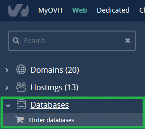{.thumbnail}

En **Tipo de bases de datos**, seleccione `CloudDB`{.action}.

En **Personalización**, elija el sistema de bases de datos que desee, la RAM y el datacenter.

Indique la duración deseada.

{.thumbnail}

Acepte los contratos y haga clic en `Generar la orden de pedido`{.action}.

{.thumbnail}

## Informacion general
Una vez en el espacio de su CloudDB del área de cliente, podrá ver la información general del servicio.

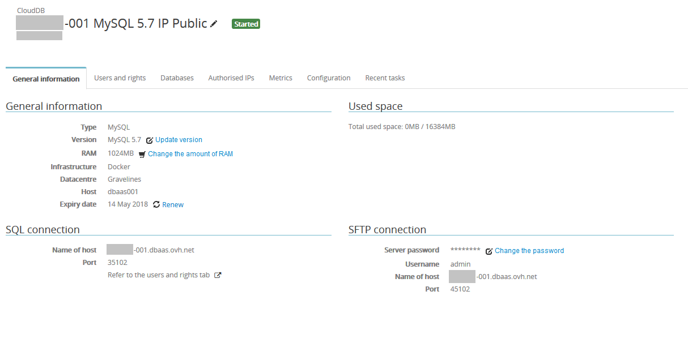{.thumbnail}

## Crear bases de datos y usuarios

### Crear una base de datos
La instancia ya se ha creado, pero todavía está vacía.

Abra la pestaña `Bases de datos`{.action} y haga clic en el botón `Añadir una base de datos`{.action}.

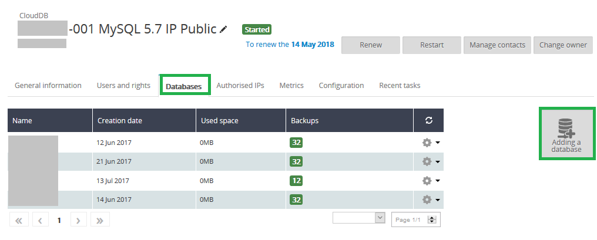{.thumbnail}

Asigne un nombre a la base de datos y haga clic en `Aceptar`{.action}.

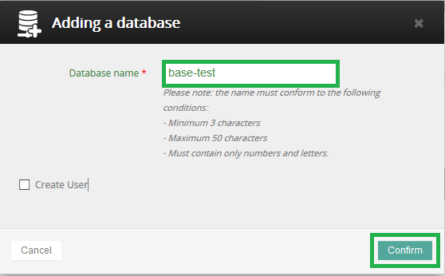{.thumbnail}

### Crear un usuario
Para utilizar una instancia CloudDB, es necesario crear usuarios con permisos específicos para conectarse a una base de datos.

Para ello, abra la pestaña `Usuarios y permisos`{.action} y haga clic en `Añadir un usuario`{.action}.

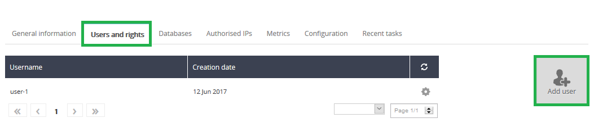{.thumbnail}

Introduzca un **nombre de usuario** y una **contraseña** y haga clic en `Aceptar`{.action}.

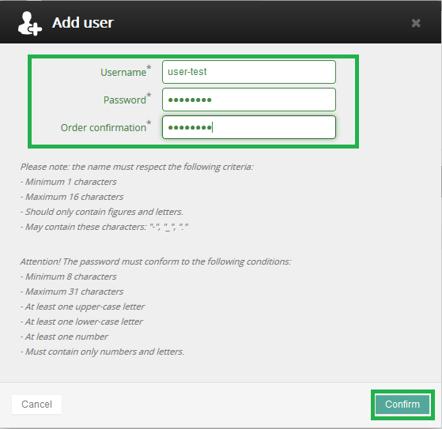{.thumbnail}

### Gestionar los permisos de los usuarios
Abra la pestaña `Bases de datos`{.action}, haga clic en el icono con forma de **rueda dentada** situado al final de la línea correspondiente a la base de datos y seleccione `Gestionar los usuarios`{.action}.

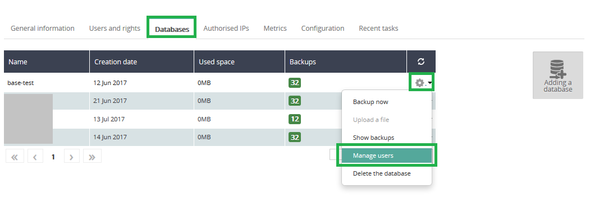{.thumbnail}

Elija los permisos para los usuarios que desee.

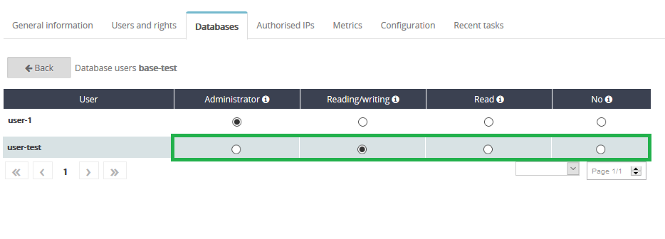{.thumbnail}

A continuación se ofrece la descripción de los permisos existentes:

- **Administrador:** Autorización de las consultas de tipo **Select, Insert, Update, Delete, Create, Alter** y **Drop**.
- **Lectura-Escritura:** Autorización de las consultas de tipo **Select, Insert, Update** y **Delete**.
- **Lectura:** Autorización de las consultas de tipo **Select**.
- **Ninguno:** Sin permisos sobre la base.

## Autorizar las IP

### Anadir el servidor
Para poder acceder a la instancia de CloudDB, es necesario especificar las IP autorizadas desde este menú.

Abra la pestaña `IP autorizadas`{.action} y haga clic en `Añadir una dirección IP/máscara`{.action}.

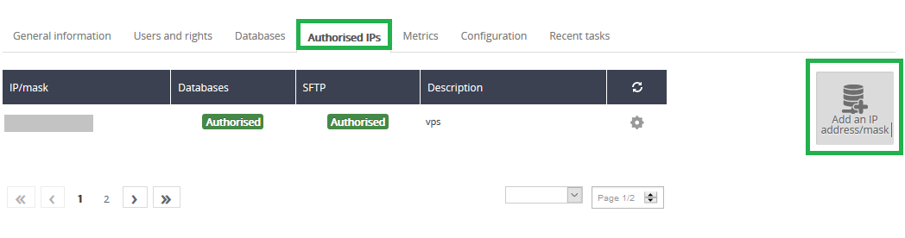{.thumbnail}

Indique la IP del servidor o red y, opcionalmente, una descripción, y haga clic en `Aceptar`{.action}.

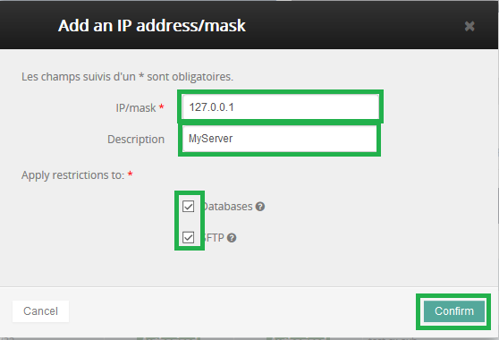{.thumbnail}

## Utilizar la base de datos
Una vez haya finalizado la configuración, existen múltiples formas de utilizar la base de datos, según el caso de uso y el motor elegido.

A continuación vamos a ver un caso de uso típico.

### Instalar WordPress con el lab DBaaS y el motor MySQL
Cree una instancia CloudDB MySQL.

Cree una base de datos y un usuario asociado a dicha base de datos, y asígnele permisos de **admin**.

Autorice a la IP del servidor a acceder al servicio CloudDB.

Consulte en su área de cliente la siguiente información:

- Nombre de host
- Puerto SQL

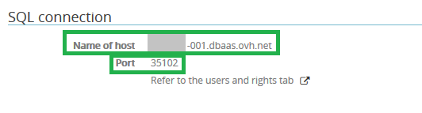{.thumbnail}

- Base de datos

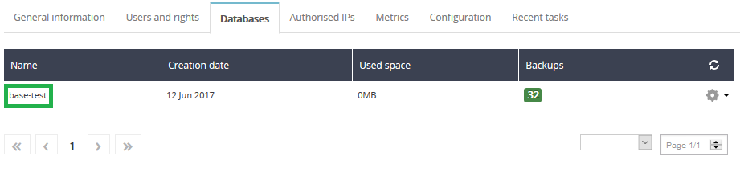{.thumbnail}

- Usuario

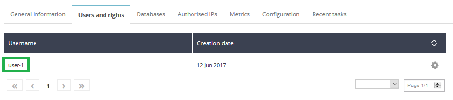{.thumbnail}

WordPress le pedirá esos datos durante la instalación.

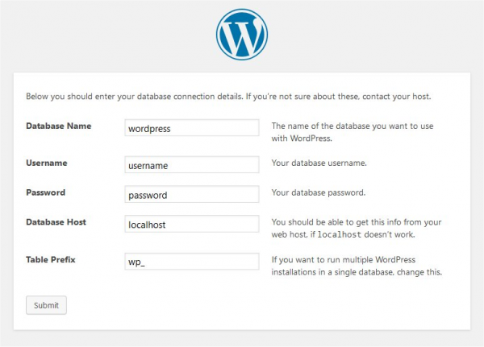{.thumbnail}

Cumplimente los campos como se indica a continuación (aquí se indican los valores utilizados en esta guía):

- **Nombre de la base de datos:** base-test
- **Nombre de Usuario:** user-1
- **Contraseña:** la contraseña que haya elegido para el usuario «user-1»
- **Servidor de la base de datos:** xxx.dbaas.ovh.net:35102 (debe tener el formato **host:puerto**)
- **Prefijo de tabla:** en este caso no es necesario cambiar nada

Para otros casos de uso, seguiremos el método de conexión oficial de los motores utilizados.

No dude en consultar la documentación oficial.