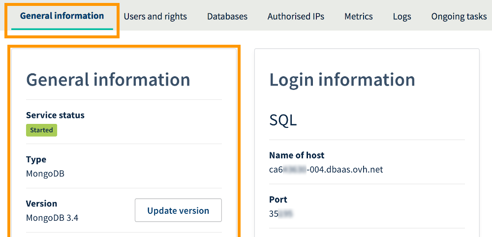
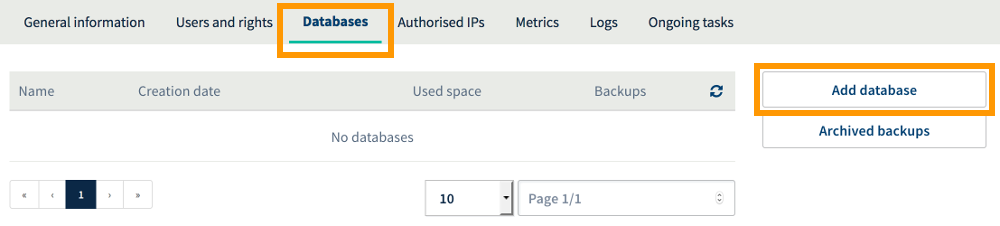
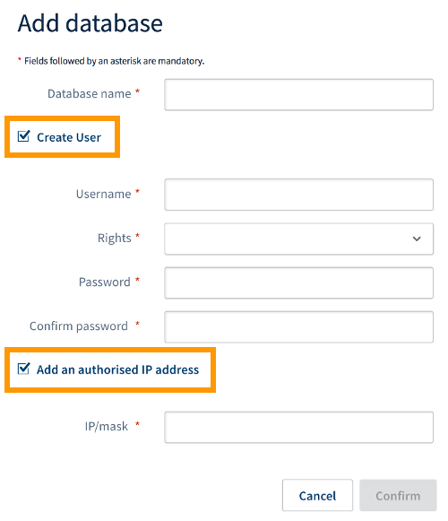
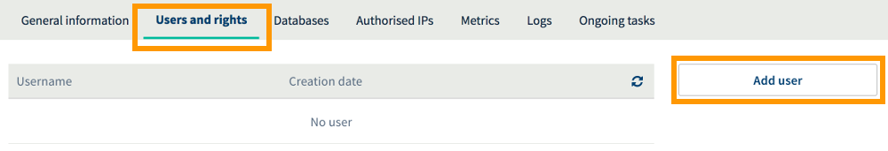
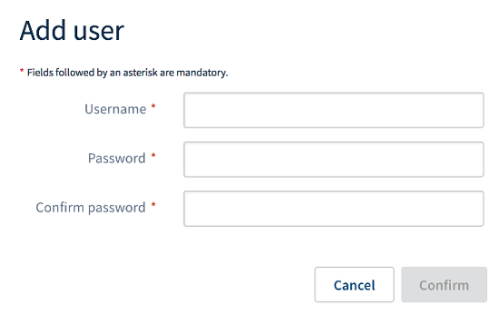
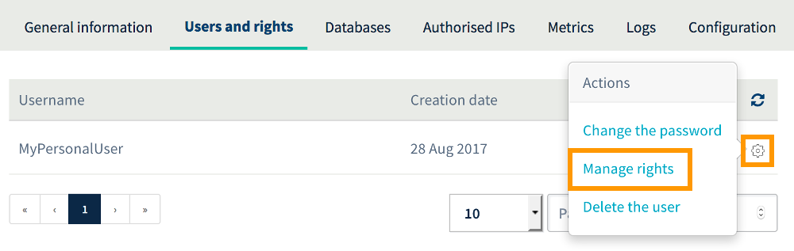
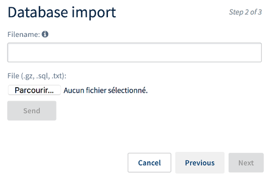
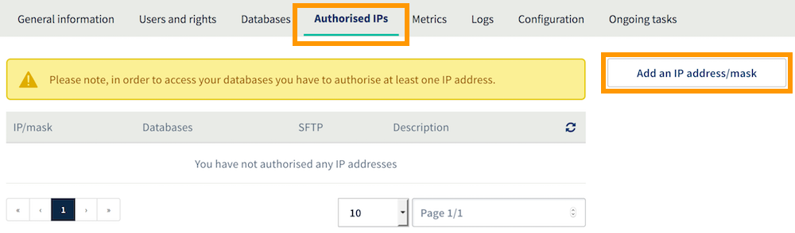
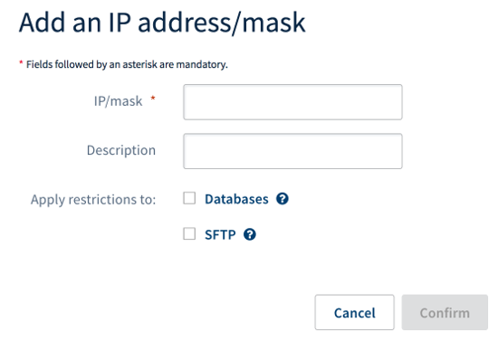
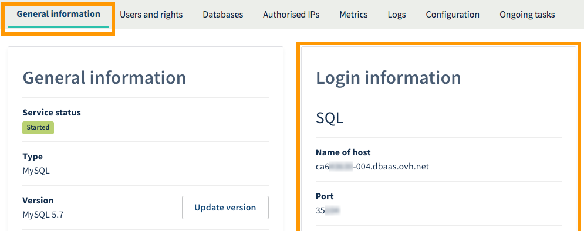

**Päivitetty 11.5.2018**

## Tavoite

CloudDB-ratkaisun avulla on mahdollista käyttää tietokantainstanssia, jonka resurssit ovat dedikoituja ja taattuja. Palvelu tarjoaa enemmän suorituskykyä sekä joustavuutta ja on suunnattu pääasiassa asiakkaille, joilla on erikoistarpeita.

**Katso, kuinka CloudDB-ratkaisun käyttö aloitetaan.**

## Edellytykset

- Sinulla on [CloudDB-instanssi](https://www.ovh-hosting.fi/cloud/cloud-databases/){.external}.
- Olet kirjautunut [hallintapaneeliin](https://www.ovh.com/auth/?action=gotomanager){.external}.

## Käytännössä

### Katso instanssin yleiset tiedot

Mene [hallintapaneelin](https://www.ovh.com/auth/?action=gotomanager){.external} vasemmassa laidassa olevassa valikossa kohtaan `Tietokannat`{.action} ja sitten kyseessä olevaan instanssiin. Varmista, että olet kohdassa `Yleiset tiedot`{.action}.

> [!primary]
>
> CloudDB-palvelusi nimi hallintapaneelissa sisältää osan asiakastunnuksestasi ja päättyy kolmeen lukuun (ensimmäisenä asennettu CloudDB-palvelu 001, toisena asennettu 002 jne.).
>

Voit tarkastella sieltä instanssiasi koskevia tärkeitä tietoja. Kehotamme varmistamaan huolellisesti, että tiedot ovat oikein tai vastaavat alla olevia esimerkkejä.

|Tieto|Yksityiskohdat|
|---|---|
|Palvelun tila|Näkyy erityisesti silloin, jos instanssi on käynnistetty, sitä ollaan käynnistämässä uudelleen tai jäädyttämässä. Instanssin on oltava käynnistettynä, jotta sillä voidaan tehdä toimintoja.|
|Tyyppi|Näyttää palvelimen käyttämän tietokantajärjestelmän.|
|Versio|Näyttää palvelimen käyttämän tietokantajärjestelmän version. Huolehdi verkkosivusi yhteensopivuudesta valitun version kanssa.|
|RAM|Näyttää instanssia varten saatavilla olevan keskusmuistin sekä mahdolliset muistin ylitykset. CloudDB-instanssisi sisältää dedikoituja ja taattuja resursseja eli sen RAM-muistin. Tarpeen vaatiessa voit kehittää sitä ja saada ilmoituksia, mikäli kulutat kaikki instanssisi muistiresurssit.|
|Infrastruktuuri|Näyttää instanssisi käyttämän infrastruktuurin. Kyseessä on OVH:n infrastruktuurille ominainen tieto.|
|Konesali|Näyttää konesalin, jossa instanssi on luotu.|
|Isäntäkone|Näyttää OVH:n palvelimen, johon instanssi on luotu. Kyseessä on OVH:n infrastruktuurille ominainen tieto, jota voidaan käyttää [häiriötilanteisiin](http://status.ovh.net/){.external} liittyvässä viestinnässä.|

{.thumbnail}

### Tietokannan luominen

> [!primary]
>
> Tätä kohtaa ei sovelleta Redis-tietokantajärjestelmään.
>

Luo ensimmäinen tietokanta CloudDB-instanssissa klikkaamalla kuvaketta `Tietokannat`{.action} ja sitten painiketta `Lisää tietokanta`{.action}.

{.thumbnail}

Voit valita näkyviin tulevassa ikkunassa sekä lisäksi tietokannan luomishetkellä seuraavat toiminnot:

-  **Luo käyttäjä**: käyttäjä voi suorittaa tietokantakyselyjä tietokannassasi (kuten tietojen lukeminen, lisääminen tai poistaminen).

- **Lisää hyväksytty IP-osoite**: tästä osoitteesta tuleville kyselyille sallitaan pääsy tietokantaasi.

Valintasi mukaan täydennä nyt pyydetyt tiedot ja klikkaa sitten painiketta `Vahvista`{.action}.

|Tieto|Kuvaus|
|---|---|
|Tietokannan nimi|Tämä on tulevan tietokantasi nimi.|
|Käyttäjänimi|Käyttäjä, joka voi kirjautua tietokantaasi ja tehdä siellä kyselyjä (valinnainen, jos ruutua “*Luo käyttäjä*” ei ole rastitettu).|
|Oikeudet|Näillä tarkoitetaan käyttäjään yhdistettyjä oikeuksia, perinteistä käyttöä varten valitse `Administraattori`{.action} (valinnainen, jos ruutua “*Luo käyttäjä*” ei ole rastitettu).|
|Salasana|Valitse salasana ja vahvista se (valinnainen, jos ruutua “*Luo käyttäjä*” ei ole rastitettu).|
|IP/maski|IP-osoite, maski tai palvelimet, joilla on lupa yhdistää tietokantaasi (valinnainen, jos ruutua “*Lisää hyväksytty IP-osoite*” ei ole rastitettu).|

> [!warning]
>
> Turvallisuussyistä kehotamme noudattamaan tietojen rekisteröinnin yhteydessä ilmoitettuja ehtoja.
>

{.thumbnail}

### Käyttäjän luominen

> [!primary]
>
> Tätä kohtaa ei sovelleta Redis-tietokantajärjestelmään.
>

Jos olet luonut käyttäjän tietokannan luonnin yhteydessä äskeisessä kohdassa, tämä vaihe ei ole pakollinen. Erityislaatuisessa projektissa voidaan kuitenkin tarvita useampia käyttäjiä, joilla on oikeudet päästä tietokantaan. Esimerkiksi yhdellä tietokannan käyttäjällä voi olla luku- ja kirjoitusoikeudet, kun taas toisella on ainoastaan lukuoikeudet.

Jos projektisi ei kaipaa ylimääräistä käyttäjää, voit siirtyä seuraavaan vaiheeseen. Muussa tapauksessa voit klikata käyttäjän luomiseksi CloudDB-instanssiin kuvaketta `Käyttäjät ja oikeudet`{.action} ja sitten painiketta `Lisää käyttäjä`{.action}.

{.thumbnail}

Täydennä nyt pyydetyt tiedot näkyviin tulevassa ikkunassa ja klikkaa sitten painiketta `Vahvista`{.action}.

|Tieto|Kuvaus|
|---|---|
|Käyttäjänimi|Käyttäjä, joka voi yhdistää instanssiisi. Voit seuraavassa vaiheessa myöntää käyttäjälle oikeuksia tietokantaasi.|
|Salasana|Valitse salasana ja vahvista se.|

> [!warning]
>
> Turvallisuussyistä kehotamme noudattamaan tietojen rekisteröinnin yhteydessä ilmoitettuja ehtoja.
>

{.thumbnail}

Kun käyttäjä on luotu, on tarpeen myöntää käyttäjälle oikeuksia toimintojen toteuttamiseksi tietokannassasi (kuten luku, tietojen lisäys tai poisto). Klikkaa sitä varten hammasrattaan kuvaa ja sitten `Oikeuksien hallinta`{.action}. Valitse uudella sivulla haluttu oikeus klikkaamalla sitä. Perinteisessä käytössä valitse `Administraattori`{.action}.

{.thumbnail}

### Tietokannan tuominen

> [!primary]
>
> Tätä vaihetta käytetään, jos tuot olemassa olevan tietokannan varmuuskopion. Muussa tapauksessa siirry seuraavaan vaiheeseen.
>

Tietokannan tuomiseen on olemassa useita tekniikoita. OVH:n hallintapaneelissa on käytettävissä tähän tarkoitukseen erityinen työkalu, johon keskitymme lähemmin. Voit kuitenkin käyttää toista tapaa mieltymystesi ja osaamisesi mukaan.

Alla olevissa vaiheissa käydään läpi tietokannan tuominen OVH:n hallintapaneelissa saatavilla olevalla työkalulla.

- **1. Kirjaudu käyttöliittymään, jossa tuonti tapahtuu**

Klikkaa `Tietokannat`{.action}-välilehdessä hammasrattaan kuvaa ja sitten `Tuo tiedosto`{.action}. Seuraavassa avautuvassa ikkunassa rastita kohta `Tuo uusi tiedosto`{.action} ja klikkaa sitten `Seuraava`{.action}.

{.thumbnail}

- **2. Valitse ja lähetä varmuuskopiotiedosto**

Anna tiedostonimi, jolla voit tunnistaa varmuuskopion myöhemmin, jos haluat palauttaa sen uudemman kerran. Valitse seuraavaksi kohdan **Tiedosto** vierestä tietokoneellasi oleva tietokannan varmuuskopiotiedosto, klikkaa sitten `Lähetä`{.action}. Odota, että käyttöliittymä ilmoittaa lähetyksen onnistumisesta ja klikkaa sitten painiketta `Seuraava`{.action}.

{.thumbnail}

- **3. Aloita tietokannan tuominen**

Valitse lopuksi, sovelletaanko alla kuvattuja lisäoptioita vai ei. Klikkaa sitten `Vahvista`{.action}.

|Lisäoptiot|Kuvaus|
|---|---|
|Tyhjennä nykyinen tietokanta|Tietokantasi nykyinen sisältö poistetaan kokonaisuudessaan ja korvataan sitten varmuuskopiollasi.|
|Lähetä sähköpostiviesti tuonnin päätyttyä|Saat sähköpostitse ilmoituksen, kun tietokantasi tuominen on suoritettu.|

{.thumbnail} 

### Hyväksy IP-osoite

Jotta yhteys CloudDB-instanssiisi toimii, on ilmoitettava IP-osoitteet tai IP-alue, joiden on sallittu yhdistää tietokantaasi. Klikkaa sitä varten kuvaketta `Hyväksytyt IP-osoitteet`{.action} ja sitten painiketta `Lisää IP-osoite/maski`{.action}.

{.thumbnail}

Ilmoita näkyviin tulevassa ikkunassa IP-osoite tai maski, jonka haluat hyväksyä kohdassa `IP/maski`{.action}. Tämän jälkeen voit halutessasi lisätä kuvauksen. Päätä seuraavaksi, haluatko kirjautua ainoastaan tietokantoihin vai SFTP:hen. Klikkaa lopuksi `Vahvista`{.action}.

{.thumbnail}

### Yhdistä sivusi tietokantaan

Nyt kun tietokantasi on luotu, ja yhdellä tai useammalla käyttäjällä on siihen oikeudet ja vähintään yhdellä IP-osoitteella on lupa yhdistää CloudDB-instanssiisi, on jäljellä enää verkkosivusi liittäminen tietokantaan. Tämä vaihe voidaan toteuttaa monin tavoin, riippuen verkkosivustasi, käyttämästäsi sisällönhallintajärjestelmästä (WordPress, Joomla! jne.) tai vaiheesta, jossa olet verkkosivun asennusta toteuttaessa.

Jotta voit suorittaa tämä toimenpiteen oikein, sinulla täytyy joka tapauksessa olla hallussasi seuraavat viisi tietoa:

|Tieto|Kuvaus|
|---|---|
|Tietokannan nimi|Tämä on nimi, jonka määritit tietokannan luonnin yhteydessä. Voit löytää kaikki CloudDB-instanssissa luodut tietokannat välilehdeltä `Tietokannat`{.action}.|
|Käyttäjänimi|Tämä on tietokannan luonnin yhteydessä määritetty käyttäjänimi tai mahdollinen ylimääräinen käyttäjä, jonka olet lisännyt. Voit löytää kaikki CloudDB-instanssissa luodut käyttäjät välilehdeltä `Käyttäjät ja oikeudet`{.action}.|
|Käyttäjän salasana|Määrittämääsi käyttäjään liittyvä salasana.|
|Isäntäpalvelimen nimi|Annettava palvelin, jotta sivusi voi yhdistää tietokantaan. Tämä tieto löytyy hallintapaneeliin osiosta **Kirjautumistiedot** ja sieltä välilehdeltä `Yleiset tiedot`{.action}.|
|Palvelimen portti|Yhteysportti CloudDB-instanssiisi, jotta sivusi voi yhdistää tietokantaasi. Tämä tieto löytyy hallintapaneeliin osiosta **Kirjautumistiedot** ja sieltä välilehdeltä `Yleiset tiedot`{.action}.|

> [!warning]
>
> Harvinaisissa tapauksissa kenttää `portti`{.action} ei voida tarjota sivusi konfiguraatiossa. Mikäli näin on, täytyy tämä kenttä lisätä isäntäpalvelimen nimen perään ja erottaa ne merkillä *:* (esimerkiksi isäntäpalvelimennimi:portti).
>

{.thumbnail}

## Lue lisää aiheesta

Viesti käyttäjäyhteisömme kanssa osoitteessa: <https://community.ovh.com/en/>.