Vous disposez d'un site web ou d'une application qui nécessite une base de données, mais vous ne voulez pas la gérer ? Découvrez l'offre CloudDB' sans plus tarder ! OVH s'occupe de tout.

## Généralités

### Pourquoi utiliser des bases de donnees managees ?
Cette offre est partie d'un **constat simple** : même si vous **savez** le faire, administrer une base de données n'est pas forcément votre **priorité**. Sécurisation, mises à jour, monitoring, gestion des droits, des performances, ... cela peut très vite être fastidieux !

**Alors pourquoi ne pas laisser ce travail à OVH et vous concentrer sur votre cœur de métier ?**

C'est notre objectif. Que vous soyez un particulier ou un professionnel, faibles besoins ou gros cluster, notre but est d'adresser l'ensemble du marché.

### Les avantages de l'offre CloudDB
**Simple et rapide :**

- Création de bases de données SQL via l'Espace Client
- Nombre de bases illimité (dans la limite de l'espace disque alloué)
- Jusqu'à 200 connexions simultanées
- Gestion des utilisateurs et droits associés via l'Espace Client
- Accès aux métriques via l'Espace Client
- Accès aux logs

**Performant :**

- Ressources RAM garanties
- Infrastructure éprouvée

**Sécurisé :**

- Monitoring H24 7j/7 par nos équipes
- Sauvegardes journalières automatiques
- Autorisation d'IP(s) obligatoire

**Evolutif :**

- Compatible avec tous les produits OVH et plus globalement avec tout produit connecté au réseau public

> [!primary]
>
> Pour cela il faudra prendre soin d'autoriser l'IP de la gateway du cluster où se trouver votre hébergement mutualisé. Vous trouverez toutes les informations dans le lien suivant: [https://docs.ovh.com/fr/hosting/liste-des-adresses-ip-des-clusters-et-hebergements-web/](https://docs.ovh.com/fr/hosting/liste-des-adresses-ip-des-clusters-et-hebergements-web/)
> 

- Choix de la version SQL et changement vers une version supérieure possible à tout moment

### Moteurs proposes
Lorsque vous souscrivez à l'offre CloudDB, vous avez le choix entre plusieurs systèmes de bases de données :

**SQL**

- MySQL
- PostgreSQL
- MariaDB

Chaque instance dispose de ses propres ressources dédiées. Les bases qu'elle contient, une ou plusieurs, se **partageront** vos ressources entre elles.

## Commandez votre offre CloudDB

### Connexion au manager
Afin de pouvoir créer votre instance puis vos bases, il vous faut vous rendre dans votre [Espace Client Web](https://www.ovh.com/manager/web/){.external}.

### Commande
Une fois dans votre [Espace Client Web](https://www.ovh.com/manager/web/){.external}, cliquez sur **"Bases de données"**, puis sur `Commander des bases de données`{.action}.

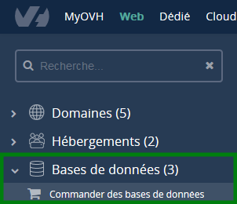{.thumbnail}

Effectuez votre commande en choisissant les éléments ci-dessous :

- **"CloudDB"**
- **"Votre système de base de données"**
- **"Sa RAM"**
- **"Son datacentre"**
- **"La durée voulue"**

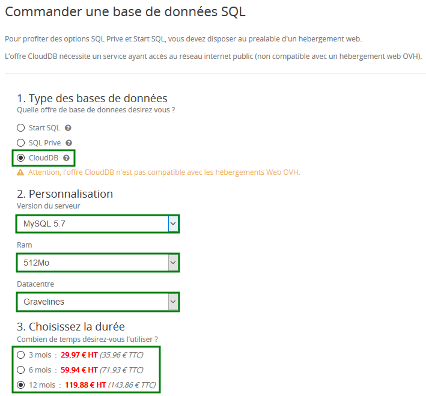{.thumbnail}

Validez ensuite les contrats et cliquez sur `+ Générer le bon de commande`{.action}.

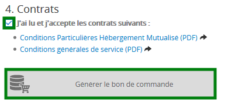{.thumbnail}

## Informations generales
Une foi sur votre espace client, il vous sera possible de visualiser les informations générales de votre instance.

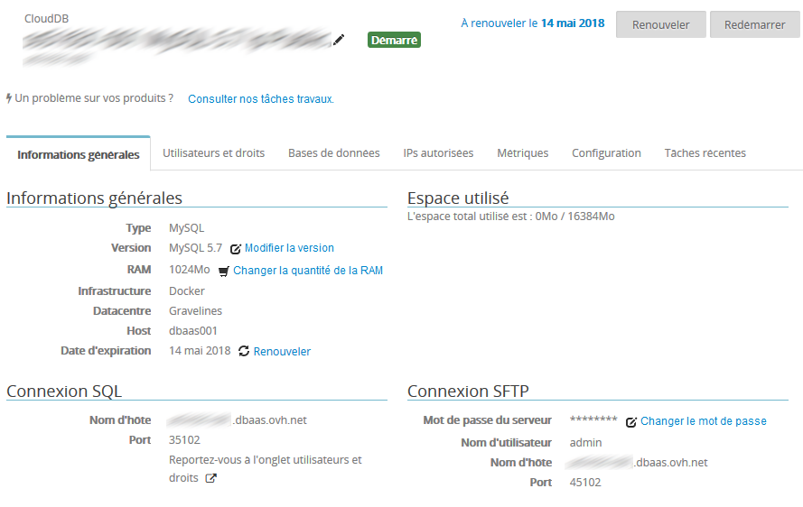{.thumbnail}

## Créer mes bases et mes utilisateurs

### Créer une base de donnees
A ce stade, votre instance est donc créée, mais celle-ci est vide.

Cliquez sur l'onglet **"Bases de données"**, puis sur le bouton `+ Ajouter une base de données`{.action}.

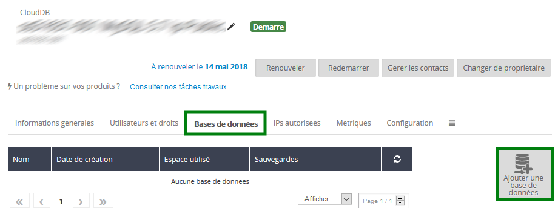{.thumbnail}

Indiquez un nom pour votre base de données, et cliquez sur `+ valider`{.action}.

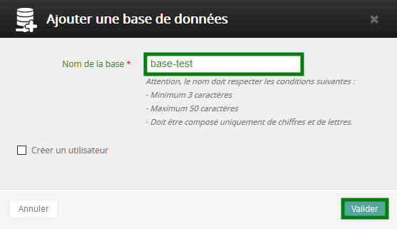{.thumbnail}

### Créer un utilisateur
Pour utiliser votre offre CloudDB, il est nécessaire de créer des utilisateurs qui auront des droits spécifiques pour se connecter à une base de données.

Vous devez pour cela vous rendre dans l'onglet **"Utilisateurs et droits"** et enfin cliquer sur `+ Ajouter un utilisateur`{.action}.

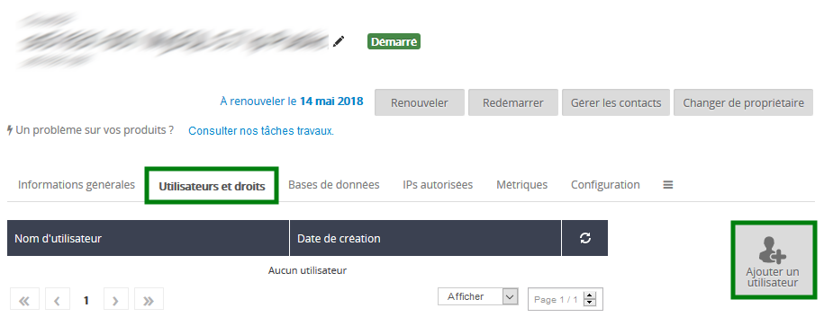{.thumbnail}

Il vous sera ensuite demandé de renseigner un **nom d'utilisateur** et un **mot de passe** puis de cliquer sur `Valider`{.action}.

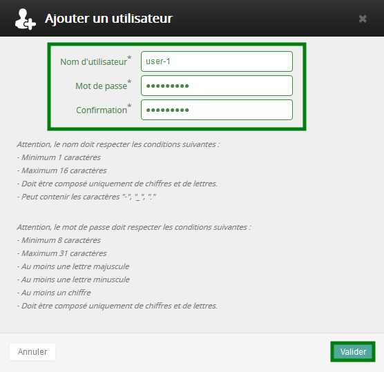{.thumbnail}

### Gerer les droits utilisateurs
Cliquez sur l'onglet **"Bases de données"**, puis sur  la **"roue crantée"** de la base de données désirée, et enfin sur le bouton `+ Gérer les utilisateurs`{.action}.

{.thumbnail}

Choisissez ensuite les droits pour l'utilisateur de votre choix

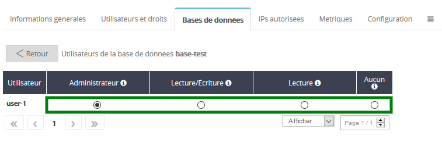{.thumbnail}

Voici la description des 3 droits proposés :

- **Administrateur :** Autorisation des requêtes de type **Select / Insert / Update / Delete / Create / Alter / Drop**
- **Lecture / Ecriture :** Autorisation des requêtes de type **Select / Insert / Update / Delete**
- **Lecture :** Autorisation des requêtes de type **Select**
- **Aucun :** Aucun droit sur la base

## Autorisez vos IPs

### Ajout de votre serveur
Afin que l'accès à votre instance CloudDB fonctionne, il est obligatoire de spécifier la ou les IPs autorisées dans ce menu. Cliquez sur l'onglet **"IPs autorisées"**, puis sur `+ Ajouter une adresse IP / masque`{.action}.

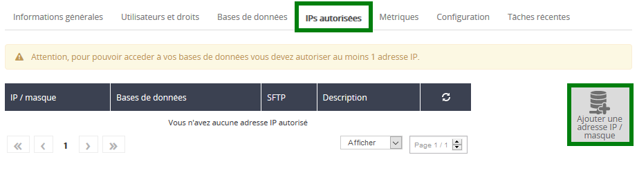{.thumbnail}

Indiquez l'IP de votre serveur ou un réseau, ainsi qu'une description si vous le désirez, puis cliquez sur `Valider`{.action}.

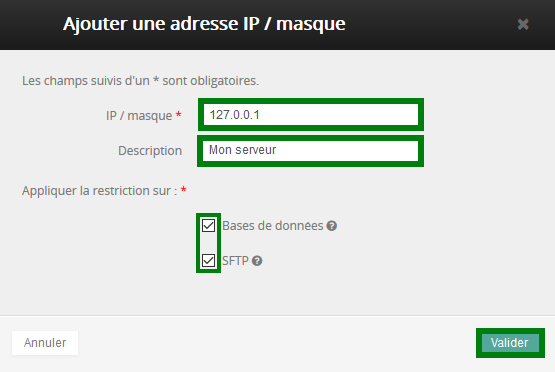{.thumbnail}

## Utiliser votre base de donnees
Votre configuration est terminée ? Parfait !

Suivant votre cas d'usage et le moteur choisi, les manières d'utiliser votre base de données sont multiples.

Voyons un cas d'usage typique.

### Installer WordPress avec le lab DBaaS et le moteur MySQL
- Créez une instance CloudDB MySQL
- Créez une base de données et un utilisateur relié à cette base, et associez-lui les droits ADMIN.
- Autorisez l'IP de votre serveur à contacter votre service CloudDB

Récupérez dans votre espace client ces informations :

- Nom d'hôte
- Port SQL

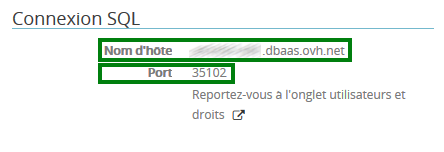{.thumbnail}

- Base de données

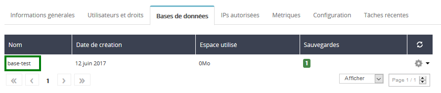{.thumbnail}

- Utilisateur

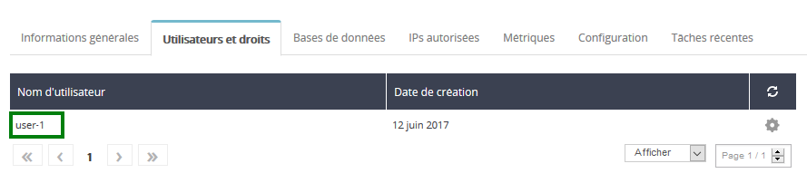{.thumbnail}

Notez bien toutes ces informations. WordPress réclame ces informations à l'installation.

{.thumbnail}

Nous allons donc remplir les champs comme ceci :

- **Database Name** : *base-test*
- **User Name** : *user-1*
- **Password** : le password que vous avez choisi pour l'utilisateur *user-1*
- **Database Host** : *xxx.dbaas.ovh.net:35102* (notez bien : **host:port**)
- **Table prefix** : on ne change rien dans notre cas

Pour d'autres cas d'usage, nous respectons toutes les méthodes de connexions officielles des moteurs employés. N'hésitez pas à parcourir les documentations officielles.